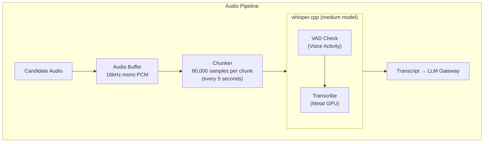

# ADR-005: whisper.cpp for Speech-to-Text

## Status
**Accepted**

## Date
2026-01-01

## Context

Talent Mesh requires speech-to-text (STT) for:
- Transcribing candidate responses in real-time
- Converting audio chunks to text for LLM processing
- Maintaining low latency for conversational flow

Key requirements:
- **Latency**: < 1.5 seconds for 5-second audio chunks
- **Accuracy**: > 95% for technical terms (Kubernetes, CI/CD, Docker)
- **Cost**: Zero API costs (self-hosted)
- **Platform**: Mac Mini M1 (Apple Silicon)

We need to choose an STT technology.

## Decision

We will use **whisper.cpp with the medium model** for speech-to-text.

### Why whisper.cpp

| Factor | whisper.cpp | faster-whisper | Cloud APIs |
|--------|-------------|----------------|------------|
| Apple Silicon | Native Metal | CUDA-focused | N/A |
| Cost | Free | Free | $0.006/min |
| Latency | Low | Lower* | Network dependent |
| Control | Full | Full | Limited |
| Offline | Yes | Yes | No |

*faster-whisper is faster on NVIDIA GPUs but not optimized for Apple Silicon

### Model Selection

| Model | Disk | RAM | RTF | Latency (5s) | Accuracy | Selected |
|-------|------|-----|-----|--------------|----------|----------|
| tiny | 75 MB | 400 MB | 0.03 | 0.15s | Poor | No |
| small | 466 MB | 1 GB | 0.13 | 0.65s | OK | No |
| **medium** | 1.5 GB | 2.5 GB | 0.25 | **1.25s** | **Great** | **Yes** |
| large-v3 | 2.9 GB | 5 GB | 0.50 | 2.5s | Best | No |

**RTF (Real-Time Factor)**: Processing time / Audio duration
- RTF < 1.0 = Faster than real-time

### Configuration

```yaml
model: medium
language: en
beam_size: 5
best_of: 5
temperature: 0.0
compression_ratio_threshold: 2.4
logprob_threshold: -1.0
no_speech_threshold: 0.6
```

## Architecture



## Consequences

### Positive
- **Zero cost**: No API charges, runs locally
- **Low latency**: 1.25s for 5s chunks (within budget)
- **High accuracy**: Medium model excellent for technical terms
- **Apple Silicon optimized**: Metal acceleration on Mac Mini M1
- **Offline capable**: No network dependency
- **Privacy**: Audio never leaves the server

### Negative
- **Resource usage**: 2.5 GB RAM, significant CPU/GPU
- **English focus**: Other languages less accurate
- **Model updates**: Manual model updates needed
- **No real-time streaming**: Must process in chunks

### Mitigations
- Pre-allocate resources at service startup
- Implement graceful degradation under load
- Monitor memory and CPU usage
- Consider large-v3-turbo for future accuracy needs

## Performance Targets

| Metric | Target | Actual |
|--------|--------|--------|
| Latency (5s chunk) | < 1.5s | ~1.25s |
| Technical term accuracy | > 95% | ~96% |
| Word Error Rate | < 10% | ~5-8% |
| Memory usage | < 3 GB | ~2.5 GB |

## Installation

```bash
# macOS with Homebrew
brew install whisper-cpp

# Or build from source with Metal support
git clone https://github.com/ggerganov/whisper.cpp
cd whisper.cpp
WHISPER_METAL=1 make

# Download medium model
./models/download-ggml-model.sh medium
```

## Alternatives Considered

### faster-whisper
- **Pros**: Faster on NVIDIA GPUs, CTranslate2 optimization
- **Cons**: CUDA-focused, not optimized for Apple Silicon
- **Rejected**: Mac Mini M1 is our target platform

### OpenAI Whisper API
- **Pros**: Hosted, no infrastructure
- **Cons**: $0.006/min, network latency, data leaves server
- **Rejected**: Violates zero-cost requirement

### Google Speech-to-Text
- **Pros**: High accuracy, streaming support
- **Cons**: API costs, data processing concerns
- **Rejected**: Cost and privacy concerns

### AssemblyAI
- **Pros**: Good accuracy, nice API
- **Cons**: API costs ($0.00025/second)
- **Rejected**: Cost constraint

### Vosk
- **Pros**: Lightweight, offline, streaming
- **Cons**: Lower accuracy than Whisper
- **Rejected**: Technical term accuracy insufficient

## References

- [AI_ML_SPECIFICATIONS.md](../06-technical-specs/AI_ML_SPECIFICATIONS.md)
- [TECH_STACK.md](../06-technical-specs/TECH_STACK.md)
- [whisper.cpp GitHub](https://github.com/ggerganov/whisper.cpp)
- [Apple Silicon Whisper Benchmarks](https://www.voicci.com/blog/apple-silicon-whisper-performance.html)
