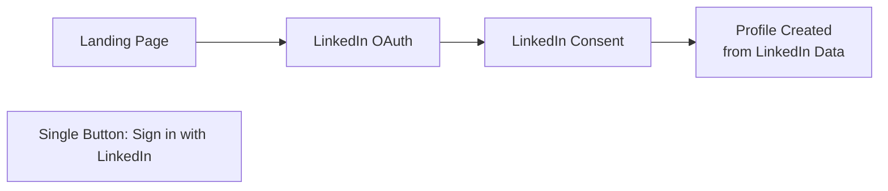

# ADR-006: LinkedIn-Only Authentication

## Status
**Accepted**

## Date
2026-01-03

## Context

Talent Mesh is an AI-powered assessment platform targeting professional talent acquisition. We need to decide on the authentication strategy for the platform.

Key considerations:
- **Target audience**: Professional candidates and hiring managers
- **Identity verification**: Need confidence that users are real professionals
- **Onboarding friction**: Balance between security and user convenience
- **Development resources**: Limited team, need simple auth implementation
- **Professional context**: Assessments are for employment purposes

The platform needs to verify that candidates are legitimate professionals with verifiable work histories.

## Decision

We will use **LinkedIn OAuth as the sole authentication method**. No email/password, no other social logins.

### Implementation

```typescript
// Auth flow - LinkedIn only
const authConfig = {
  providers: ['linkedin'],  // Single provider
  linkedin: {
    clientId: process.env.LINKEDIN_CLIENT_ID,
    clientSecret: process.env.LINKEDIN_CLIENT_SECRET,
    scope: ['openid', 'profile', 'email'],
    callbackUrl: '/auth/linkedin/callback'
  }
};

// No fallback authentication methods
// No email/password registration
// No magic links
```

### User Flow



### Data Retrieved from LinkedIn

| Field | Usage |
|-------|-------|
| `id` | Unique user identifier |
| `firstName` | Display name |
| `lastName` | Display name |
| `email` | Contact, notifications |
| `profilePictureUrl` | Avatar |
| `headline` | Professional context |

## Consequences

### Positive
- **Verified identity**: LinkedIn profiles represent real professionals
- **Pre-populated profiles**: Import name, headline, picture automatically
- **Professional context**: Users already in "work mode" mindset
- **Simplified auth**: Single OAuth flow, no password management
- **Reduced fraud**: Harder to create fake accounts
- **Industry standard**: Common for B2B/professional platforms
- **Network effects**: Potential for referrals via LinkedIn
- **Development simplicity**: One auth provider to implement and maintain

### Negative
- **Excludes non-LinkedIn users**: ~10% of professionals don't have LinkedIn
- **LinkedIn dependency**: Platform outage affects our auth
- **Geographic limitations**: LinkedIn less popular in some regions (China, Russia)
- **Privacy concerns**: Some users avoid LinkedIn for privacy reasons
- **Early career**: Students/new grads may have sparse LinkedIn profiles
- **LinkedIn API changes**: Subject to LinkedIn's API policies

### Mitigations
- **Clear messaging**: State LinkedIn requirement upfront
- **Profile enrichment**: Allow users to edit/expand beyond LinkedIn data
- **Graceful degradation**: Cache user data for LinkedIn outages
- **Future flexibility**: Architecture allows adding providers later if needed
- **Student outreach**: Partner with universities to encourage LinkedIn adoption

## Market Analysis

| User Segment | LinkedIn Penetration | Impact |
|--------------|---------------------|--------|
| Senior professionals | >95% | Minimal |
| Mid-career | >90% | Minimal |
| Entry-level | >80% | Low |
| Technical roles | >95% | Minimal |
| Non-tech roles | >85% | Low |

Estimated user loss due to LinkedIn requirement: **<5%** of target market.

## Alternatives Considered

### Email/Password + LinkedIn Optional
- **Pros**: Maximum reach, user choice
- **Cons**: Password management, fake accounts, no identity verification
- **Rejected**: Doesn't provide professional identity verification

### Multiple Social Providers (Google, GitHub, etc.)
- **Pros**: More options, higher reach
- **Cons**: No professional verification, more complexity, inconsistent data
- **Rejected**: Doesn't solve identity verification, increases maintenance

### Magic Links (Email-based)
- **Pros**: No passwords, simple
- **Cons**: No identity verification, requires email validation
- **Rejected**: Doesn't provide professional context

### Enterprise SSO (SAML/OIDC)
- **Pros**: Enterprise-grade, IT-approved
- **Cons**: Complex setup, enterprise-only, no individual users
- **Deferred**: May add for enterprise tier later

### LinkedIn + GitHub (Developer-focused)
- **Pros**: Good for technical hiring
- **Cons**: GitHub less universal, two auth flows
- **Deferred**: May add GitHub for developer-specific assessments

## Security Considerations

- LinkedIn handles password security, 2FA, breach detection
- OAuth tokens are short-lived, refreshable
- No password storage on our side (zero password liability)
- LinkedIn's fraud detection acts as first line of defense

## Implementation Checklist

- [ ] Register LinkedIn OAuth application
- [ ] Implement OAuth 2.0 flow
- [ ] Handle token refresh
- [ ] Map LinkedIn profile to user schema
- [ ] Implement session management
- [ ] Add LinkedIn outage handling
- [ ] Create clear UX messaging about LinkedIn requirement

## References

- [LinkedIn OAuth Documentation](https://docs.microsoft.com/en-us/linkedin/shared/authentication/authorization-code-flow)
- [FUNCTIONAL_REQUIREMENTS.md](../02-requirements/FUNCTIONAL_REQUIREMENTS.md)
- [USER_FLOWS.md](../07-ui-ux/USER_FLOWS.md)
