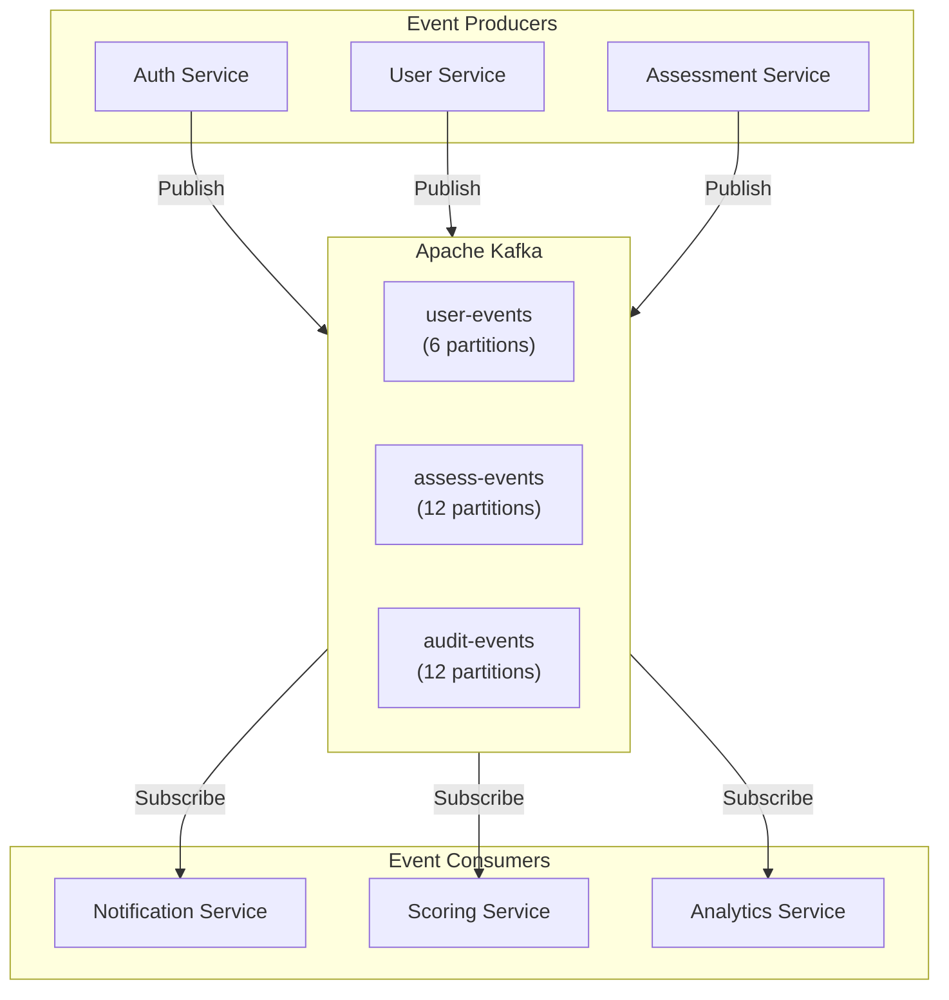
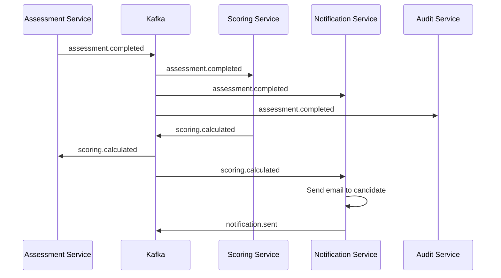

# ADR-007: Event-Driven Architecture with Kafka

## Status
**Superseded** by [ADR-026 Event Streaming Redpanda](/docs/09-adrs/ADR-026-EVENT-STREAMING-REDPANDA.md)

## Date
2026-01-01

## Supersession Note

> **Update (2026-01-07):** This ADR has been superseded by ADR-026. We use **Redpanda** (Kafka-compatible) from Day 1 instead of Redis pub/sub.
> Redpanda provides: exactly-once semantics, event replay, 365-day audit retention, and DLQ for failed events.
> See [ADR-026](/docs/09-adrs/ADR-026-EVENT-STREAMING-REDPANDA.md) for details.

## Context

Talent Mesh is a microservices-based system that requires:
- Loose coupling between services
- Reliable async communication
- Audit trail of all actions
- Event replay capability for debugging
- Scale-independent service communication

We need to decide on the inter-service communication pattern.

## Decision

We will adopt an **event-driven architecture using Apache Kafka** as the event backbone.

### Event Categories

| Category | Topics | Purpose |
|----------|--------|---------|
| Domain Events | `*-events` | Business state changes |
| Commands | `*-commands` | Action requests |
| Audit | `audit-events` | Compliance logging |
| System | `system-events` | Health, metrics |

### Topic Design

```
talent-mesh.user-events          # User lifecycle
talent-mesh.assessment-events    # Assessment state changes
talent-mesh.scheduling-events    # Booking events
talent-mesh.agent-events         # Agent pool changes
talent-mesh.audit-events         # All auditable actions
```

### Event Schema (CloudEvents)

```json
{
  "specversion": "1.0",
  "id": "evt_abc123",
  "type": "assessment.completed",
  "source": "assessment-service",
  "time": "2024-01-15T10:30:00.000Z",
  "datacontenttype": "application/json",
  "data": {
    "assessmentId": "asmt_xyz789",
    "userId": "usr_abc123",
    "score": 85,
    "passed": true
  }
}
```

## Architecture



## Topic Configuration

| Topic | Partitions | Retention | Replication |
|-------|------------|-----------|-------------|
| user-events | 6 | 7 days | 2 |
| assessment-events | 12 | 30 days | 2 |
| scheduling-events | 6 | 7 days | 2 |
| agent-events | 6 | 1 day | 2 |
| audit-events | 12 | 365 days | 3 |

## Consequences

### Positive
- **Loose coupling**: Services don't know about each other
- **Scalability**: Add consumers without affecting producers
- **Reliability**: Kafka guarantees delivery
- **Audit trail**: Complete event history
- **Replay**: Can reprocess events for debugging/recovery
- **Eventual consistency**: Natural fit for microservices

### Negative
- **Complexity**: Additional infrastructure to manage
- **Eventual consistency**: Must handle out-of-order events
- **Debugging**: Harder to trace requests across services
- **Learning curve**: Team needs Kafka expertise
- **Latency**: Async adds some delay

### Mitigations
- Use managed Kafka (Confluent, AWS MSK) in production
- Implement distributed tracing (OpenTelemetry)
- Use correlation IDs for request tracking
- Schema registry for event validation
- Comprehensive documentation and training

## Event Flow Examples

### Assessment Completion



### Consumer Groups

| Consumer Group | Events | Purpose |
|----------------|--------|---------|
| assessment-service-group | Assessment events | Handle assessments |
| scoring-service-group | Assessment events | Calculate scores |
| notification-service-group | Multiple event types | Send notifications |
| audit-service-group | All events | Store for compliance |
| analytics-service-group | All events | Build dashboards |

## Error Handling

### Dead Letter Queue

```yaml
# Failed events go to DLQ
topic: assessment-events.dlq
retention: 30 days
alerting: true
```

### Retry Strategy

```python
@retry(max_attempts=3, backoff=exponential(base=2))
async def process_event(event):
    try:
        await handle(event)
    except RetryableError:
        raise  # Will retry
    except FatalError:
        await send_to_dlq(event)
```

## Alternatives Considered

### Synchronous HTTP/REST
- **Pros**: Simpler, immediate response
- **Cons**: Tight coupling, cascading failures
- **Rejected**: Doesn't scale, no audit trail

### RabbitMQ
- **Pros**: Simpler than Kafka, good for queues
- **Cons**: No replay, less durable
- **Rejected**: Need event replay and long retention

### Redis Streams
- **Pros**: Already using Redis, simpler
- **Cons**: Less durable, limited features
- **Rejected**: Not production-grade for critical events

### AWS SNS/SQS
- **Pros**: Managed, scalable
- **Cons**: Vendor lock-in, no replay
- **Rejected**: Need self-hosted option

### NATS
- **Pros**: Lightweight, fast
- **Cons**: Less ecosystem, newer
- **Considered**: Good alternative, may evaluate later

## References

- [EVENT_SCHEMAS.md](../05-data-model/EVENT_SCHEMAS.md)
- [INTEGRATION_PATTERNS.md](../03-architecture/INTEGRATION_PATTERNS.md)
- [DATA_ARCHITECTURE.md](../03-architecture/DATA_ARCHITECTURE.md)
