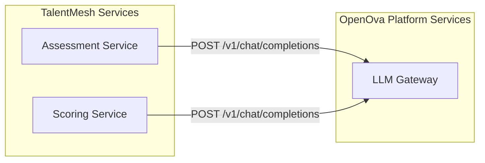

# ADR-009: LLM Integration via OpenOva LLM Gateway

## Status
**Accepted**

## Date
2026-01-03 (Updated: 2026-01-12)

## Context

TalentMesh requires LLM capabilities for conducting AI-powered assessments:
- Generating adaptive interview questions based on candidate responses
- Analyzing candidate answers for technical accuracy
- Maintaining natural conversational flow during assessments
- Providing real-time feedback and follow-up questions

Key requirements:
- **Low latency** for real-time conversation (target < 700ms response)
- **Zero cost** during development phase
- **Easy migration** to production API when scaling

## Decision

TalentMesh will use the **OpenOva LLM Gateway** platform service for all LLM capabilities. The LLM Gateway is a shared platform service that provides:

- OpenAI-compatible REST API
- CLI backend for zero-cost development
- API backend for production
- Session pooling and health management

### Integration Architecture



### Service Endpoint

```
http://llm-gateway.platform-services.svc.cluster.local:5005/v1/chat/completions
```

## Implementation

### Usage Example

```python
import openai

client = openai.OpenAI(
    base_url="http://llm-gateway.platform-services:5005/v1",
    api_key="not-required"  # CLI backend doesn't need API key
)

response = client.chat.completions.create(
    model="claude-sonnet",
    messages=[
        {"role": "system", "content": "You are an AI interviewer..."},
        {"role": "user", "content": candidate_response}
    ]
)

answer = response.choices[0].message.content
```

### Kubernetes Configuration

```yaml
# k8s/base/assessment-service/deployment.yaml
env:
  - name: LLM_BASE_URL
    value: "http://llm-gateway.platform-services:5005/v1"
```

## Consequences

### Positive
- **Zero development cost** - OpenOva provides CLI backend at no cost
- **Standard interface** - OpenAI-compatible API for portability
- **Platform managed** - Session pooling, health checks, monitoring handled by OpenOva
- **Easy migration** - Backend switching handled at platform level
- **Shared infrastructure** - Other tenants can reuse the same service

### Negative
- **Platform dependency** - Requires OpenOva LLM Gateway availability
- **No direct control** - Backend configuration managed at platform level

## Latency Budget

| Component | Target |
|-----------|--------|
| Service-to-gateway network | < 5ms |
| LLM response | < 700ms |
| **Total** | **< 705ms** |

## References

- [OpenOva LLM Gateway Service](https://github.com/openova-io/handbook/blob/main/services/LLM_GATEWAY.md)
- [AI/ML Specifications](../technical/AI_ML_SPECIFICATIONS.md)

---

*ADR Version: 2.0*
*Last Updated: 2026-01-12*
