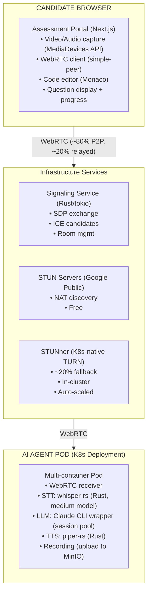

# ADR-010: WebRTC Direct Assessment Portal

## Status
**Accepted**

## Date
2026-01-03

## Updated
2026-01-07 - Updated for Contabo VPS architecture (see [ADR-014](ADR-014-CONTABO-VPS-INFRASTRUCTURE.md))

## Context

An earlier approach considered using Google Meet with a Playwright bot for automated assessments. However, after analysis, significant limitations were identified:

1. **Platform Dependency**: Tied to Google Meet UI changes and bot detection
2. **Complexity**: Virtual audio routing, browser automation, stealth techniques
3. **User Experience**: Candidates must navigate external platform (Google Meet)
4. **Risk**: Google may detect/block automation at any time

We revisited the "Custom WebRTC" option that was previously rejected and found it more viable for our unified K3s cluster architecture.

## Decision

We will build a **WebRTC Direct Assessment Portal** where:

1. **Candidates** connect via browser directly to our assessment portal
2. **AI Agent Pods** (K8s deployments) receive WebRTC streams and run AI processing (STT/TTS/LLM)
3. **Central infrastructure** (unified K3s cluster) handles signaling, authentication, and data storage

### Architecture Choice: Unified K3s Cluster



### NAT Traversal Strategy

1. **STUN (Free)**: Google public STUN servers for NAT discovery
2. **ICE Candidates**: Exchange via signaling service
3. **P2P Connection**: ~80% success rate for direct connection
4. **TURN Fallback**: STUNner (K8s-native) for remaining ~20%

## Technology Choices

| Component | Technology | Rationale |
|-----------|------------|-----------|
| WebRTC Client | simple-peer | Lightweight wrapper, well-maintained |
| Signaling | Rust (tokio + axum) | Low-latency, efficient, ARM64 optimized |
| TURN Server | STUNner | K8s-native, auto-scaling, in-cluster |
| STUN Servers | Google | Free, reliable, global |
| Media Capture | MediaDevices API | Browser native, no plugins |
| STT | whisper-rs (Rust) | Native Rust bindings, ARM64 optimized |
| TTS | piper-rs (Rust) | Native Rust bindings, low latency |

## Connection Flow

```mermaid
sequenceDiagram
    participant C as Candidate Browser
    participant S as Signaling Service
    participant A as AI Agent Pod
    participant STUN as STUN Server

    C->>S: join(sessionId)
    A->>S: join(sessionId)

    A->>STUN: Discover public IP
    C->>STUN: Discover public IP

    A->>S: offer (SDP)
    S->>C: offer (SDP)

    C->>S: answer (SDP)
    S->>A: answer (SDP)

    A->>S: ICE candidates
    S->>C: ICE candidates
    C->>S: ICE candidates
    S->>A: ICE candidates

    Note over C,A: ICE connectivity checks

    alt P2P Success (~80%)
        C<-->A: Direct P2P (DTLS-SRTP)
    else P2P Fails (~20%)
        C<-->A: Via STUNner Relay
    end
```

## Consequences

### Positive

1. **No Platform Dependency**: Own the entire stack
2. **Better UX**: Seamless in-browser experience
3. **Simpler Architecture**: No browser automation or virtual audio
4. **Lower Risk**: No bot detection concerns
5. **Low Cost**: STUNner runs in-cluster (~$15/month on Contabo)
6. **Privacy**: P2P means less data through central servers
7. **Scalability**: AI Agent Pods scale with K8s HPA
8. **Hybrid Interviews**: Support up to 5 participants (AI + humans)

### Negative

1. **Browser Compatibility**: Must support modern browsers only
2. **NAT Traversal Complexity**: 20% may need TURN fallback
3. **x86_64 Architecture**: AI Agent Pods run on Contabo VPS

### Mitigations

- Clear browser requirements in UI
- STUNner monitoring via Prometheus
- Connection quality indicators
- K8s HPA for AI Agent Pod scaling

## Cost Comparison

| Component | Google Meet + Bot | WebRTC Direct |
|-----------|-------------------|---------------|
| Platform | Free (Google Meet) | Free (own portal) |
| Bot Infrastructure | Medium complexity | None |
| Audio Routing | Virtual audio devices | Native WebRTC |
| TURN Server | N/A | ~$0 (STUNner in-cluster) |
| Signaling | N/A | ~$0 (Rust service in-cluster) |
| Infrastructure | N/A | ~$15/month (Contabo VPS) |
| Risk | Bot detection | Browser compatibility |
| **Monthly Cost (1k assessments)** | ~$50 | **~$15** |

## Migration Path

1. Build signaling service (Rust/tokio)
2. Implement assessment portal with WebRTC
3. Deploy STUNner to K3s cluster
4. Deploy AI Agent Pods with STT/TTS/LLM
5. Deprecate Meeting Bot service

## References

- [ADR-014](ADR-014-CONTABO-VPS-INFRASTRUCTURE.md) - Contabo VPS infrastructure
- [SYSTEM_OVERVIEW.md](../03-architecture/SYSTEM_OVERVIEW.md) - Updated architecture
- [MICROSERVICES_CATALOG.md](../03-architecture/MICROSERVICES_CATALOG.md) - Signaling service
- [TECH_STACK.md](../06-technical-specs/TECH_STACK.md) - WebRTC stack
- [simple-peer](https://github.com/feross/simple-peer) - WebRTC wrapper
- [STUNner](https://github.com/l7mp/stunner) - K8s-native TURN server

---

*Document Version: 2.0*
*Last Updated: 2026-01-04*
*Owner: Architecture Team*
