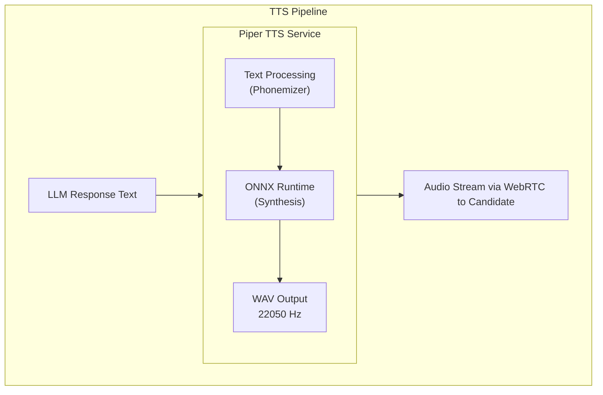

# ADR-015: Piper for Text-to-Speech

## Status
**Accepted**

## Date
2026-01-01

## Context

Talent Mesh requires text-to-speech (TTS) for:
- Converting AI interviewer responses to spoken audio
- Providing natural-sounding voice in assessments
- Maintaining low latency for conversational flow

Key requirements:
- **Latency**: < 200ms for response synthesis
- **Quality**: Natural sounding, MOS > 4.0
- **Cost**: Zero API costs (self-hosted)
- **Platform**: Contabo VPS x86_64 (ONNX runtime)

We need to choose a TTS technology.

## Decision

We will use **Piper TTS with en_US-lessac-medium voice**.

### Why Piper

| Factor | Piper | Coqui XTTS | Cloud APIs |
|--------|-------|------------|------------|
| Latency | < 200ms | ~200ms+ | Network + processing |
| Quality (MOS) | ~4.0 | ~4.5 | ~4.5 |
| Voice cloning | No | Yes | Some |
| Cost | Free | Free | $4-16/1M chars |
| RAM | ~200 MB | ~4 GB | N/A |
| x86_64 Support | ONNX ✓ | CPU/CUDA | N/A |

### Voice Selection

| Voice | Quality | Speed | Natural | Selected |
|-------|---------|-------|---------|----------|
| **en_US-lessac-medium** | Natural | Fast | Yes | **Yes** |
| en_US-amy-medium | Natural | Fast | Yes | Backup |
| en_GB-alan-medium | British | Fast | Yes | Optional |

Voice samples: https://rhasspy.github.io/piper-samples/

### Configuration

```yaml
model: en_US-lessac-medium
speaker_id: 0
length_scale: 1.0      # Speed (1.0 = normal)
noise_scale: 0.667     # Variation
noise_w: 0.8           # Phoneme duration noise
sentence_silence: 0.2  # Pause between sentences
```

## Architecture



## Consequences

### Positive
- **Zero cost**: No API charges, runs locally
- **Low latency**: 50-200ms synthesis time
- **Natural quality**: MOS ~4.0, professional sounding
- **Lightweight**: Only ~200 MB RAM
- **Cross-platform**: ONNX runs on any platform
- **Multiple voices**: Can change voice per use case

### Negative
- **No voice cloning**: Cannot match specific voice
- **English-focused**: Best quality in English
- **Limited expressiveness**: No emotion control
- **Model selection**: Must choose voice upfront

### Mitigations
- Selected high-quality lessac voice
- Backup voices available (amy, alan)
- Can switch to Coqui XTTS if cloning needed
- Pre-test voice with candidate feedback

## Performance Targets

| Metric | Target | Actual |
|--------|--------|--------|
| Latency | < 200ms | 50-200ms |
| Audio quality (MOS) | > 4.0 | ~4.0 |
| Pronunciation accuracy | > 99% | ~99% |
| Memory usage | < 500 MB | ~200 MB |

## Technical Terms Pronunciation

Piper handles most technical terms well. For edge cases, we can use:
- Phoneme hints in text
- Custom lexicon (future enhancement)

```python
# Example: Kubernetes pronunciation
text = "Let's discuss K8s and Docker."
# Piper handles this correctly
```

## Installation

```bash
# Python installation
pip install piper-tts

# Download voice model
piper --model en_US-lessac-medium --download-dir ./models

# Verify installation
echo "Hello, this is a test." | piper --model ./models/en_US-lessac-medium.onnx --output_file test.wav
```

## API Usage

```python
from piper import PiperVoice

voice = PiperVoice.load("./models/en_US-lessac-medium.onnx")

def synthesize(text: str) -> bytes:
    audio = voice.synthesize(text)
    return audio  # WAV bytes
```

## Alternatives Considered

### Coqui XTTS
- **Pros**: Higher quality, voice cloning
- **Cons**: 4 GB RAM, higher resource usage
- **Deferred**: May use for premium tier with cloned voices

### Chatterbox
- **Pros**: Excellent quality, zero-shot cloning
- **Cons**: 1 GB RAM, newer/less tested
- **Deferred**: Consider for future voice cloning feature

### Kokoro TTS
- **Pros**: Great quality, fast
- **Cons**: Less documentation, newer
- **Alternative**: Good backup option

### Amazon Polly
- **Pros**: High quality, SSML support
- **Cons**: $4/1M chars, API dependency
- **Rejected**: Cost constraint

### Google Cloud TTS
- **Pros**: WaveNet quality, many voices
- **Cons**: $4-16/1M chars, API dependency
- **Rejected**: Cost constraint

### ElevenLabs
- **Pros**: Best quality, voice cloning
- **Cons**: $5-330/month, API dependency
- **Rejected**: Cost and vendor lock-in

## Future Enhancements

1. **Voice cloning**: Add Coqui XTTS for premium tier
2. **Emotion control**: Investigate expressive TTS options
3. **Multiple languages**: Add non-English voices
4. **Custom lexicon**: Technical term pronunciation tuning

## References

- [AI_ML_SPECIFICATIONS.md](../06-technical-specs/AI_ML_SPECIFICATIONS.md)
- [TECH_STACK.md](../06-technical-specs/TECH_STACK.md)
- [Piper GitHub](https://github.com/rhasspy/piper)
- [Piper Voice Samples](https://rhasspy.github.io/piper-samples/)
