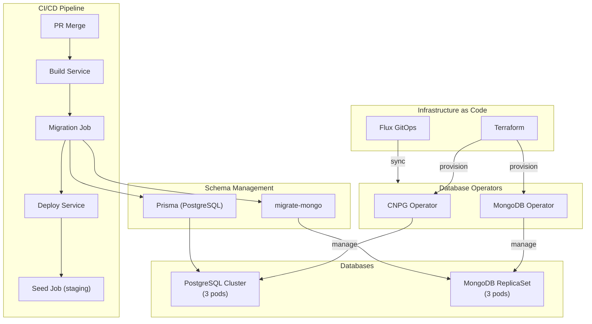
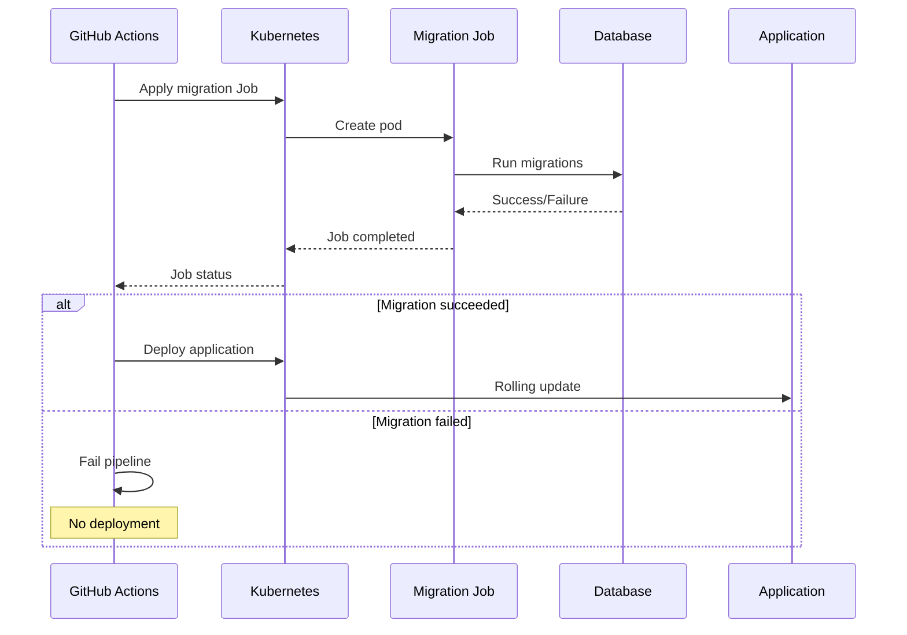
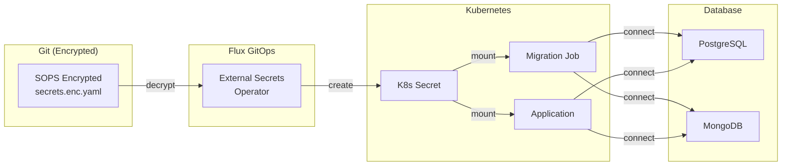
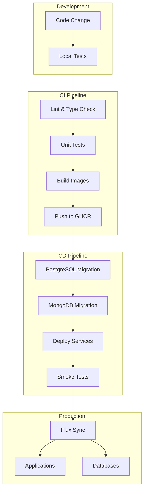

# ADR-033: Database CI/CD and Schema Migrations

## Status
**Accepted**

## Date
2026-01-08

## Context

Talent Mesh requires 100% Infrastructure as Code (IaC), including databases. We need to answer:

1. **How are databases provisioned?** - Via operators or manual?
2. **How are schema changes applied?** - Migrations in CI/CD?
3. **How do we rollback?** - Failed migration recovery?
4. **How is seed data managed?** - Test data for staging?
5. **How are credentials managed?** - Secrets for migrations?

Current state:
- CNPG operator provisions PostgreSQL
- MongoDB Community Operator provisions MongoDB
- No documented migration strategy
- No seed data management

## Decision

### Database Lifecycle Overview



### 1. Database Provisioning (100% IaC)

**PostgreSQL via CNPG Operator:**

```yaml
# k8s/databases/postgresql-cluster.yaml
apiVersion: postgresql.cnpg.io/v1
kind: Cluster
metadata:
  name: postgresql
  namespace: databases
spec:
  instances: 3
  primaryUpdateStrategy: unsupervised

  postgresql:
    parameters:
      max_connections: "200"
      shared_buffers: "256MB"

  storage:
    size: 50Gi
    storageClass: local-path

  resources:
    requests:
      memory: "512Mi"
      cpu: "200m"
    limits:
      memory: "2Gi"
      cpu: "1000m"

  bootstrap:
    initdb:
      database: talent_mesh
      owner: app
      secret:
        name: postgresql-app-credentials

  backup:
    barmanObjectStore:
      destinationPath: s3://talent-mesh-backups/postgresql
      endpointURL: https://r2.cloudflarestorage.com
      s3Credentials:
        accessKeyId:
          name: r2-credentials
          key: access-key-id
        secretAccessKey:
          name: r2-credentials
          key: secret-access-key
    retentionPolicy: "7d"
```

**MongoDB via Community Operator:**

```yaml
# k8s/databases/mongodb-cluster.yaml
apiVersion: mongodbcommunity.mongodb.com/v1
kind: MongoDBCommunity
metadata:
  name: mongodb
  namespace: databases
spec:
  members: 3
  type: ReplicaSet
  version: "7.0.5"

  security:
    authentication:
      modes: ["SCRAM"]

  users:
    - name: app
      db: admin
      passwordSecretRef:
        name: mongodb-app-credentials
      roles:
        - name: readWrite
          db: talent_mesh
        - name: clusterAdmin
          db: admin

  statefulSet:
    spec:
      template:
        spec:
          containers:
            - name: mongod
              resources:
                requests:
                  memory: "512Mi"
                  cpu: "200m"
                limits:
                  memory: "2Gi"
                  cpu: "1000m"
```

### 2. Schema Migrations

**Strategy: Pre-Deploy Migration Jobs**

Migrations run as Kubernetes Jobs BEFORE service deployment.



**PostgreSQL Migrations (Prisma):**

```yaml
# k8s/jobs/migrate-postgresql.yaml
apiVersion: batch/v1
kind: Job
metadata:
  name: migrate-postgresql-${COMMIT_SHA}
  namespace: platform-services
spec:
  backoffLimit: 3
  ttlSecondsAfterFinished: 3600
  template:
    spec:
      restartPolicy: Never
      initContainers:
        - name: wait-for-db
          image: busybox
          command:
            - sh
            - -c
            - |
              until nc -z postgresql-rw.databases 5432; do
                echo "Waiting for PostgreSQL..."
                sleep 2
              done
      containers:
        - name: migrate
          image: ghcr.io/talent-mesh/auth-service:${IMAGE_TAG}
          command:
            - npx
            - prisma
            - migrate
            - deploy
          env:
            - name: DATABASE_URL
              valueFrom:
                secretKeyRef:
                  name: postgresql-app-credentials
                  key: uri
```

**MongoDB Migrations (migrate-mongo):**

```yaml
# k8s/jobs/migrate-mongodb.yaml
apiVersion: batch/v1
kind: Job
metadata:
  name: migrate-mongodb-${COMMIT_SHA}
  namespace: platform-services
spec:
  backoffLimit: 3
  ttlSecondsAfterFinished: 3600
  template:
    spec:
      restartPolicy: Never
      initContainers:
        - name: wait-for-db
          image: busybox
          command:
            - sh
            - -c
            - |
              until nc -z mongodb-svc.databases 27017; do
                echo "Waiting for MongoDB..."
                sleep 2
              done
      containers:
        - name: migrate
          image: ghcr.io/talent-mesh/user-service:${IMAGE_TAG}
          command:
            - npx
            - migrate-mongo
            - up
          env:
            - name: MONGODB_URI
              valueFrom:
                secretKeyRef:
                  name: mongodb-app-credentials
                  key: uri
```

**Migration File Structure:**

```
services/
├── auth-service/
│   └── prisma/
│       ├── schema.prisma
│       └── migrations/
│           ├── 20260101_init/
│           │   └── migration.sql
│           ├── 20260108_add_linkedin_fields/
│           │   └── migration.sql
│           └── migration_lock.toml
│
├── user-service/
│   └── migrations/
│       ├── 20260101000000-init.js
│       ├── 20260108000000-add-verified-fields.js
│       └── migrate-mongo-config.js
```

### 3. CI/CD Pipeline

**GitHub Actions Workflow:**

```yaml
# .github/workflows/deploy.yaml
name: Deploy

on:
  push:
    branches: [main]

jobs:
  build:
    runs-on: ubuntu-latest
    outputs:
      image_tag: ${{ steps.meta.outputs.tags }}
    steps:
      - uses: actions/checkout@v4

      - name: Build and push images
        # ... build steps

  migrate:
    needs: build
    runs-on: ubuntu-latest
    steps:
      - uses: actions/checkout@v4

      - name: Setup kubectl
        uses: azure/setup-kubectl@v3

      - name: Configure kubeconfig
        run: |
          mkdir -p ~/.kube
          echo "${{ secrets.KUBECONFIG }}" | base64 -d > ~/.kube/config

      - name: Run PostgreSQL migrations
        run: |
          envsubst < k8s/jobs/migrate-postgresql.yaml | kubectl apply -f -
          kubectl wait --for=condition=complete \
            --timeout=300s \
            job/migrate-postgresql-${{ github.sha }}

      - name: Run MongoDB migrations
        run: |
          envsubst < k8s/jobs/migrate-mongodb.yaml | kubectl apply -f -
          kubectl wait --for=condition=complete \
            --timeout=300s \
            job/migrate-mongodb-${{ github.sha }}

  deploy:
    needs: [build, migrate]
    runs-on: ubuntu-latest
    steps:
      - name: Deploy via Flux
        run: |
          # Trigger Flux reconciliation
          flux reconcile kustomization apps --with-source
```

### 4. Rollback Procedures

**Migration Rollback Strategy:**

| Scenario | Action | Risk |
|----------|--------|------|
| Migration failed (not applied) | Fix and re-run | Low |
| Migration succeeded, app broken | Deploy previous version | Low |
| Data migration corrupted data | Restore from backup | High |
| Breaking schema change | Manual rollback migration | Medium |

**PostgreSQL Rollback:**

```bash
# Option 1: Revert to previous migration
npx prisma migrate resolve --rolled-back 20260108_add_linkedin_fields

# Option 2: Point-in-time recovery (PITR)
# CNPG supports PITR via barman
kubectl cnpg recovery postgresql \
  --backup-name daily-backup-20260107 \
  --target-time "2026-01-07T23:59:59Z"
```

**MongoDB Rollback:**

```bash
# Option 1: Run down migration
npx migrate-mongo down

# Option 2: Restore from backup
mongorestore --uri="$MONGODB_URI" /backups/20260107/
```

**Safe Migration Practices:**

```prisma
// GOOD: Additive change (safe)
model User {
  id        String   @id
  email     String
  linkedinId String? // New nullable field - safe
}

// BAD: Destructive change (dangerous)
model User {
  id        String   @id
  // email removed - DATA LOSS
}
```

**Multi-Step Migration for Breaking Changes:**

```
Step 1: Add new column (nullable)
Step 2: Deploy app that writes to both columns
Step 3: Backfill data
Step 4: Deploy app that reads from new column
Step 5: Remove old column
```

### 5. Seed Data Management

**Seed Data Strategy:**

| Environment | Seed Data | Purpose |
|-------------|-----------|---------|
| Development | Full test data | Local development |
| Staging | Anonymized production subset | Integration testing |
| Production | None (or reference data only) | Clean slate |

**Seed Job (Staging Only):**

```yaml
# k8s/jobs/seed-staging.yaml
apiVersion: batch/v1
kind: Job
metadata:
  name: seed-staging
  namespace: platform-services
spec:
  template:
    spec:
      restartPolicy: Never
      containers:
        - name: seed
          image: ghcr.io/talent-mesh/seed-runner:latest
          command:
            - npm
            - run
            - seed:staging
          env:
            - name: DATABASE_URL
              valueFrom:
                secretKeyRef:
                  name: postgresql-app-credentials
                  key: uri
            - name: MONGODB_URI
              valueFrom:
                secretKeyRef:
                  name: mongodb-app-credentials
                  key: uri
```

**Seed Script:**

```typescript
// scripts/seed.ts
async function seedStaging() {
  // Create test organization
  await prisma.organization.upsert({
    where: { id: 'test-org-1' },
    create: {
      id: 'test-org-1',
      name: 'Talent Mesh (Test)',
    },
    update: {},
  });

  // Create test users (anonymized)
  for (let i = 0; i < 100; i++) {
    await prisma.user.create({
      data: {
        email: `test-user-${i}@example.com`,
        linkedinId: `test-linkedin-${i}`,
        role: i === 0 ? 'ADMIN' : 'CANDIDATE',
      },
    });
  }

  // Create test assessments
  // ...
}
```

### 6. Credentials Management

**Secret Flow:**



**Credentials Secret:**

```yaml
# k8s/secrets/database-credentials.enc.yaml (SOPS encrypted)
apiVersion: v1
kind: Secret
metadata:
  name: postgresql-app-credentials
  namespace: databases
type: Opaque
stringData:
  uri: ENC[AES256_GCM,data:...,type:str]
  username: ENC[AES256_GCM,data:...,type:str]
  password: ENC[AES256_GCM,data:...,type:str]
---
apiVersion: v1
kind: Secret
metadata:
  name: mongodb-app-credentials
  namespace: databases
type: Opaque
stringData:
  uri: ENC[AES256_GCM,data:...,type:str]
```

### Complete CI/CD Flow



## Consequences

### Positive

1. **100% IaC** - Databases provisioned via operators and GitOps
2. **Safe migrations** - Pre-deploy jobs prevent broken deployments
3. **Rollback capability** - Multiple recovery options
4. **Consistent environments** - Same process for all environments
5. **Audit trail** - All changes in Git history

### Negative

1. **Pipeline complexity** - Additional migration steps
2. **Longer deployments** - Migrations add time
3. **Migration failures** - Can block deployments

### Neutral

1. **Operators manage HA** - Not manual configuration
2. **PITR via operators** - Built-in recovery

## Implementation Checklist

- [ ] Configure CNPG Cluster resource
- [ ] Configure MongoDB Community resource
- [ ] Set up Prisma migrations for PostgreSQL
- [ ] Set up migrate-mongo for MongoDB
- [ ] Create migration Job templates
- [ ] Update CI/CD workflow with migration steps
- [ ] Create seed scripts for staging
- [ ] Document rollback procedures
- [ ] Test PITR recovery
- [ ] Set up migration monitoring/alerting

## Related ADRs

- [ADR-021: Database Operators - CNPG + MongoDB](/docs/09-adrs/ADR-021-DATABASE-OPERATORS-CNPG-MONGODB.md)
- [ADR-023: Backup Strategy - Cloudflare R2](/docs/09-adrs/ADR-023-BACKUP-CLOUDFLARE-R2.md)
- [ADR-013: Secrets - SOPS + ESO](/docs/09-adrs/ADR-013-SECRETS-SOPS-ESO.md)
- [ADR-016: Flux GitOps](/docs/09-adrs/ADR-016-FLUX-GITOPS.md)

## References

- [Prisma Migrations](https://www.prisma.io/docs/concepts/components/prisma-migrate)
- [migrate-mongo](https://github.com/seppevs/migrate-mongo)
- [CNPG Recovery](https://cloudnative-pg.io/documentation/current/recovery/)
- [MongoDB Community Operator](https://github.com/mongodb/mongodb-kubernetes-operator)
