# Talent Mesh System Architecture Overview

## Document Purpose

This document provides a high-level view of the Talent Mesh system architecture using C4 model diagrams and architectural principles.

---

## Architectural Vision

Talent Mesh is designed as a **cloud-native microservices platform** optimized for:

1. **Vibe Coding Compatibility** - Each service small enough for AI-assisted development
2. **Platform-Managed Infrastructure** - Hosted on OpenOva Platform
3. **Cost Efficiency** - Zero development cost via LLM Gateway
4. **Polyglot Flexibility** - TypeScript for platform, Rust for performance-critical services

---

## C4 Model Diagrams

### Level 1: System Context

Shows Talent Mesh and its interactions with external systems and users.

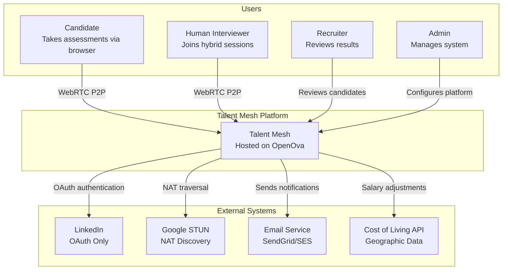

**Context Description:**

| Actor/System | Description | Interaction |
|--------------|-------------|-------------|
| Candidate | Job seeker taking assessments | Assessment Portal UI (WebRTC) |
| Recruiter | Hiring professional reviewing results | Web app, APIs |
| Admin | Platform administrator | Admin dashboard |
| Human Interviewer | Joins hybrid AI+Human sessions | WebRTC P2P mesh |
| LinkedIn | Professional network | OAuth 2.0 (authentication only) |
| Google STUN | NAT discovery service | STUN protocol (free) |
| LLM Gateway | Large Language Model | OpenOva platform service |
| Email Service | Transactional email | SMTP/API |
| MinIO | Object storage | S3-compatible API (OpenOva service) |
| Cost of Living API | Geographic salary data | REST API (Numbeo/Expatistan) |

---

### Level 2: Container Diagram

Shows the high-level technology choices and containers within Talent Mesh.

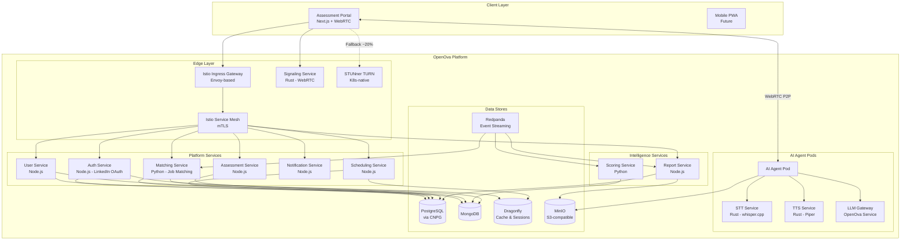

**Container Descriptions:**

| Container | Technology | Responsibility | Scale Strategy |
|-----------|------------|----------------|----------------|
| Assessment Portal | Next.js 14 + WebRTC | User interface, media capture | CDN, static assets |
| Istio Ingress Gateway | Envoy-based | HTTP/WebSocket routing, TLS, rate limiting | Platform-managed |
| Istio Service Mesh | Ambient Mode (ztunnel) | mTLS, traffic management | Sidecar-less |
| Signaling Service | Rust | WebRTC offer/answer exchange | Platform-managed |
| STUNner TURN | Go (K8s-native) | NAT traversal fallback (~20%) | Platform-managed |
| Auth Service | Node.js | LinkedIn OAuth, authorization | HPA |
| User Service | Node.js | User profiles, CV analysis | HPA |
| Assessment Service | Node.js | Assessment configuration | HPA |
| Scheduling Service | Node.js | Slot management, booking | HPA |
| Notification Service | Node.js | Email, webhooks | HPA |
| Matching Service | Python | Candidate-job matching, CoL data | HPA |
| AI Agent Pod | Container | WebRTC receiver, AI pipeline | Platform-managed |
| STT Service | Rust (whisper.cpp) | Speech-to-text | In AI Agent Pod |
| TTS Service | Rust (Piper) | Text-to-speech | In AI Agent Pod |
| LLM Gateway | Python | LLM session pool | OpenOva service |
| Scoring Service | Python | Assessment scoring | HPA |
| Report Service | Node.js | Report generation | HPA |

---

## Platform Architecture

### Overview

Talent Mesh runs on the **OpenOva Platform** with DNS-based failover:
- **Candidates** connect via WebRTC P2P directly to **AI Agent Pods**
- **Human Interviewers** can join sessions for hybrid AI+Human interviews (up to 5 participants)
- **All AI processing** (STT, TTS, LLM) runs in platform-managed pods
- **Infrastructure managed by OpenOva** - See [OpenOva Handbook](https://github.com/openova-io/handbook)

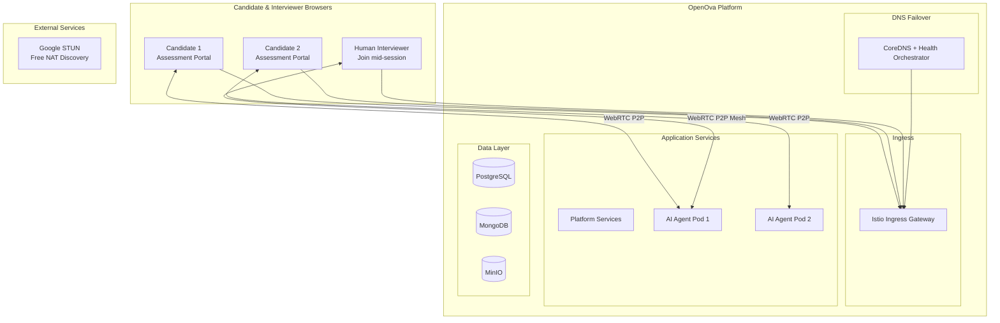

### WebRTC P2P Architecture (Up to 5 Participants)

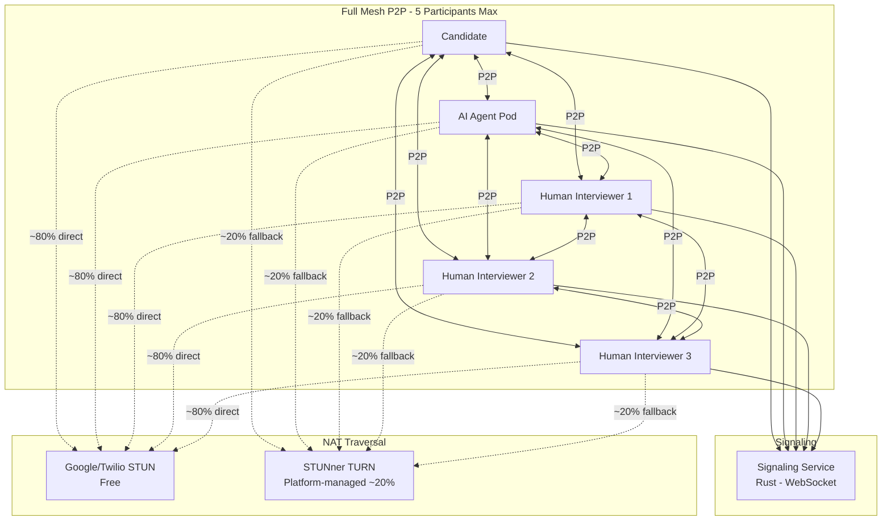

**Hybrid Interview Modes:**

| Mode | Participants | Use Case |
|------|-------------|----------|
| AI-Only | Candidate + AI Agent | Standard screening |
| Hybrid | Candidate + AI + 1-3 Humans | Final round interviews |
| Human-Only | Candidate + 1-4 Humans | Traditional interviews |

**Security Measures:**

1. **Cilium CNI + eBPF** - Network isolation (Platform-managed)
2. **Istio mTLS** - Service-to-service encryption (Ambient Mode)
3. **WebRTC DTLS-SRTP** - Encrypted media streams
4. **MinIO IAM** - S3-compatible access policies
5. **Audit Trail** - All interactions logged via Redpanda events

---

### Level 3: Component Diagram - AI Agent Pod

Detailed view of the AI Agent Pod running on the platform.

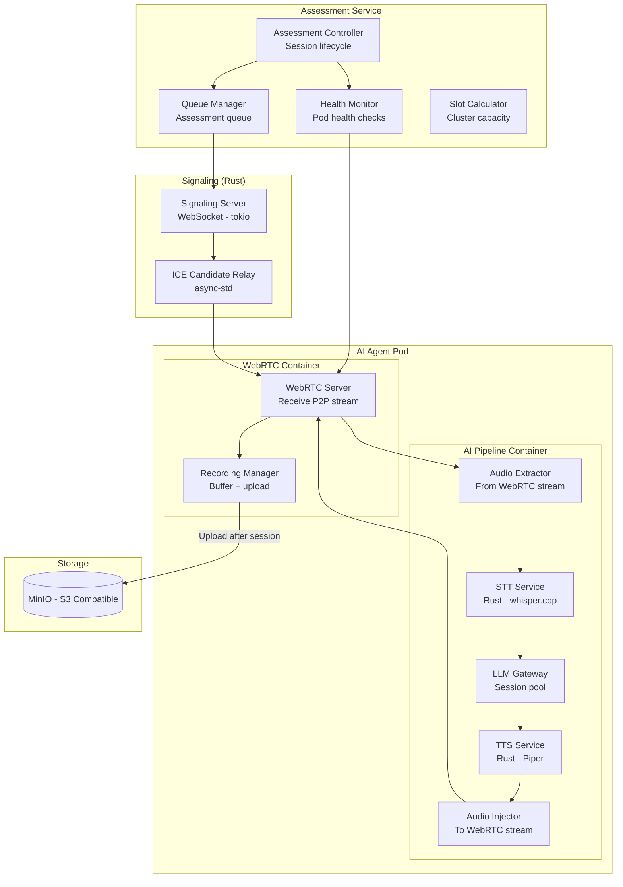

**Component Descriptions:**

| Component | Location | Responsibility | Key Interfaces |
|-----------|----------|----------------|----------------|
| Assessment Controller | Platform | Session lifecycle, pod assignment | REST API, Redpanda |
| Queue Manager | Platform | Manage assessment queue, assignment | Dragonfly Streams |
| Health Monitor | Platform | Pod health via probes | Liveness/readiness |
| Slot Calculator | Platform | Calculate available slots from capacity | REST API |
| Signaling Server | Platform | WebRTC offer/answer exchange (Rust) | WebSocket |
| ICE Candidate Relay | Platform | Exchange ICE candidates for NAT traversal | WebSocket |
| WebRTC Server | AI Pod | Receive P2P media from candidate | WebRTC |
| Recording Manager | AI Pod | Buffer, upload to MinIO | S3-compatible API |
| Audio Extractor | AI Pod | Extract audio from WebRTC stream | Internal |
| STT Service | AI Pod | Rust wrapper around whisper.cpp | gRPC |
| LLM Gateway | AI Pod | Manage LLM sessions | Internal |
| TTS Service | AI Pod | Rust wrapper around Piper | gRPC |
| Audio Injector | AI Pod | Send TTS audio back to candidate | WebRTC |

---

### Level 3: Component Diagram - Platform Services

Detailed view of core platform services.

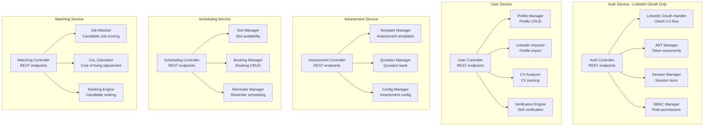

---

## Matching Service Architecture

The Matching Service provides intelligent candidate-job matching with cost-of-living adjustments.

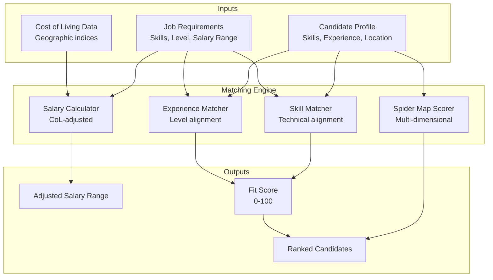

**Matching Criteria:**

| Dimension | Weight | Data Source |
|-----------|--------|-------------|
| Technical Skills | 30% | Assessment spider map |
| Problem Solving | 20% | Assessment spider map |
| Communication | 15% | Assessment spider map |
| Experience Level | 15% | LinkedIn profile |
| Salary Fit | 10% | CoL-adjusted calculation |
| Availability | 10% | Scheduling data |

---

## Technology Stack Overview

### Language Distribution

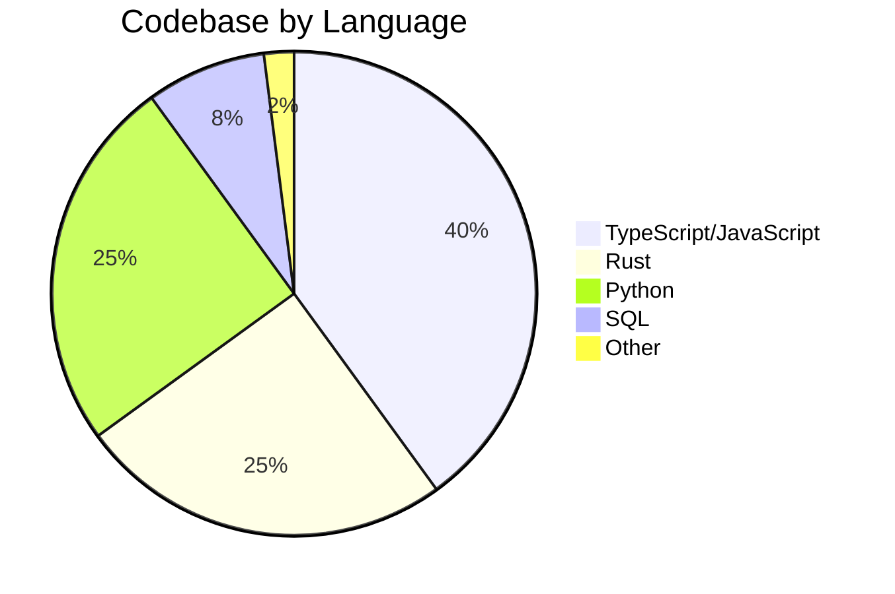

### Technology Rationale

| Layer | Choice | Rationale |
|-------|--------|-----------|
| Frontend | Next.js 14 + WebRTC | SSR, React ecosystem, native media APIs |
| API Gateway | Istio/Envoy | Service mesh, mTLS, observability |
| Platform Services | Node.js | TypeScript, async I/O, npm ecosystem |
| Signaling | **Rust (tokio)** | Performance-critical, low latency WebSocket |
| NAT Traversal | **STUNner** | K8s-native TURN, platform-managed |
| STT Service | **Rust (whisper.cpp)** | x86_64 optimized, low latency |
| TTS Service | **Rust (Piper)** | x86_64 optimized, low latency |
| LLM Gateway | Python | Session pooling (OpenOva service) |
| Orchestration | **Kubernetes** | Platform-managed |
| Networking | **Cilium CNI** | eBPF-based networking |
| Primary DB | PostgreSQL | ACID, CNPG operator |
| Document DB | MongoDB | Flexible schemas |
| Cache | Dragonfly | Redis-compatible, multi-threaded |
| Events | Redpanda | Kafka-compatible, event replay |
| Objects | **MinIO** | S3-compatible, platform-managed |

### Rust vs Python Decision Matrix

| Criterion | Signaling | STT | TTS | LLM Gateway |
|-----------|-----------|-----|-----|-------------|
| Latency Critical | Yes | Yes | Yes | No |
| CPU Intensive | No | Yes | Yes | No |
| x86_64 Optimization | Yes | Yes | Yes | No |
| Complex AI Libraries | No | No | No | Yes |
| **Choice** | **Rust** | **Rust** | **Rust** | **Python** |

---

## Architectural Principles

### 1. Vibe Coding Compatibility

Each microservice is designed to fit within AI assistant context windows:

| Constraint | Limit | Rationale |
|------------|-------|-----------|
| Lines of code | < 50k | Claude ~200k token context |
| Files per service | < 500 | Cognitive load |
| Dependencies | < 50 | Stability, security |
| Cyclomatic complexity | < 10/function | Understandability |

### 2. Domain-Driven Design

Services align with bounded contexts:

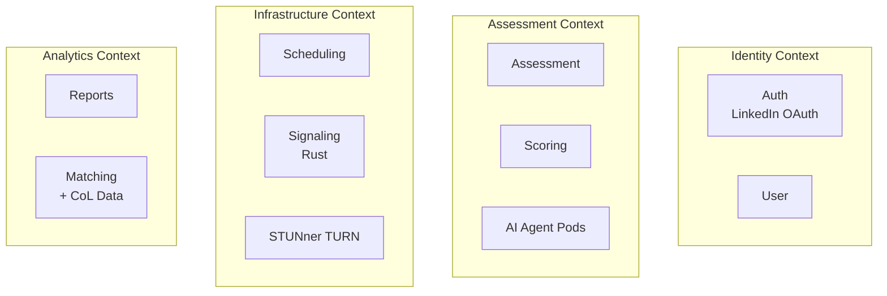

### 3. Event-Driven Architecture

Services communicate via events for loose coupling:

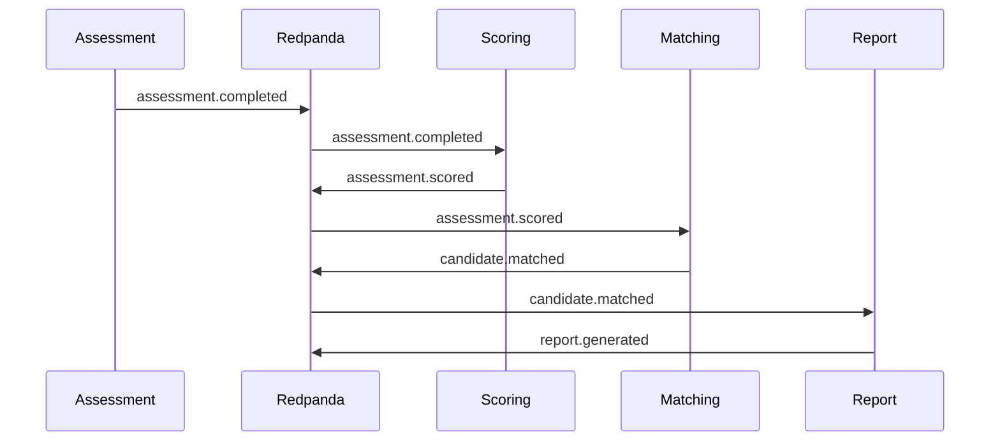

### 4. CAP Theorem Application

| System | CAP Choice | Justification |
|--------|------------|---------------|
| PostgreSQL | CP | Consistency for auth, booking |
| MongoDB | AP | Availability for profiles, results |
| Dragonfly | AP | Speed for cache, sessions (Redis-compatible) |
| Redpanda | AP | Event streaming (Kafka-compatible) |

### 5. Twelve-Factor App Compliance

| Factor | Implementation |
|--------|----------------|
| Codebase | Git monorepo with service folders |
| Dependencies | package.json / requirements.txt |
| Config | Environment variables |
| Backing services | Attached resources via URLs |
| Build, release, run | CI/CD pipeline stages |
| Processes | Stateless, share-nothing |
| Port binding | Self-contained HTTP servers |
| Concurrency | Process model, horizontal scaling |
| Disposability | Fast startup, graceful shutdown |
| Dev/prod parity | Docker Compose ~ Kubernetes |
| Logs | Stdout, collected by platform |
| Admin processes | Separate CLI tools |

---

## Cross-Cutting Concerns

### Security Architecture

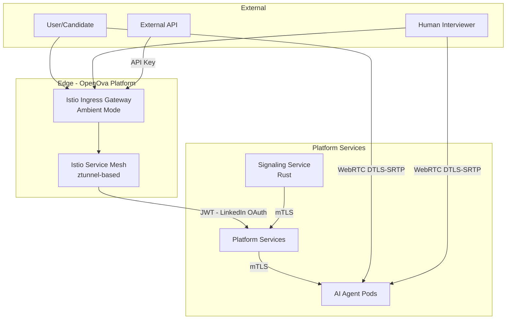

### Authentication Flow - LinkedIn Only

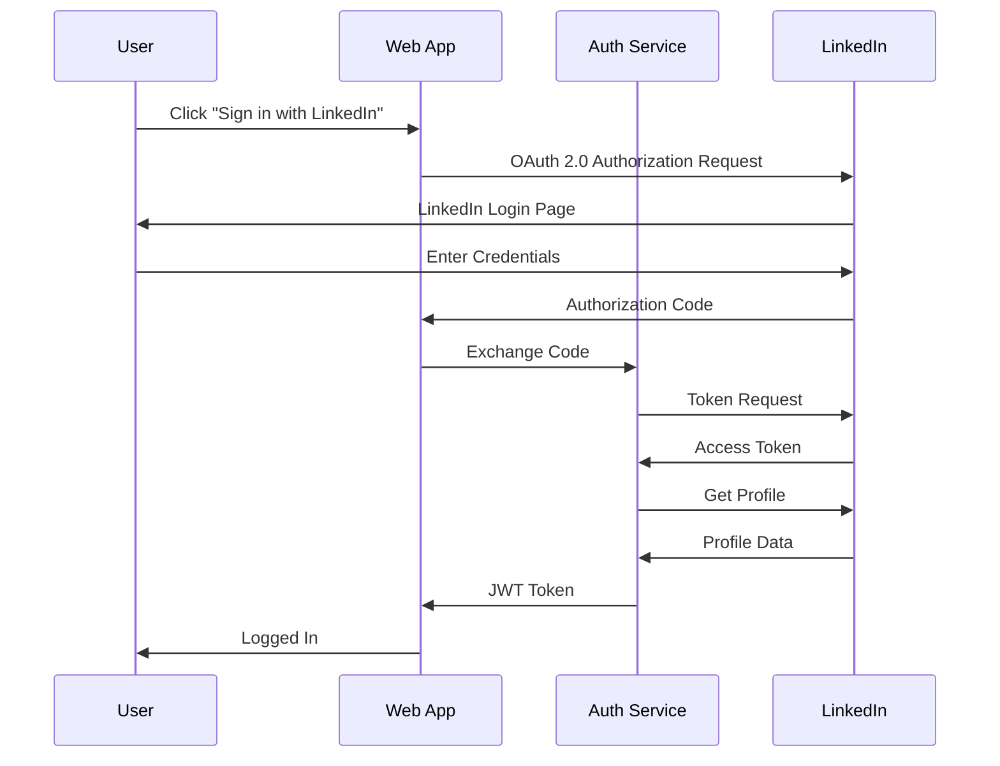

### Observability Stack

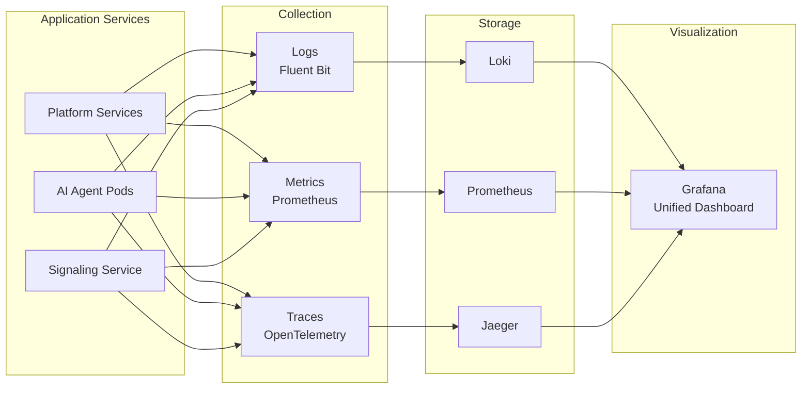

---

## Deployment Architecture

### Development Environment

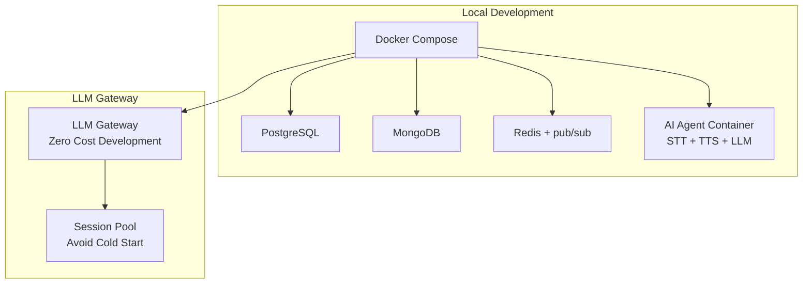

### Production Environment

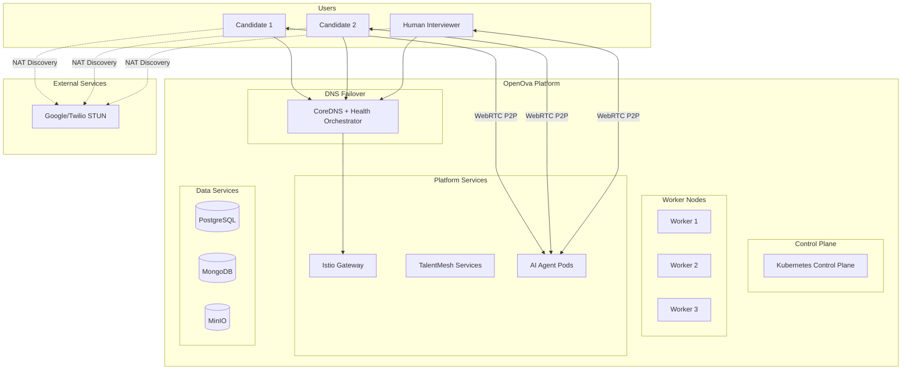

### AI Agent Pod Architecture

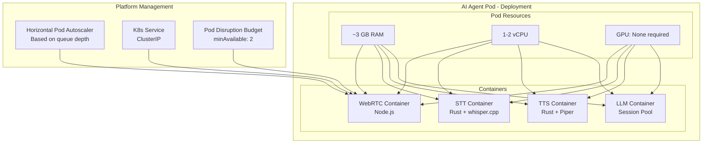

---

## LLM Gateway Architecture

Zero development cost through session pooling via OpenOva LLM Gateway:

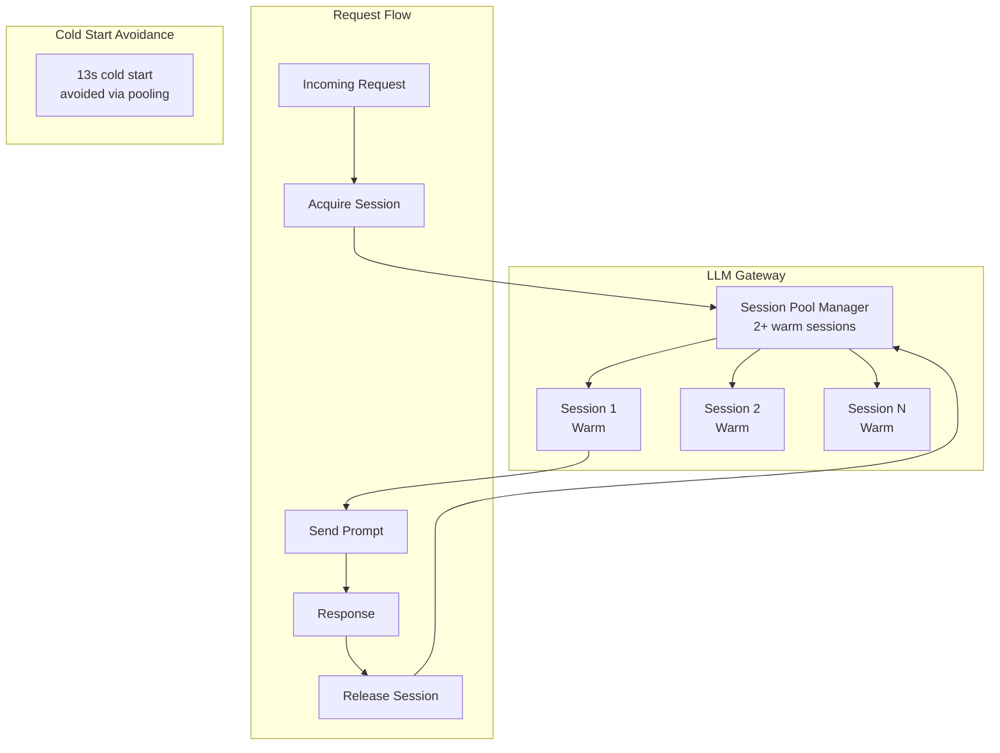

**Configuration:**

```python
# Environment-based backend switching
LLM_BACKEND=cli   # Development: Zero cost
LLM_BACKEND=api   # Production: Claude API

# Session pool configuration
POOL_SIZE=2                    # Warm sessions
SESSION_TIMEOUT=300            # 5 min idle timeout
MAX_REQUESTS_PER_SESSION=100   # Refresh threshold
```

For full LLM Gateway specification, see [OpenOva LLM Gateway](https://github.com/openova-io/handbook/blob/main/services/LLM_GATEWAY.md).

---

## Quality Attributes

| Attribute | Target | Measurement |
|-----------|--------|-------------|
| Availability | 99.5% | Uptime monitoring (Grafana) |
| Latency (API) | < 100ms P95 | Prometheus metrics |
| Latency (AI Response) | < 2.5s P95 | Custom OpenTelemetry metrics |
| Throughput | 6-8 concurrent assessments (MVP) | Pod metrics |
| Scalability | Platform-managed | Request via platform team |
| Maintainability | < 50k LOC/service | Static analysis |
| Security | OWASP Top 10 compliant | Security scanning |

---

## Platform Documentation

For infrastructure, deployment, and platform services documentation, see:

| Resource | Description |
|----------|-------------|
| [OpenOva Handbook](https://github.com/openova-io/handbook) | Platform documentation |
| [LLM Gateway](https://github.com/openova-io/handbook/blob/main/services/LLM_GATEWAY.md) | LLM service specification |
| [DNS Failover](https://github.com/openova-io/handbook/blob/main/technical/DNS_FAILOVER_SPEC.md) | High availability |
| [Deployment Architecture](https://github.com/openova-io/handbook/blob/main/architecture/DEPLOYMENT_ARCHITECTURE.md) | K8s deployment |

---

*Document Version: 5.0*
*Last Updated: 2026-01-12*
*Owner: Architecture Team*
