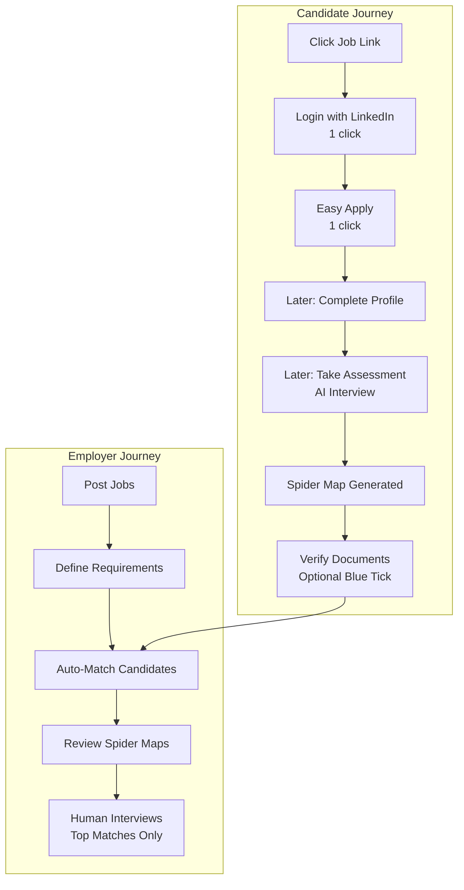
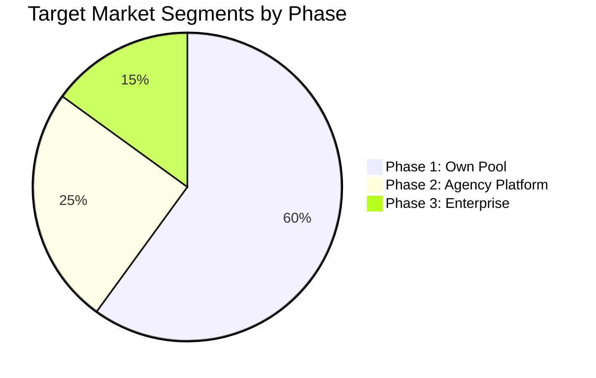
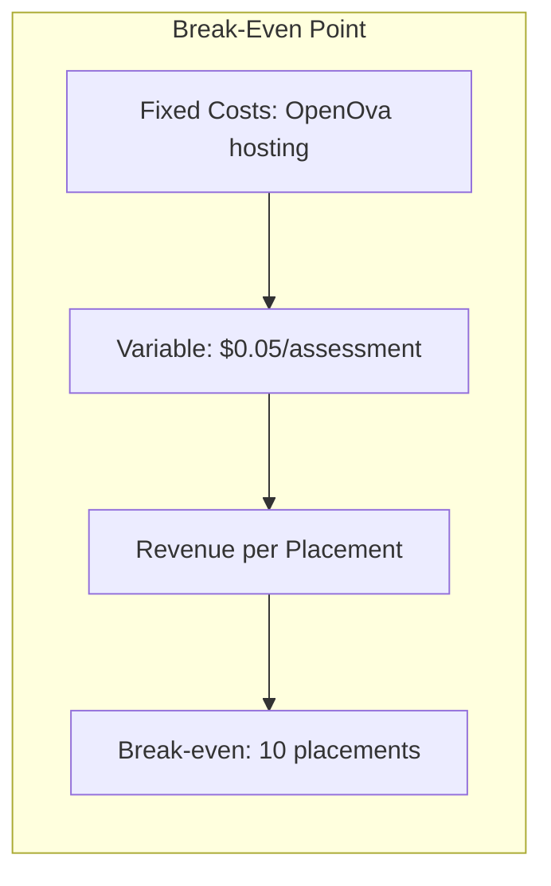
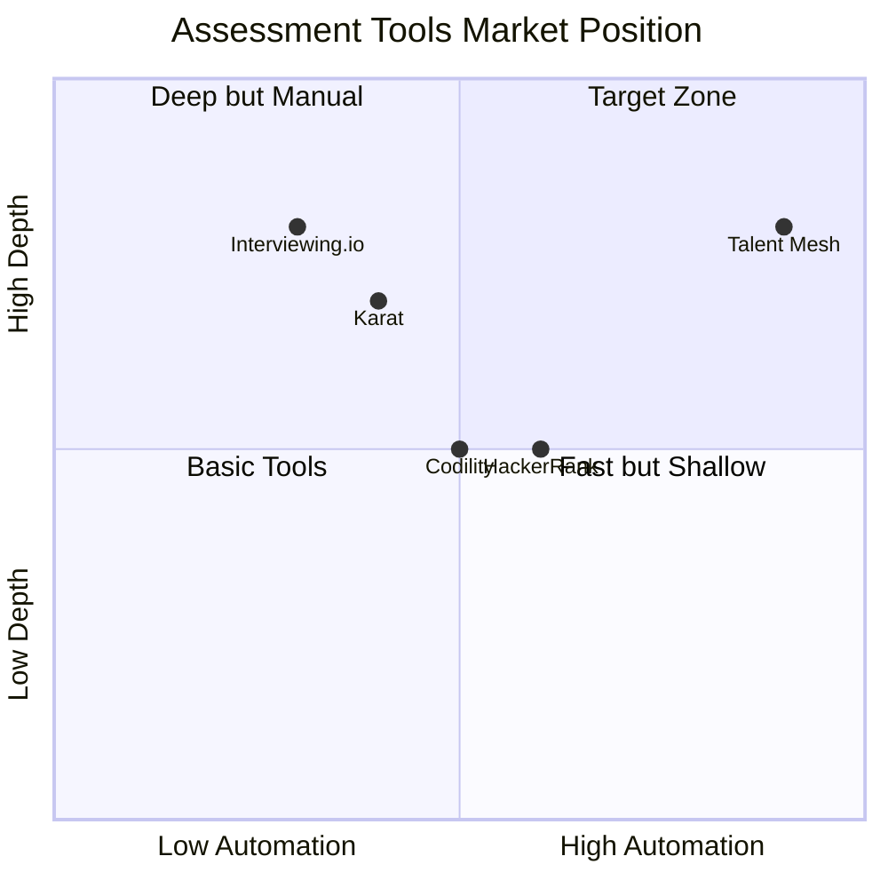

# Talent Mesh Business Case

## Executive Summary

Talent Mesh is an AI-powered multi-dimensional talent assessment platform that automates technical screening at scale. By leveraging Large Language Models (LLMs) for conducting live assessments via WebRTC, the platform reduces screening costs by 99.9% while improving candidate quality and experience.

**Primary Business Model:** Build our own candidate pool for recruitment services
**Secondary Model:** Platform for other agencies (future phase, white-label possible)

**Investment Required:** Low fixed infrastructure cost (hosted on OpenOva Platform)
**Break-even Point:** 10 successful placements
**Target Cost:** ~$0.05 per assessment in production (LLM API only)

---

## Problem Statement

### The Hiring Bottleneck

Modern tech hiring faces a fundamental scaling problem:

**Pain Points:**

| Problem | Impact | Current Solutions | Limitations |
|---------|--------|-------------------|-------------|
| Volume vs Quality | Miss good candidates, hire bad ones | Resume screening tools | Keyword matching, no skill verification |
| Inconsistent Evaluation | Bias, varying standards | Structured interviews | Still requires human time |
| Candidate Experience | Long wait times, ghosting | Automated emails | No real engagement |
| Cost per Screen | $50-200 per technical screen | Outsourced screening | Quality inconsistency |
| Interviewer Burnout | Top engineers doing screening | Interview rotations | Productivity loss |

### Market Pain Quantified

| Metric | Industry Average |
|--------|------------------|
| Time to fill technical role | 42 days |
| Cost per hire | $4,700 |
| Interview-to-offer ratio | 4:1 |
| Candidate drop-off rate | 60% |
| Interviewer hours per hire | 20+ hours |

---

## Solution: Talent Mesh

### Core Value Proposition

**"Assess once. Match everywhere. Hire with confidence."**

Talent Mesh provides:
1. **Independent Candidate Assessments** - Candidates assess themselves proactively
2. **Independent Job Postings** - Employers post jobs without managing candidates
3. **Auto-Matching** - System matches profiles to jobs based on multi-dimensional fit
4. **Verified Information** - "Blue tick" verification for salary, credentials, experience
5. **Net Benefit Calculation** - Considers cost-of-living, tax, work-life balance
6. **Easy Apply Flow** - Job links via LinkedIn/WhatsApp → minimal clicks to apply

### How It Works

### Key Differentiators

| Feature | Talent Mesh | Traditional | Outsourced |
|---------|-------------|-------------|------------|
| Cost per screen | $0.05 | $100-200 | $50-100 |
| Infrastructure cost | **Low fixed cost** (OpenOva) | $1000+/month | N/A |
| Availability | 24/7 | Business hours | Limited |
| Consistency | 100% | Variable | Variable |
| Scale | Unlimited | Limited by team | Moderate |
| Turnaround | Instant | Days | Hours |
| Multi-dimensional | Yes (spider map) | No | No |
| AI + Human Hybrid | Yes (up to 5 participants) | N/A | N/A |
| Candidate experience | Immediate, fair | Depends | Depends |
| Cost-of-living matching | Yes | No | No |
| Verified credentials | Yes (blue tick) | No | No |
| Assessment retakes | Yes (tracked) | N/A | N/A |

---

## Business Model

### Primary Model: Candidate Pool Building

Talent Mesh is first and foremost a recruitment company that uses AI to build and assess its own candidate pool.

**Revenue Sources:**
1. Placement fees from successful hires
2. Retained search services using assessed pool
3. Consulting on technical talent evaluation

### Secondary Model: Platform (Future Phase)

Once proven, the platform can be offered to other agencies:

| Model | Price Point | Target |
|-------|-------------|--------|
| Platform fee | 10-15% of placement | Staffing agencies |
| White-label license | Custom | Large enterprises |
| API access | Usage-based | ATS vendors |

**Important:** This is NOT the MVP focus. Platform monetization only after proving 10+ successful placements.

---

## Market Opportunity

### Total Addressable Market (TAM)

| Segment | Size | Notes |
|---------|------|-------|
| Global tech hiring market | $500B+ | Growing 15% YoY |
| Technical assessment tools | $3.2B | Growing 25% YoY |
| AI recruitment tools | $1.5B | Growing 35% YoY |

### Target Segments (Phased)

**Phase 1 (MVP):**
- Talent Mesh's own recruitment pool
- Generic technical assessments
- Prove the model works

**Phase 2:**
- Technical staffing agencies
- White-label platform offering

**Phase 3:**
- Enterprise recruitment teams
- Education/bootcamp certification

---

## Financial Analysis

### Cost Structure (Minimal Infrastructure Cost)

| Component | Cost | Notes |
|-----------|------|-------|
| OpenOva Platform Hosting | Low fixed cost | See [OpenOva SLA](https://github.com/openova-io/handbook) |
| Public STUN (Google/Twilio) | $0 | NAT discovery |
| LLM Gateway (development) | $0 | OpenOva platform service |
| LLM API (production) | ~$0.05/assessment | Only when at scale |
| TURN Server | $0 | OpenOva platform service (Stunner) |
| Speech-to-Text | $0 | Open source (whisper.cpp) |
| Text-to-Speech | $0 | Open source (Piper) |
| Object Storage | $0 | OpenOva platform service (MinIO) |
| Cost-of-living data | $0 | Numbeo/Expatistan free tiers |
| **Total Infrastructure** | **Low fixed cost** | Hosted on OpenOva |
| **Total per assessment** | **~$0.05** | LLM API only |

> **Note:** Infrastructure details (node counts, scaling) are managed by OpenOva Platform.
> See [OpenOva Deployment Architecture](https://github.com/openova-io/handbook/blob/main/architecture/DEPLOYMENT_ARCHITECTURE.md) for details.

### Break-Even Analysis

| Scenario | Assessments | Successful Placements | Revenue Model |
|----------|-------------|----------------------|---------------|
| MVP Validation | 100+ | 10 | Own recruitment fees |
| Growth | 1,000 | 50+ | Recruitment + Platform |
| Scale | 10,000 | 500+ | Full platform |

### ROI Comparison

**For a company doing 100 technical screens/month:**

| Approach | Monthly Cost | Time Investment |
|----------|--------------|-----------------|
| Internal (engineers) | $10,000+ | 200 engineer hours |
| Outsourced screening | $5,000+ | Management overhead |
| **Talent Mesh** | **$5** | Minimal |

**Savings: $5,000-10,000/month = $60,000-120,000/year**

---

## Competitive Analysis

### Market Landscape

### Competitive Comparison

| Feature | Talent Mesh | HackerRank | Codility | Karat |
|---------|-------------|------------|----------|-------|
| Live AI interviewer | Yes | No | No | Human |
| Voice conversation | Yes | No | No | Yes |
| Multi-dimensional | Yes | Limited | Limited | Limited |
| Cost per screen | $0.05 | $5-25 | $5-25 | $100+ |
| Infrastructure cost | **Low fixed cost** | SaaS fees | SaaS fees | N/A |
| 24/7 availability | Yes | Yes | Yes | Limited |
| Custom assessments | Yes | Template | Template | Yes |
| Spider map profiling | Yes | No | No | No |
| Auto job matching | Yes | No | No | No |
| Cost-of-living analysis | Yes | No | No | No |
| Verified credentials | Yes | No | No | No |
| Hybrid AI+Human | Yes | No | No | No |

### Competitive Moat

1. **Minimal Infrastructure Cost** - OpenOva Platform hosting vs competitors' cloud bills
2. **Multi-dimensional Assessment** - Unique spider map approach
3. **Intelligent Matching** - Cost-of-living, tax, career growth factors
4. **Verified Information** - Trust layer with blue tick verification
5. **Open Source Stack** - No vendor lock-in on core components
6. **Easy Apply Flow** - Maximum conversion from job links
7. **Hybrid Interviews** - AI + human interviewers in same session

---

## Risk Analysis

### Technical Risks

| Risk | Probability | Impact | Mitigation |
|------|-------------|--------|------------|
| WebRTC NAT traversal failure | Low | Medium | STUNner TURN server on K8s |
| LLM hallucinations | Low | Medium | Prompt engineering, human review |
| Audio quality issues | Medium | Medium | Noise cancellation, retry mechanisms |
| Latency spikes | Low | Medium | Local AI processing, buffer management |
| Provider issues | Low | Medium | IaC for fast migration to other providers |
| Browser compatibility | Low | Low | WebRTC widely supported |
| Node failure | Low | Medium | App-level replication, K8s rescheduling |

### Business Risks

| Risk | Probability | Impact | Mitigation |
|------|-------------|--------|------------|
| Market acceptance | Medium | High | Start with own pool, prove value first |
| Regulatory (AI hiring) | Medium | Medium | Bias testing, explainability, compliance |
| Competition from big players | Medium | Medium | Speed to market, niche focus |
| LinkedIn API restrictions | Medium | Medium | Basic data + manual profile completion |

### Mitigation Strategies

1. **Technical**: 100% IaC (Terraform) enables rapid migration to any cloud
2. **Regulatory**: GDPR/CCPA compliance built-in, bias auditing
3. **Market**: Prove with own recruitment first, then expand
4. **Financial**: Minimal fixed costs (OpenOva hosting), affordable MVP

---

## Implementation Strategy

### MVP Scope (Phase 1)

Target final architecture directly - NO rework approach.

**MVP Includes:**
- Talent Mesh as only organization
- LinkedIn-only authentication with Easy Apply
- Standard generic assessment catalog
- Multi-dimensional spider maps
- Candidate pool with verified info
- Hosted on OpenOva Platform
- AI + Human hybrid interview support
- WebRTC P2P (up to 5 participants)

**MVP Excludes (Added Later as Modules):**
- Multi-organization support
- Auto job matching (manual initially)
- Large-scale paid cloud infrastructure
- White-label platform

### Phase 2: Auto-Matching
- Candidate-job matching algorithm
- Cost-of-living integration (Numbeo/Expatistan)
- Tax implication estimates
- Career growth scoring

### Phase 3: Platform
- Multi-organization support
- Agency white-labeling
- Paid cloud scaling (Civo/Vultr)
- API for integrations

---

## Success Metrics

### Key Performance Indicators (KPIs)

| KPI | Target | Measurement |
|-----|--------|-------------|
| Assessment completion rate | >90% | Completed/Started |
| Candidate satisfaction | >4.0/5 | Post-assessment survey |
| Prediction accuracy | >80% | Correlation with human assessment |
| System uptime | >99% | Monitoring |
| Cost per assessment | <$0.10 | Claude API costs / assessments |
| Response latency | <2.5 seconds | P95 latency |
| Successful placements | 10+ | Hired candidates that succeed |
| Infrastructure cost | Low fixed | OpenOva Platform |

### Leading Indicators
- Daily active assessments
- Candidate NPS score
- Pass-through to human interview rate
- Spider map completeness
- Easy Apply conversion rate

### Lagging Indicators
- Placement success rate
- Revenue per placement
- Market share (future)
- Brand recognition

---

## Conclusion

Talent Mesh addresses a significant market pain point with a technically viable, cost-effective solution. The combination of:

- **Minimal infrastructure cost** via OpenOva Platform hosting
- **99% lower production cost** vs traditional screening
- **Multi-dimensional profiling** creating unique value
- **Intelligent matching** considering total compensation picture
- **Verified credentials** building trust
- **Easy Apply flow** maximizing candidate conversion
- **Hybrid AI+Human interviews** for final rounds

...positions Talent Mesh to first prove value through its own recruitment pool, then expand as a platform for the broader market.

**Recommendation:** Proceed with MVP development focused on Talent Mesh's own candidate pool, targeting 10 successful placements to validate the model.

---

*Document Version: 3.0*
*Last Updated: 2026-01-04*
*Owner: Product Team*
