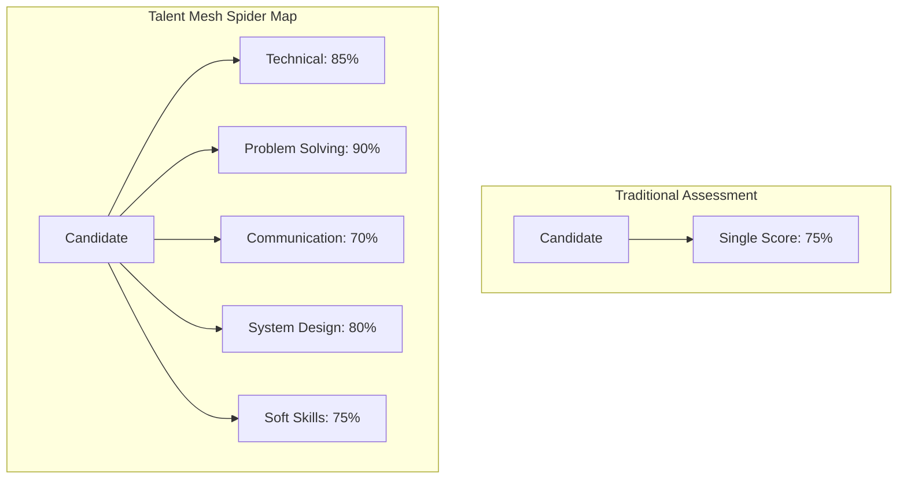
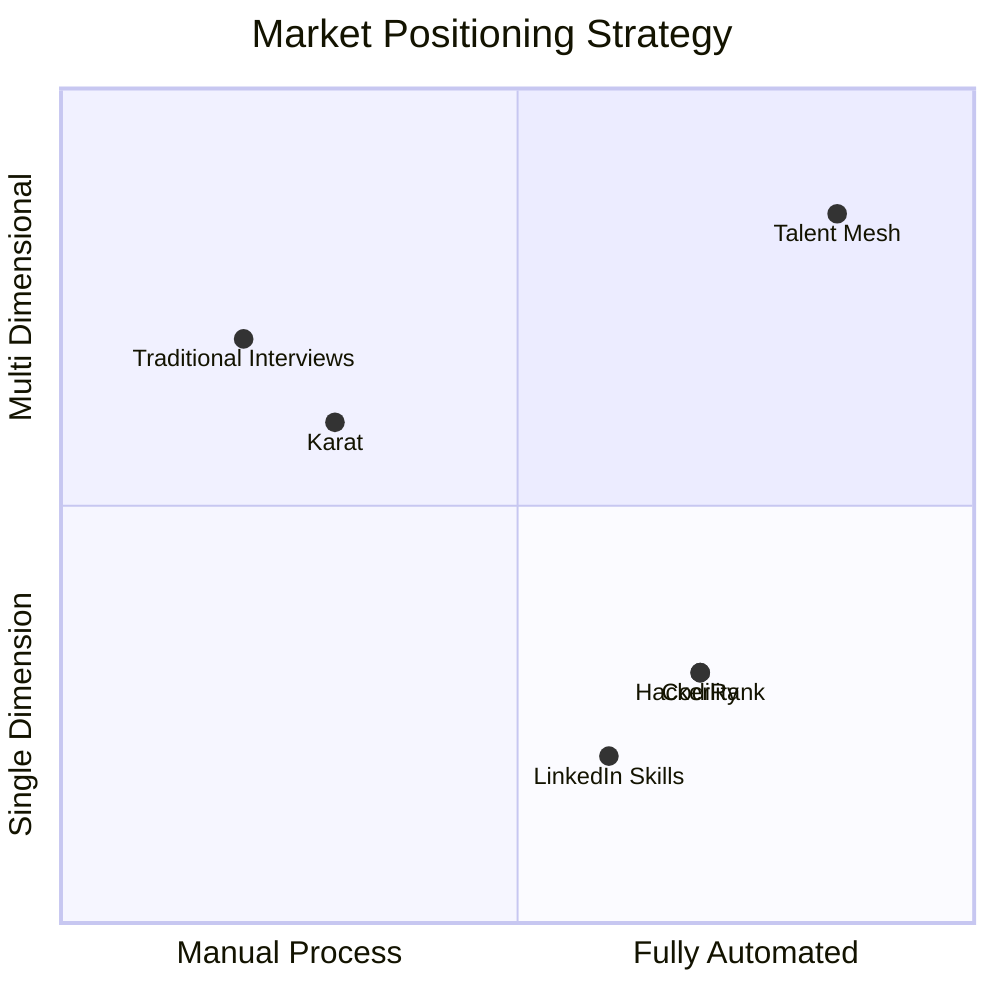

# Talent Mesh Product Vision

## Vision Statement

> **"Every candidate gets a fair, comprehensive assessment. Every job finds its perfect match."**

Talent Mesh envisions a world where hiring is objective, efficient, and candidate-centric. We're building an AI-powered assessment platform that understands candidates across multiple dimensions, creating a mesh of skills, experiences, and verified credentials that connects talent with opportunity.

---

## Mission

To democratize technical hiring by providing AI-powered assessments that are:
- **Fair** - Consistent evaluation for every candidate
- **Comprehensive** - Multi-dimensional skill profiling with verified credentials
- **Efficient** - Minimal infrastructure cost (~$15/month) via Contabo VPS
- **Candidate-Friendly** - Immediate, respectful, informative
- **Intelligent** - Matches considering total compensation picture

---

## Core Values

### 1. Fairness First
Every candidate receives the same quality assessment regardless of when they apply, their background, or their location. The AI doesn't have bad days, unconscious biases, or favorites.

### 2. Depth Over Speed
While we're fast, we prioritize thorough assessment. A 30-minute conversation reveals more than a 5-minute coding test.

### 3. Candidate Respect
Candidates are people, not tickets. They receive prompt assessments, clear expectations, and constructive feedback. Assessment history tracks growth, not just failures.

### 4. Transparency
Companies see how assessments are scored. Candidates understand what's being evaluated. Verified information builds trust.

### 5. Continuous Learning
The system improves with every assessment, learning what predicts success and refining its approach.

---

## Product Principles

### 1. Conversation Over Test
Traditional assessments feel like exams. Talent Mesh conducts conversations that reveal how candidates think, not just what they know.

### 2. Multi-Dimensional Over Single-Score
A single score hides nuance. Our spider map shows strengths and growth areas across multiple dimensions.

### 3. Right Match Over Top Score
A candidate scoring 70% might be perfect for Role A but wrong for Role B. We match multi-dimensional profiles to job requirements, considering:
- Skills alignment
- Cost-of-living differential
- Tax implications
- Work-life balance factors
- Career growth potential

### 4. Augment Humans, Don't Replace
AI handles volume screening. Humans make final decisions. The platform surfaces the best candidates for human evaluation.

### 5. Modular by Design
Every component is replaceable. Better STT engine? Swap it. Different LLM? Plug it in. New assessment type? Add it. Zero rework on existing modules.

### 6. Trust Through Verification
Verified credentials ("blue tick") for salary, education, experience build trust between candidates and employers.

---

## Business Model Clarity

### Primary Goal: Build Our Own Pool
Talent Mesh is first a recruitment company. We assess candidates for our own talent pool.

### Secondary Goal: Platform (Future)
Only after proving success with 10+ placements do we consider:
- Platform for other agencies
- White-label licensing
- API access for ATS integration

**Candidates are always free. We never charge job seekers.**

---

## Strategic Goals

### MVP Goals

| Goal | Success Criteria |
|------|------------------|
| Working platform | AI assessments via WebRTC Assessment Portal |
| Prove accuracy | >80% correlation with human assessment |
| Build initial pool | 100+ assessed candidates |
| Validate model | 10 successful placements |
| Minimal infrastructure cost | Contabo VPS (~$15/month) + Claude CLI |

### Post-MVP Goals

| Goal | Success Criteria |
|------|------------------|
| Auto-matching | Cost-of-living aware matching algorithm |
| Verified credentials | Blue tick system operational |
| Scale capacity | Add Contabo VPS nodes to K3s cluster |
| Multi-assessment | 5+ assessment types available |

### Future Goals

| Goal | Success Criteria |
|------|------------------|
| Platform mode | Multi-organization support |
| Enterprise readiness | SSO, audit logs, compliance |
| Integration ecosystem | ATS integrations |

---

## Target Users

### Primary Personas

#### 1. Candidate - "Alex Kim"
**Context:** Senior developer looking for next opportunity
**Behavior:**
- Takes assessments independently (not tied to specific job)
- Values transparent, fair evaluation
- Wants feedback regardless of outcome
**Success:** Complete spider map, verified credentials, matched to relevant opportunities

#### 2. Talent Mesh Recruiter - "Sarah Chen" (MVP)
**Context:** Internal recruiter building candidate pool
**Behavior:**
- Reviews spider maps and assessment recordings
- Matches candidates to client needs manually
- Uses verified information to build trust with clients
**Success:** Place 10+ candidates successfully

#### 3. External Recruiter - "Mike Rodriguez" (Future)
**Context:** Agency recruiter using platform
**Behavior:**
- Uses platform to screen candidates
- Leverages spider maps for client presentations
- Pays for platform access
**Success:** 80%+ client acceptance rate

### Authentication: LinkedIn Only

All users authenticate exclusively via LinkedIn OAuth. This:
- Verifies professional identity
- Provides baseline profile data
- Ensures target audience (professionals) engagement
- Simplifies onboarding

Users without LinkedIn are not our target market.

---

## Product Pillars

### Pillar 1: Assessment Engine
The core AI interviewer that conducts live conversations.

**Components:**
- Assessment Portal (WebRTC P2P to AI agent pods)
- Signaling Service (Rust - WebRTC coordination)
- Speech-to-text (whisper.cpp via Rust wrapper)
- LLM conversation engine (Claude CLI with session pooling)
- Text-to-speech (Piper via Rust wrapper)
- STUNner (TURN relay for NAT traversal)

**Hybrid Support:**
- AI-only assessments (1 candidate + AI)
- AI + Human interviews (up to 5 participants via P2P mesh)

**Key Metrics:**
- Response latency <2.5 seconds
- Conversation naturalness score
- Assessment completion rate
- P2P connection success rate (~80% direct, ~20% via TURN)

### Pillar 2: Multi-Dimensional Profiling
The spider map system that captures candidate capabilities across dimensions.

**Components:**
- Assessment type catalog (generic + custom)
- Scoring engine
- Spider map visualization
- Historical tracking (all retakes visible)
- Brain-dumper detection

**Key Metrics:**
- Profile completeness
- Dimension coverage
- Score reliability (test-retest)

### Pillar 3: Verified Information
Trust layer with document verification.

**Verifiable Items:**
- Salary slips / Annual bonus
- Educational certificates
- Work experience letters
- Government ID (if simple)

**Key Metrics:**
- Verification completion rate
- Employer trust score
- Blue tick adoption

### Pillar 4: Smart Matching (Post-MVP)
Connecting candidate profiles to job requirements intelligently.

**Matching Factors:**
- Skills vs requirements
- Compensation + cost-of-living
- Tax implications (rough estimates)
- Work-life balance
- Career growth

**Data Sources:**
- Numbeo / Expatistan (cost-of-living)
- Static tax brackets by jurisdiction

**Key Metrics:**
- Match accuracy
- Net benefit calculation accuracy
- Candidate satisfaction with matches

### Pillar 5: Candidate Experience
Everything the candidate sees and experiences.

**Components:**
- LinkedIn OAuth onboarding
- Self-scheduling (Calendly-like)
- Assessment UI
- Feedback delivery
- Profile management
- Retake management (2 weeks, max 3)

**Key Metrics:**
- NPS score
- Completion rate
- Time to assessment

### Pillar 6: Recruiter Dashboard
Tools for reviewing and managing candidates.

**Components:**
- Candidate pipeline
- Spider map viewer
- Recording playback
- Comparison view
- Verification status

**Key Metrics:**
- Time to review
- Dashboard engagement

---

## Competitive Positioning

### Positioning Statement

**For** technical professionals
**Who** want fair, comprehensive skill assessment
**Talent Mesh** is an AI-powered assessment platform
**That** evaluates multi-dimensionally and matches intelligently
**Unlike** coding tests that measure only technical skills
**We** provide a complete verified profile with net-benefit matching

---

## Assessment Rules

| Rule | Value | Rationale |
|------|-------|-----------|
| Retake wait period | 2 weeks | Prevent gaming |
| Maximum retakes | 3 per assessment type | Allow improvement, cap abuse |
| Retake cost | Credits required | Discourage frivolous retakes |
| History visibility | All attempts shown | Employers see growth pattern |
| Brain-dumper detection | Algorithmic penalty | Reward genuine improvement |

---

## Success Metrics

### North Star Metric
**Successful Placements**
- Definition: Candidates placed who succeed in their roles
- MVP Target: 10 placements
- Validation: Candidate and employer satisfaction 90 days post-hire

### Supporting Metrics

| Category | Metric | Target |
|----------|--------|--------|
| Engagement | Assessment completion rate | >90% |
| Quality | Human-AI correlation | >80% |
| Efficiency | Cost per assessment | <$0.10 |
| Satisfaction | Candidate NPS | >50 |
| Verification | Blue tick adoption | >30% |
| Matching | Net benefit accuracy | >70% |

---

## Phased Approach (No Rework)

All phases target final architecture. New capabilities are added as independent modules.

### MVP (Phase 1)
- Talent Mesh only organization
- LinkedIn-only auth with Easy Apply flow
- Generic assessment catalog
- Spider maps with history tracking
- Basic verification (blue tick)
- Unified K3s cluster on Contabo VPS (~€13.50/month)
- AI + Human hybrid interview support

### Phase 2
- Auto-matching algorithm
- Cost-of-living integration
- Enhanced verification
- Scale capacity (add Contabo VPS nodes)

### Phase 3
- Multi-organization support
- White-label platform
- ATS integrations
- Enterprise features
- Paid cloud infrastructure (Civo/Vultr) when outgrowing free tier

---

## Infrastructure Vision

### Contabo VPS Strategy

Talent Mesh uses Contabo VPS for cost-effective, reliable infrastructure:

| Resource | Per Node (VPS 10) | 3 Nodes (MVP) |
|----------|-------------------|---------------|
| vCPU | 4 | 12 |
| RAM | 8 GB | 24 GB |
| Storage | 200 GB SSD | 600 GB |
| Bandwidth | 200 Mbit/s | 200 Mbit/s |
| Monthly Cost | €4.50 | **~€13.50 (~$15)** |

**Scaling Path:** Add more Contabo VPS nodes or upgrade to higher-tier instances (VPS 20, VPS 30).

### Technology Choices

| Component | Technology | Rationale |
|-----------|------------|-----------|
| Orchestration | K3s | Lightweight, single binary |
| Networking | Cilium CNI | eBPF-based, public IPs |
| Ingress | Istio Gateway | Unified gateway, Ambient Mode |
| Service Mesh | Istio Ambient | Sidecar-less, ztunnel-based |
| Load Balancing | DNS Failover | CoreDNS + Health Orchestrator |
| TURN Server | STUNner | K8s-native, runs on cluster |
| STT | whisper.cpp (Rust) | Performance-critical |
| TTS | Piper (Rust) | Low latency |
| Signaling | Rust | WebRTC handshake performance |
| Platform | Node.js/TypeScript | Vibe coding compatibility |
| IaC | Terraform | 100% reproducible |

---

*Document Version: 3.0*
*Last Updated: 2026-01-04*
*Owner: Product Team*
