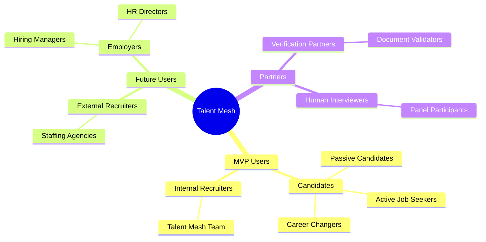
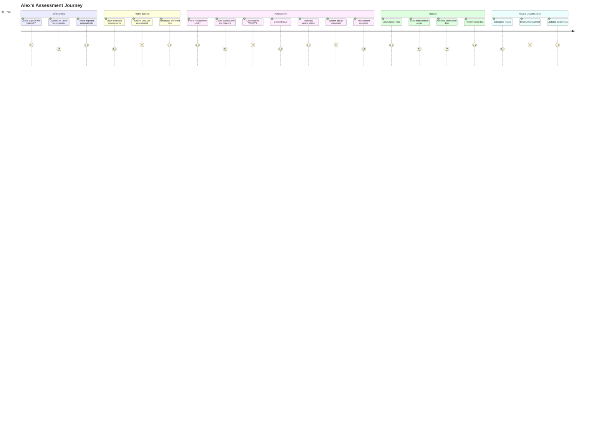
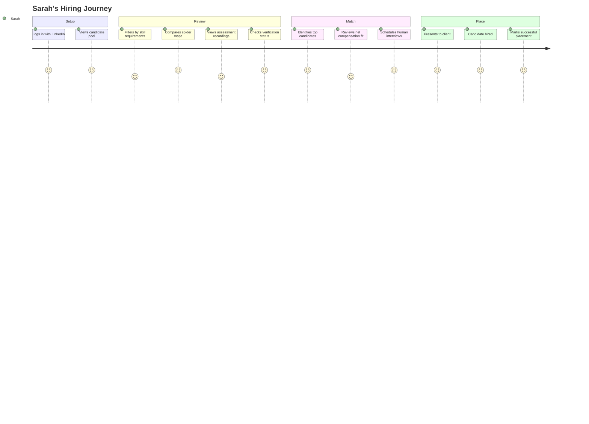

# Talent Mesh Stakeholder Personas

## Overview

This document defines the key stakeholders and user personas for Talent Mesh. Understanding these personas is critical for building features that solve real problems for real users.

**Key Constraint:** LinkedIn-only authentication. Users without LinkedIn are not our target market.

---

## Stakeholder Map



---

## Primary Personas

### Persona 1: Job Seeker - "Alex Kim"

```
+---------------------------------------------------------------------+
|  ALEX KIM                                                           |
|  Senior Software Engineer                                           |
|  Actively Looking                                                   |
+---------------------------------------------------------------------+
|  Demographics                                                       |
|  * Age: 31                                                          |
|  * Location: Remote (Denver, CO)                                    |
|  * Experience: 7 years as software engineer                         |
|  * Current: DevOps Engineer at mid-size company                     |
|  * LinkedIn: Active profile, 500+ connections                       |
+---------------------------------------------------------------------+
|  Goals                                                              |
|  * Find a role with growth opportunities                            |
|  * Consider remote-first companies                                  |
|  * Understand net compensation (including cost-of-living)           |
|  * Build verified, portable skill profile                           |
+---------------------------------------------------------------------+
|  Pain Points                                                        |
|  * Ghosted by 60% of companies applied to                           |
|  * Repetitive screening calls asking same questions                 |
|  * No feedback when rejected                                        |
|  * Can't prove skills without endless interviews                    |
+---------------------------------------------------------------------+
|  Technology Comfort                                                 |
|  * Expert: Kubernetes, AWS, Terraform, Python                       |
|  * Comfortable with video calls                                     |
|  * LinkedIn power user                                              |
+---------------------------------------------------------------------+
```

**Jobs To Be Done:**
1. When I'm job hunting, I want to assess once and be matched to multiple opportunities, so I don't repeat the same process.
2. When I do a technical assessment, I want to showcase my actual skills through conversation, not memorized trivia.
3. When I'm not selected, I want to understand why, so I can improve.
4. When I improve my skills, I want to retake assessments to update my profile.

**Key Features Needed:**
- LinkedIn OAuth login (mandatory)
- Natural conversation assessment (not robotic Q&A)
- Spider map showing multi-dimensional profile
- Assessment history (see growth over retakes)
- Verified credentials (blue tick for salary, education)
- Net benefit matching (cost-of-living aware)

**Assessment Behavior:**
- Can retake after 2 weeks
- Maximum 3 retakes per assessment type
- All attempts visible (shows improvement pattern)
- Credits required for retakes

**Success Metrics:**
- Assessment experience rating >4/5
- Would recommend to friend >80%
- Completion rate >95%

---

### Persona 2: Talent Mesh Internal Recruiter - "Sarah Chen" (MVP Focus)

```
+---------------------------------------------------------------------+
|  SARAH CHEN                                                         |
|  Talent Mesh Recruiter                                              |
|  Building Candidate Pool                                            |
+---------------------------------------------------------------------+
|  Demographics                                                       |
|  * Age: 34                                                          |
|  * Location: San Francisco, CA                                      |
|  * Experience: 8 years in recruiting                                |
|  * Role: Build and monetize Talent Mesh candidate pool              |
+---------------------------------------------------------------------+
|  Goals                                                              |
|  * Build pool of 100+ assessed candidates                           |
|  * Place 10+ candidates successfully (prove model)                  |
|  * Build trust with clients using verified info                     |
|  * Match candidates considering total compensation                  |
+---------------------------------------------------------------------+
|  Pain Points                                                        |
|  * Traditional screening is expensive                               |
|  * Candidates exaggerate skills                                     |
|  * No standardized way to compare candidates                        |
|  * Clients question candidate quality                               |
+---------------------------------------------------------------------+
|  Technology Comfort                                                 |
|  * Uses: LinkedIn Recruiter, various ATS tools                      |
|  * Quick to adopt new tools if they prove ROI                       |
|  * Values data-driven decisions                                     |
+---------------------------------------------------------------------+
```

**Jobs To Be Done:**
1. When I review candidates, I want to see their spider map immediately, so I can understand strengths at a glance.
2. When presenting to clients, I want verified credentials, so I can build trust.
3. When matching candidates to roles, I want cost-of-living analysis, so clients see net benefit.
4. When a candidate has multiple attempts, I want to see their improvement pattern.

**Key Features Needed:**
- Candidate pool dashboard
- Spider map comparison view
- Verification status (blue tick)
- Assessment recording playback
- Historical attempt tracking
- Manual matching tools (auto-matching is post-MVP)

**Success Metrics:**
- 10 successful placements
- Client satisfaction >90%
- Time to placement reduced by 50%

---

### Persona 3: External Recruiter - "Mike Rodriguez" (Future)

```
+---------------------------------------------------------------------+
|  MIKE RODRIGUEZ                                                     |
|  Senior Technical Recruiter                                         |
|  Tech Staffing Agency                                               |
+---------------------------------------------------------------------+
|  Demographics                                                       |
|  * Age: 29                                                          |
|  * Location: Austin, TX                                             |
|  * Experience: 5 years in tech recruiting                           |
|  * Commission-based compensation                                    |
|  * Places 8-12 candidates/month                                     |
+---------------------------------------------------------------------+
|  Goals                                                              |
|  * Place more candidates (increase commissions)                     |
|  * Reduce time from sourcing to placement                           |
|  * Build reputation for quality candidates                          |
|  * Differentiate from competing agencies                            |
+---------------------------------------------------------------------+
|  Pain Points                                                        |
|  * Can't verify technical skills before submitting                  |
|  * Clients reject 60% of submitted candidates                       |
|  * No budget for expensive assessment tools                         |
|  * Technical interviews are a bottleneck                            |
+---------------------------------------------------------------------+
|  Technology Comfort                                                 |
|  * Uses: LinkedIn, Bullhorn, various job boards                     |
|  * Very tech-savvy, early adopter                                   |
|  * Values speed and mobile access                                   |
+---------------------------------------------------------------------+
```

**Jobs To Be Done:**
1. When I source a candidate, I want them to self-assess, so I don't manage the screening process.
2. When presenting to clients, I want verified spider maps, so they trust my candidates.
3. When a candidate is rejected, I want to understand why from their assessment, so I improve sourcing.

**Key Features Needed (Future):**
- Platform access (paid)
- Candidate invitation flow
- White-label reports
- API for ATS integration

**Success Metrics:**
- Client acceptance rate >80%
- <24 hour source-to-submit time
- Candidate NPS >60

---

### Persona 4: Human Interviewer - "David Park" (MVP Support)

```
+---------------------------------------------------------------------+
|  DAVID PARK                                                         |
|  Senior Engineering Manager                                         |
|  Panel Interviewer                                                  |
+---------------------------------------------------------------------+
|  Demographics                                                       |
|  * Age: 38                                                          |
|  * Location: Seattle, WA                                            |
|  * Experience: 12 years in software engineering                     |
|  * Role: Conducts final-round technical interviews                  |
+---------------------------------------------------------------------+
|  Goals                                                              |
|  * Join AI assessments to evaluate culture fit                      |
|  * Ask follow-up questions based on AI conversation                 |
|  * Reduce time spent on initial screening                           |
|  * Make better hiring decisions with AI insights                    |
+---------------------------------------------------------------------+
|  Pain Points                                                        |
|  * Too much time on first-round interviews                          |
|  * Inconsistent candidate quality from recruiters                   |
|  * No context on candidate skills before interview                  |
|  * Scheduling complexity with multiple interviewers                 |
+---------------------------------------------------------------------+
```

**Jobs To Be Done:**
1. When I join an assessment, I want to see the AI's conversation so far, so I can ask relevant follow-ups.
2. When reviewing a candidate, I want the spider map visible, so I understand their profile.
3. When the AI assessment is complete, I want to add my notes to the evaluation.

**Key Features Needed:**
- Join in-progress AI assessments (WebRTC P2P mesh)
- View real-time transcript
- Access candidate spider map during interview
- Add human evaluation notes post-session

**Success Metrics:**
- Interview efficiency (decisions per hour)
- Candidate quality improvement
- Interview satisfaction score

---

## Secondary Personas

### Persona 5: Hiring Manager - "Priya Sharma" (Future)

**Role:** Reviews final candidates from recruiter

**Key Concerns:**
- Spider map accuracy
- Verified credentials
- Assessment recording quality
- Culture fit indicators

**Key Features Needed:**
- Read-only candidate view
- Comparison tools
- Feedback loop to improve matching

---

### Persona 6: HR Director - "James O'Brien" (Future)

**Role:** Ensures compliance, fairness, and vendor management

**Key Concerns:**
- EEOC compliance
- GDPR/CCPA data handling
- Bias in AI systems
- Audit trail

**Key Features Needed:**
- Bias audit reports
- Data retention controls
- Explainable AI decisions

---

## User Journey Maps

### Candidate Journey



### Recruiter Journey



---

## Stakeholder Needs Matrix

| Stakeholder | Primary Need | Secondary Need | Success Metric |
|-------------|--------------|----------------|----------------|
| Job Seeker | Fair assessment | Net benefit matching | Experience rating |
| Internal Recruiter | Quality pool | Verified info | Successful placements |
| External Recruiter | Speed | Client acceptance | Placement rate |
| Human Interviewer | Efficiency | AI insights | Decisions per hour |
| Hiring Manager | Accurate profile | Recording access | Interview efficiency |
| HR Director | Compliance | Fairness | Audit pass rate |

---

## Persona-Feature Mapping

| Feature | Alex (Candidate) | Sarah (Internal) | David (Interviewer) | Priority |
|---------|------------------|------------------|---------------------|----------|
| LinkedIn OAuth | Required | Required | Required | P0 |
| Spider map | View own | View all | View in-session | P0 |
| Assessment retakes | Use | View history | View history | P0 |
| Verified info | Upload docs | View badges | View badges | P0 |
| Candidate feedback | Receive | - | - | P1 |
| Recording playback | Own only | All candidates | Assigned sessions | P1 |
| Hybrid AI+Human | Participate | Schedule | Join mid-session | P0 |
| Real-time transcript | - | - | View during session | P1 |
| Cost-of-living match | See benefit | Use for matching | - | P1 |
| Multi-org platform | - | - | - | P2 |

---

## Anti-Personas

These are users we explicitly do **not** design for:

### 1. "The Non-LinkedIn User"
Doesn't have LinkedIn or refuses to use it.
**Response:** Not our target market. LinkedIn verification is core to trust.

### 2. "The Bot Detector"
Tries to game the system or detect AI to cheat.
**Response:** Design for honest candidates, include integrity checks, track all attempts.

### 3. "The Over-Optimizer"
Wants to micromanage every assessment question.
**Response:** Provide templates, not infinite customization.

### 4. "The Zero-Touch Hirer"
Wants AI to make final hiring decisions.
**Response:** AI screens, humans decide. We augment, not replace.

---

*Document Version: 3.0*
*Last Updated: 2026-01-04*
*Owner: Product Team*
