# Talent Mesh Domain Model

## Overview

This document defines the domain model for Talent Mesh using Domain-Driven Design (DDD) principles. It identifies bounded contexts, aggregates, entities, and value objects.

---

## Strategic Design

### Domain Vision Statement

Talent Mesh is an AI-powered talent assessment platform that evaluates candidates across multiple dimensions through automated video interviews, creating comprehensive skill profiles that match candidates to opportunities.

### Subdomains

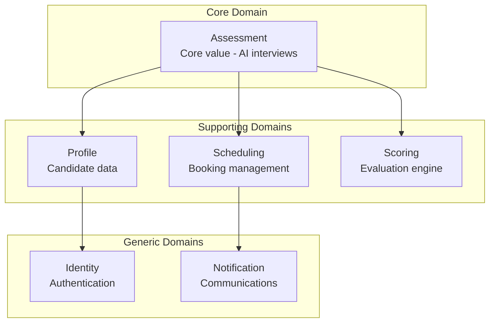

| Subdomain | Type | Description |
|-----------|------|-------------|
| Assessment | Core | AI-powered interview execution |
| Scoring | Core | Multi-dimensional evaluation |
| Profile | Supporting | Candidate data management |
| Scheduling | Supporting | Availability and booking |
| Identity | Generic | Authentication/Authorization |
| Notification | Generic | Email and webhooks |

---

## Bounded Contexts

### Context Map

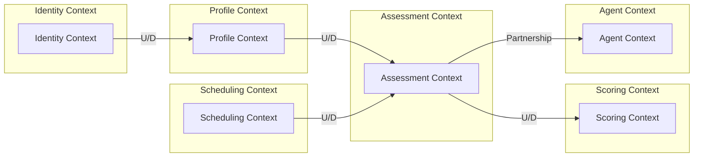

### Context Relationships

| Upstream | Downstream | Relationship | Description |
|----------|------------|--------------|-------------|
| Identity | Profile | Customer-Supplier | Profile depends on user identity |
| Profile | Assessment | Customer-Supplier | Assessment uses candidate profiles |
| Scheduling | Assessment | Customer-Supplier | Assessment triggered by bookings |
| Assessment | Scoring | Customer-Supplier | Scoring processes completed assessments |
| Assessment | Agent | Partnership | Tight integration for real-time interviews |

---

## Bounded Context Details

### 1. Identity Context

**Responsibility:** User authentication, authorization, and organization management

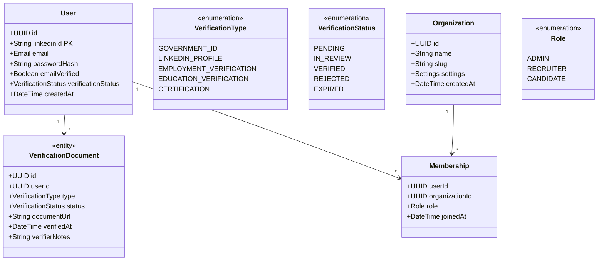

**Aggregates:**
- **User** (Aggregate Root): User identity and credentials (linkedinId as primary identifier)
- **Organization** (Aggregate Root): Company and team structure
- **VerificationDocument** (Entity): User verification documents

**Domain Events:**
- `UserRegistered`
- `UserLoggedIn`
- `OrganizationCreated`
- `MemberInvited`
- `VerificationDocumentSubmitted`
- `VerificationDocumentApproved`
- `VerificationDocumentRejected`

---

### 2. Profile Context

**Responsibility:** Candidate profile management, CV analysis, skill tracking

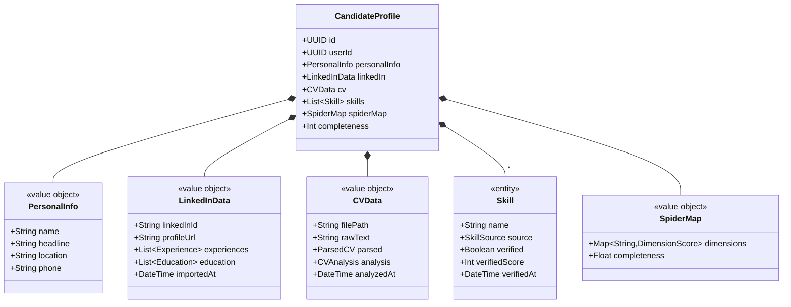

**Aggregates:**
- **CandidateProfile** (Aggregate Root): Complete candidate profile

**Domain Events:**
- `ProfileCreated`
- `ProfileUpdated`
- `CVUploaded`
- `CVAnalyzed`
- `LinkedInImported`
- `SkillVerified`
- `SpiderMapUpdated`

---

### 3. Assessment Context

**Responsibility:** Assessment configuration, execution, and transcript management

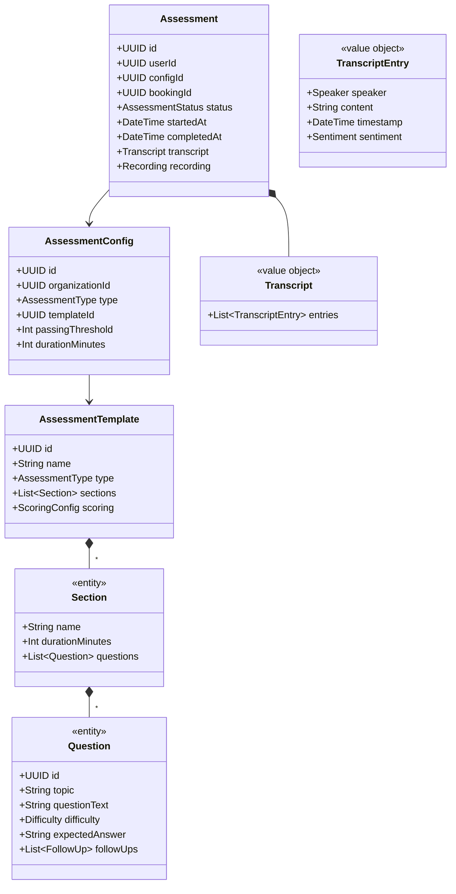

#### Assessment History Aggregate

Tracks assessment retakes and historical performance for a candidate.

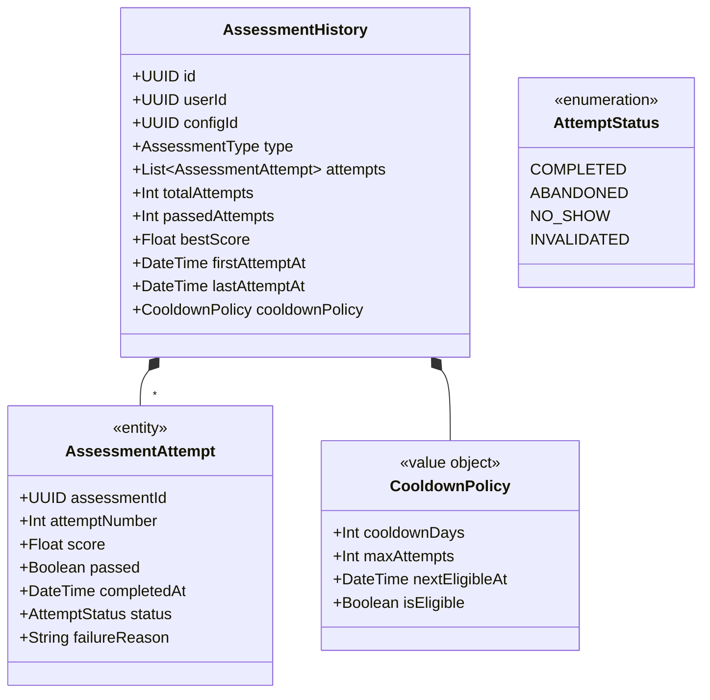

#### Assessment State Machine

The Assessment entity follows a comprehensive state machine that handles WebRTC connection, AI/Human modes, and various failure scenarios.

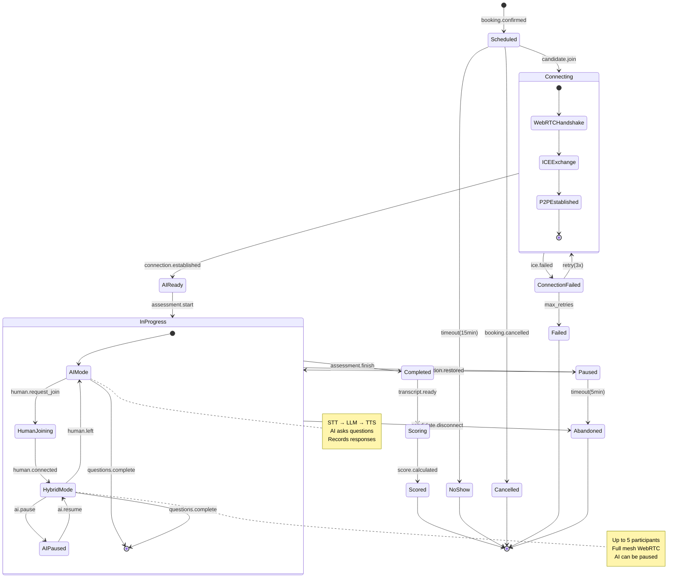

#### Assessment Status Values

| Status | Description | Transitions To |
|--------|-------------|----------------|
| `SCHEDULED` | Booking confirmed, awaiting candidate | CONNECTING, NO_SHOW, CANCELLED |
| `CONNECTING` | WebRTC handshake in progress | AI_READY, CONNECTION_FAILED |
| `AI_READY` | P2P established, AI ready | IN_PROGRESS |
| `IN_PROGRESS` | Assessment actively running | PAUSED, COMPLETED, ABANDONED |
| `PAUSED` | Connection temporarily lost | IN_PROGRESS, ABANDONED |
| `COMPLETED` | Assessment finished normally | SCORING |
| `SCORING` | Transcript being evaluated | SCORED |
| `SCORED` | Final scores available | (terminal) |
| `NO_SHOW` | Candidate didn't join within timeout | (terminal) |
| `CANCELLED` | Booking cancelled before start | (terminal) |
| `ABANDONED` | Candidate disconnected during assessment | (terminal) |
| `FAILED` | Technical failure prevented completion | (terminal) |

#### Session Mode Transitions

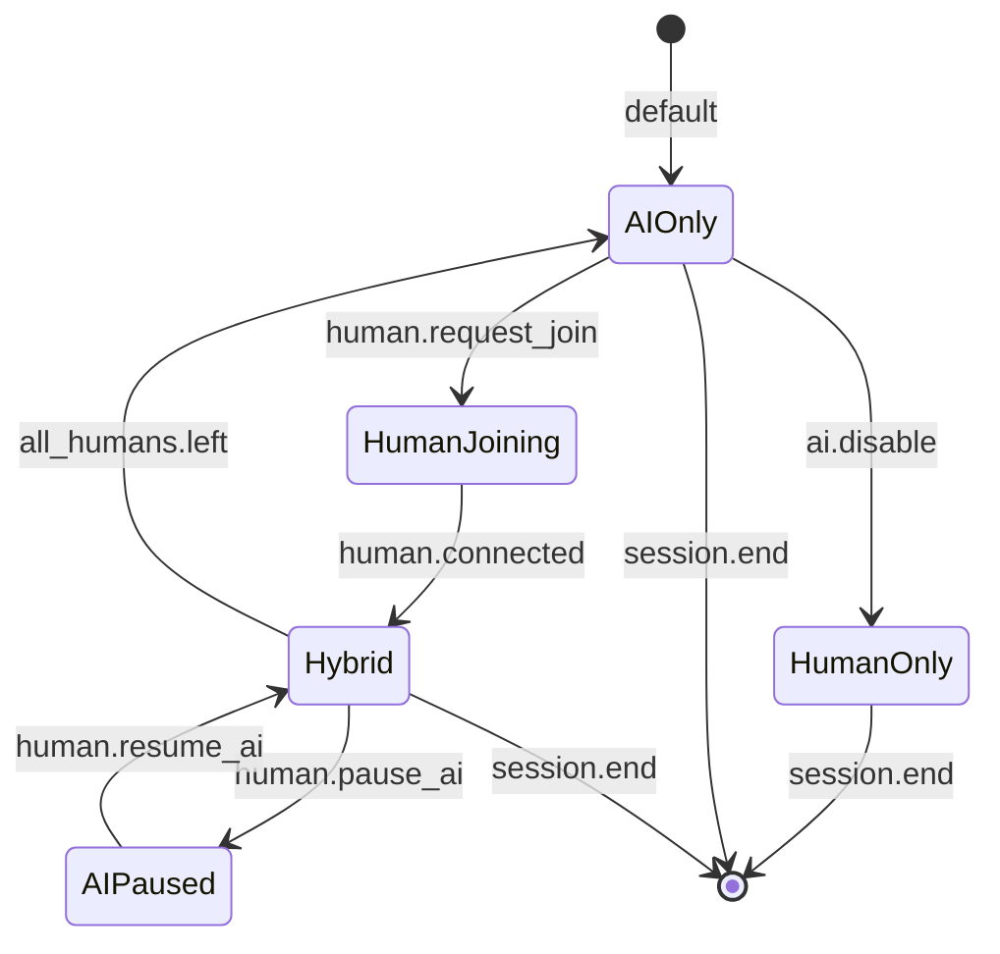

| Mode | Participants | AI Behavior |
|------|--------------|-------------|
| `AI_ONLY` | Candidate + AI | AI asks questions, STT/TTS active |
| `HUMAN_JOINING` | Candidate + AI + Human (connecting) | AI continues, signaling in progress |
| `HYBRID` | Candidate + AI + 1-3 Humans | AI and humans can both interact |
| `AI_PAUSED` | Candidate + Humans (AI silent) | AI listens but doesn't speak |
| `HUMAN_ONLY` | Candidate + Humans | AI disabled, recording only |

**Aggregates:**
- **AssessmentTemplate** (Aggregate Root): Reusable assessment structure
- **Assessment** (Aggregate Root): Individual assessment instance
- **AssessmentHistory** (Aggregate Root): Candidate's assessment attempt history for retakes

**Domain Events:**
- `AssessmentScheduled`
- `AssessmentStarted`
- `AssessmentCompleted`
- `AssessmentAbandoned`
- `TranscriptUpdated`
- `RetakeRequested`
- `CooldownExpired`
- `HumanInterviewerJoined`
- `HumanInterviewerLeft`
- `AIPaused`
- `AIResumed`
- `ConnectionLost`
- `ConnectionRestored`

---

### 4. Scheduling Context

**Responsibility:** Slot availability, booking management, reminders

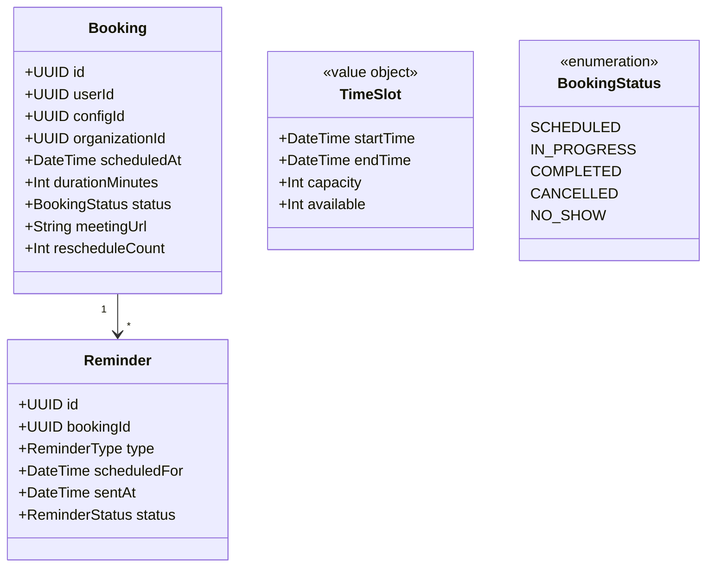

**Aggregates:**
- **Booking** (Aggregate Root): Assessment booking

**Domain Events:**
- `BookingCreated`
- `BookingRescheduled`
- `BookingCancelled`
- `ReminderSent`

---

### 5. Scoring Context

**Responsibility:** Assessment evaluation, scoring, and result generation

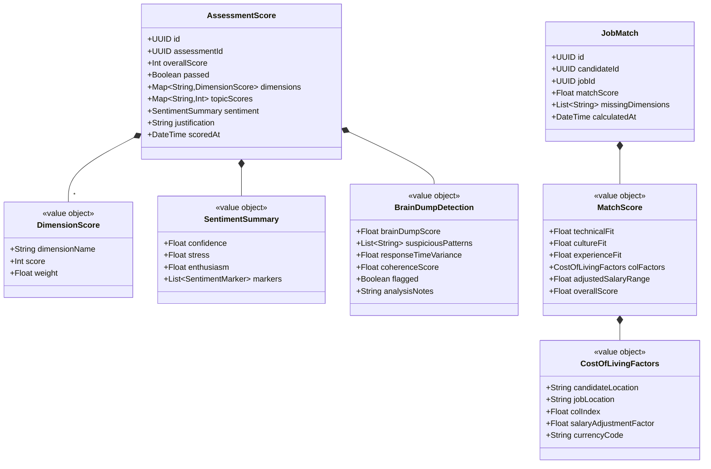

**Aggregates:**
- **AssessmentScore** (Aggregate Root): Assessment evaluation results
- **JobMatch** (Aggregate Root): Candidate-job matching with cost-of-living adjustments

**Domain Events:**
- `AssessmentScored`
- `SpiderMapGenerated`
- `JobMatchCalculated`
- `BrainDumpDetected`

---

### 6. Agent Context

**Responsibility:** AI Agent Pod lifecycle management, capacity scaling, session orchestration

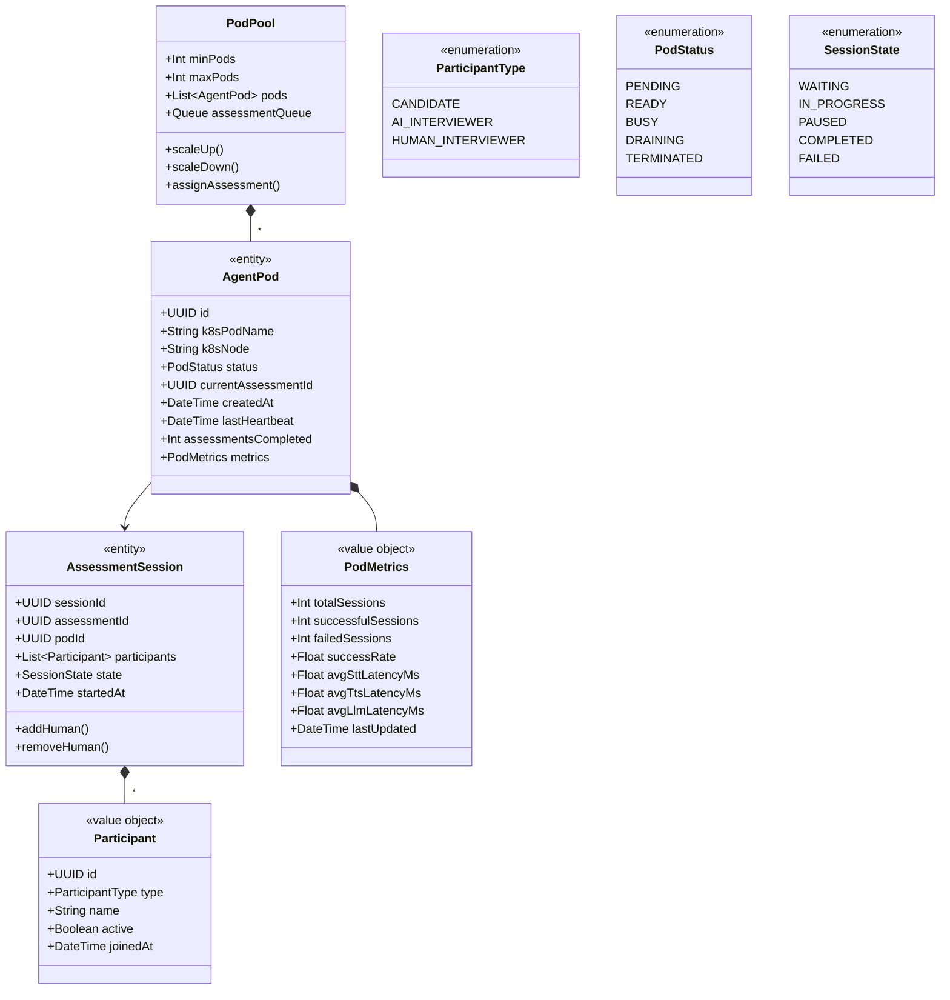

**Aggregates:**
- **PodPool** (Aggregate Root): Pod lifecycle and capacity management
- **AgentPod** (Aggregate Root): Kubernetes pod hosting AI interview components
- **AssessmentSession** (Aggregate Root): Multi-participant session coordination

**Domain Events:**
- `PodReady`
- `PodBusy`
- `PodDraining`
- `PodTerminated`
- `PodFailed`
- `AssessmentAssigned`
- `SessionStarted`
- `HumanInterviewerJoined`
- `HumanInterviewerLeft`
- `SessionCompleted`

---

## Ubiquitous Language

| Term | Definition |
|------|------------|
| Assessment | A structured evaluation of a candidate's skills through AI conversation |
| Spider Map | Visual representation of candidate capabilities across multiple dimensions |
| Dimension | A category of skills being evaluated (e.g., DevOps, System Design) |
| AI Agent Pod | Kubernetes pod hosting STT, TTS, and LLM components for AI interviews |
| Pod Pool | Collection of AI Agent Pods managed by the Agent Service |
| Assessment Session | A WebRTC session with candidate and AI (optionally human interviewers) |
| Booking | A scheduled appointment for an assessment |
| Template | A reusable structure defining assessment questions and flow |
| Transcript | Complete record of assessment conversation |
| Scoring | Process of evaluating assessment responses |
| Pass Threshold | Minimum score required to pass an assessment |
| Slot | Available time period for scheduling |
| Profile | Aggregated candidate information from all sources |
| Skill | A verified or declared competency |
| Match Score | Compatibility rating between candidate and job with cost-of-living adjustments |
| Verification Document | Document submitted for identity or credential verification |
| Assessment History | Record of all assessment attempts by a candidate for retake tracking |
| Brain Dump Detection | Analysis to detect inauthentic or memorized responses |
| Cost of Living Factor | Adjustment factor for salary based on candidate/job locations |
| Cooldown Policy | Rules governing waiting periods between assessment retakes |
| Pod Metrics | Performance and health metrics for AI Agent Pods |
| Hybrid Interview | Assessment session with both AI and human interviewers |

---

## Domain Services

### Assessment Execution Service
Coordinates the real-time assessment flow between components.

```
interface AssessmentExecutionService {
    startAssessment(assessmentId: UUID): void
    processResponse(assessmentId: UUID, response: AudioChunk): void
    completeAssessment(assessmentId: UUID): void
}
```

### Scoring Service
Calculates multi-dimensional scores from assessment transcripts.

```
interface ScoringService {
    scoreAssessment(assessmentId: UUID): AssessmentScore
    generateSpiderMap(userId: UUID): SpiderMap
    calculateJobMatch(userId: UUID, jobId: UUID): JobMatch
}
```

### CV Analysis Service
Analyzes CV documents using LLM.

```
interface CVAnalysisService {
    analyzeCV(cvData: CVData): CVAnalysis
    extractSkills(cvData: CVData): List<Skill>
    convertToATS(cvData: CVData): ATSFormat
}
```

---

## Anti-Corruption Layers

### LinkedIn ACL
Translates LinkedIn API responses to domain model.

```
LinkedInAPI -> LinkedInACL -> LinkedInData (Value Object)
```

### WebRTC Signaling ACL
Abstracts WebRTC signaling interactions.

```
WebRTC Signaling -> SignalingACL -> AssessmentSession (Entity)
```

---

*Document Version: 3.1*
*Last Updated: 2026-01-07*
*Owner: Architecture Team*
