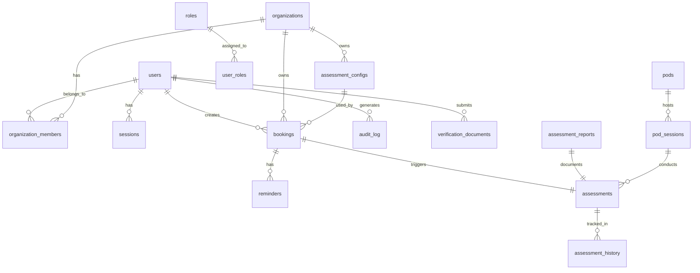
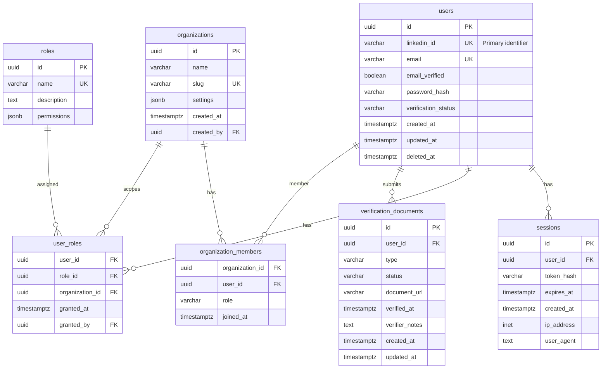
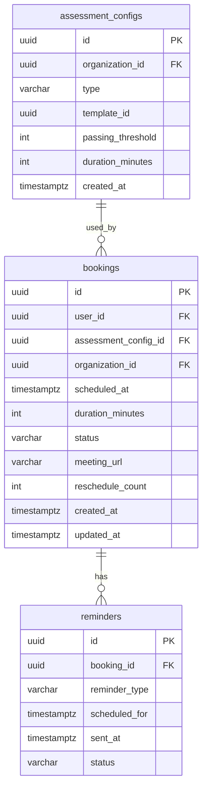
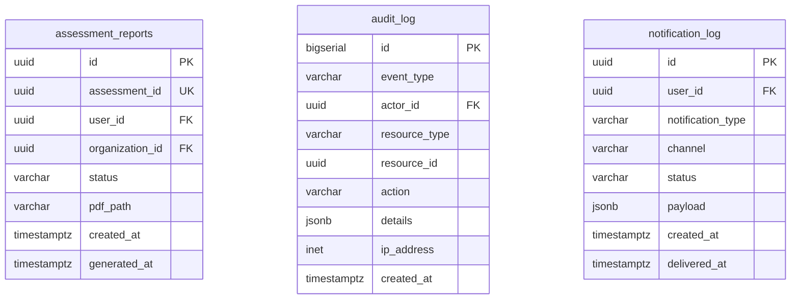
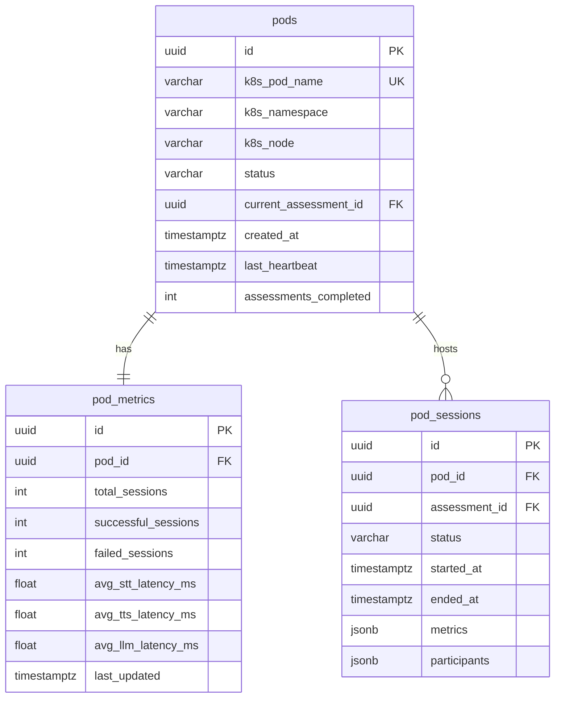
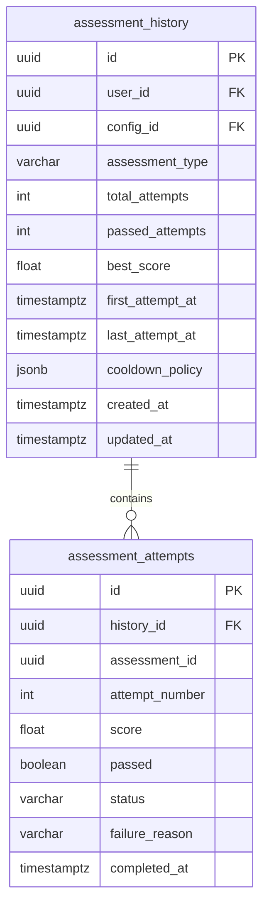
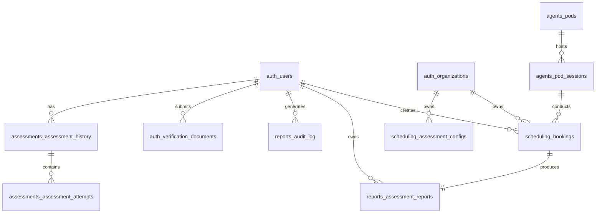

# Talent Mesh Entity Relationship Diagram

## Overview

This document defines the PostgreSQL relational schema for Talent Mesh using Entity Relationship diagrams.

---

## Schema Overview



---

## Schema: `auth`

### Entity Relationship Diagram



### Table Definitions

```sql
-- Schema: auth
CREATE SCHEMA IF NOT EXISTS auth;

-- Users table (linkedin_id as primary identifier)
CREATE TABLE auth.users (
    id UUID PRIMARY KEY DEFAULT gen_random_uuid(),
    linkedin_id VARCHAR(100) NOT NULL,  -- Primary identifier
    email VARCHAR(255) NOT NULL,
    email_verified BOOLEAN DEFAULT FALSE,
    password_hash VARCHAR(255),
    verification_status VARCHAR(50) DEFAULT 'pending',
    created_at TIMESTAMPTZ DEFAULT NOW(),
    updated_at TIMESTAMPTZ DEFAULT NOW(),
    deleted_at TIMESTAMPTZ,
    CONSTRAINT users_linkedin_unique UNIQUE (linkedin_id),
    CONSTRAINT users_email_unique UNIQUE (email),
    CONSTRAINT valid_verification_status CHECK (
        verification_status IN ('pending', 'in_review', 'verified', 'rejected', 'expired')
    )
);

-- Verification documents table
CREATE TABLE auth.verification_documents (
    id UUID PRIMARY KEY DEFAULT gen_random_uuid(),
    user_id UUID NOT NULL REFERENCES auth.users(id) ON DELETE CASCADE,
    type VARCHAR(50) NOT NULL,
    status VARCHAR(50) NOT NULL DEFAULT 'pending',
    document_url VARCHAR(500) NOT NULL,
    verified_at TIMESTAMPTZ,
    verifier_notes TEXT,
    created_at TIMESTAMPTZ DEFAULT NOW(),
    updated_at TIMESTAMPTZ DEFAULT NOW(),
    CONSTRAINT valid_doc_type CHECK (
        type IN ('government_id', 'linkedin_profile', 'employment_verification',
                 'education_verification', 'certification')
    ),
    CONSTRAINT valid_doc_status CHECK (
        status IN ('pending', 'in_review', 'verified', 'rejected', 'expired')
    )
);

-- Sessions table
CREATE TABLE auth.sessions (
    id UUID PRIMARY KEY DEFAULT gen_random_uuid(),
    user_id UUID NOT NULL REFERENCES auth.users(id) ON DELETE CASCADE,
    token_hash VARCHAR(255) NOT NULL,
    expires_at TIMESTAMPTZ NOT NULL,
    created_at TIMESTAMPTZ DEFAULT NOW(),
    ip_address INET,
    user_agent TEXT
);

-- Roles table
CREATE TABLE auth.roles (
    id UUID PRIMARY KEY DEFAULT gen_random_uuid(),
    name VARCHAR(50) NOT NULL UNIQUE,
    description TEXT,
    permissions JSONB DEFAULT '[]'::jsonb
);

-- User roles junction (with organization scope)
CREATE TABLE auth.user_roles (
    user_id UUID NOT NULL REFERENCES auth.users(id) ON DELETE CASCADE,
    role_id UUID NOT NULL REFERENCES auth.roles(id) ON DELETE CASCADE,
    organization_id UUID,
    granted_at TIMESTAMPTZ DEFAULT NOW(),
    granted_by UUID REFERENCES auth.users(id),
    PRIMARY KEY (user_id, role_id, organization_id)
);

-- Organizations table
CREATE TABLE auth.organizations (
    id UUID PRIMARY KEY DEFAULT gen_random_uuid(),
    name VARCHAR(255) NOT NULL,
    slug VARCHAR(100) NOT NULL UNIQUE,
    settings JSONB DEFAULT '{}'::jsonb,
    created_at TIMESTAMPTZ DEFAULT NOW(),
    created_by UUID REFERENCES auth.users(id)
);

-- Organization members junction
CREATE TABLE auth.organization_members (
    organization_id UUID NOT NULL REFERENCES auth.organizations(id) ON DELETE CASCADE,
    user_id UUID NOT NULL REFERENCES auth.users(id) ON DELETE CASCADE,
    role VARCHAR(50) NOT NULL DEFAULT 'member',
    joined_at TIMESTAMPTZ DEFAULT NOW(),
    PRIMARY KEY (organization_id, user_id)
);

-- Indexes
CREATE INDEX idx_users_email ON auth.users(email);
CREATE INDEX idx_users_linkedin ON auth.users(linkedin_id);
CREATE INDEX idx_users_verification_status ON auth.users(verification_status);
CREATE INDEX idx_sessions_user ON auth.sessions(user_id);
CREATE INDEX idx_sessions_expires ON auth.sessions(expires_at);
CREATE INDEX idx_sessions_token ON auth.sessions(token_hash);
CREATE INDEX idx_org_members_user ON auth.organization_members(user_id);
CREATE INDEX idx_verification_docs_user ON auth.verification_documents(user_id);
CREATE INDEX idx_verification_docs_status ON auth.verification_documents(status);
CREATE INDEX idx_verification_docs_type ON auth.verification_documents(type);
```

---

## Schema: `scheduling`

### Entity Relationship Diagram



### Table Definitions

```sql
-- Schema: scheduling
CREATE SCHEMA IF NOT EXISTS scheduling;

-- Assessment configurations (minimal - full config in MongoDB)
CREATE TABLE scheduling.assessment_configs (
    id UUID PRIMARY KEY DEFAULT gen_random_uuid(),
    organization_id UUID NOT NULL,
    type VARCHAR(50) NOT NULL,
    template_id UUID,
    passing_threshold INTEGER DEFAULT 70,
    duration_minutes INTEGER DEFAULT 45,
    created_at TIMESTAMPTZ DEFAULT NOW()
);

-- Bookings table
CREATE TABLE scheduling.bookings (
    id UUID PRIMARY KEY DEFAULT gen_random_uuid(),
    user_id UUID NOT NULL,
    assessment_config_id UUID NOT NULL REFERENCES scheduling.assessment_configs(id),
    organization_id UUID NOT NULL,
    scheduled_at TIMESTAMPTZ NOT NULL,
    duration_minutes INTEGER NOT NULL DEFAULT 45,
    status VARCHAR(50) NOT NULL DEFAULT 'scheduled',
    meeting_url VARCHAR(500),
    reschedule_count INTEGER DEFAULT 0,
    created_at TIMESTAMPTZ DEFAULT NOW(),
    updated_at TIMESTAMPTZ DEFAULT NOW(),
    CONSTRAINT valid_booking_status CHECK (
        status IN ('scheduled', 'in_progress', 'completed', 'cancelled', 'no_show')
    )
);

-- Reminders table
CREATE TABLE scheduling.reminders (
    id UUID PRIMARY KEY DEFAULT gen_random_uuid(),
    booking_id UUID NOT NULL REFERENCES scheduling.bookings(id) ON DELETE CASCADE,
    reminder_type VARCHAR(50) NOT NULL,
    scheduled_for TIMESTAMPTZ NOT NULL,
    sent_at TIMESTAMPTZ,
    status VARCHAR(50) DEFAULT 'pending',
    CONSTRAINT valid_reminder_type CHECK (
        reminder_type IN ('24_hour', '1_hour', '15_minute', 'sms')
    ),
    CONSTRAINT valid_reminder_status CHECK (
        status IN ('pending', 'sent', 'failed', 'cancelled')
    )
);

-- Indexes
CREATE INDEX idx_bookings_user ON scheduling.bookings(user_id);
CREATE INDEX idx_bookings_org ON scheduling.bookings(organization_id);
CREATE INDEX idx_bookings_scheduled ON scheduling.bookings(scheduled_at);
CREATE INDEX idx_bookings_status ON scheduling.bookings(status);
CREATE INDEX idx_bookings_config ON scheduling.bookings(assessment_config_id);
CREATE INDEX idx_reminders_booking ON scheduling.reminders(booking_id);
CREATE INDEX idx_reminders_pending ON scheduling.reminders(scheduled_for)
    WHERE status = 'pending';
```

---

## Schema: `reports`

### Entity Relationship Diagram



### Table Definitions

```sql
-- Schema: reports
CREATE SCHEMA IF NOT EXISTS reports;

-- Assessment reports metadata
CREATE TABLE reports.assessment_reports (
    id UUID PRIMARY KEY DEFAULT gen_random_uuid(),
    assessment_id UUID NOT NULL UNIQUE,
    user_id UUID NOT NULL,
    organization_id UUID NOT NULL,
    status VARCHAR(50) DEFAULT 'pending',
    pdf_path VARCHAR(500),
    created_at TIMESTAMPTZ DEFAULT NOW(),
    generated_at TIMESTAMPTZ,
    CONSTRAINT valid_report_status CHECK (
        status IN ('pending', 'generating', 'completed', 'failed')
    )
);

-- Audit log (partitioned by month)
CREATE TABLE reports.audit_log (
    id BIGSERIAL,
    event_type VARCHAR(100) NOT NULL,
    actor_id UUID,
    resource_type VARCHAR(100),
    resource_id UUID,
    action VARCHAR(50),
    details JSONB,
    ip_address INET,
    created_at TIMESTAMPTZ DEFAULT NOW(),
    PRIMARY KEY (id, created_at)
) PARTITION BY RANGE (created_at);

-- Create partitions for audit log
CREATE TABLE reports.audit_log_y2024m01 PARTITION OF reports.audit_log
    FOR VALUES FROM ('2024-01-01') TO ('2024-02-01');
CREATE TABLE reports.audit_log_y2024m02 PARTITION OF reports.audit_log
    FOR VALUES FROM ('2024-02-01') TO ('2024-03-01');
-- ... continue for each month

-- Notification log
CREATE TABLE reports.notification_log (
    id UUID PRIMARY KEY DEFAULT gen_random_uuid(),
    user_id UUID NOT NULL,
    notification_type VARCHAR(50) NOT NULL,
    channel VARCHAR(50) NOT NULL,
    status VARCHAR(50) NOT NULL DEFAULT 'pending',
    payload JSONB,
    created_at TIMESTAMPTZ DEFAULT NOW(),
    delivered_at TIMESTAMPTZ,
    CONSTRAINT valid_channel CHECK (channel IN ('email', 'sms', 'webhook', 'push')),
    CONSTRAINT valid_notification_status CHECK (
        status IN ('pending', 'sent', 'delivered', 'failed', 'bounced')
    )
);

-- Indexes
CREATE INDEX idx_reports_assessment ON reports.assessment_reports(assessment_id);
CREATE INDEX idx_reports_user ON reports.assessment_reports(user_id);
CREATE INDEX idx_reports_status ON reports.assessment_reports(status);
CREATE INDEX idx_audit_event ON reports.audit_log(event_type);
CREATE INDEX idx_audit_actor ON reports.audit_log(actor_id);
CREATE INDEX idx_audit_resource ON reports.audit_log(resource_type, resource_id);
CREATE INDEX idx_notifications_user ON reports.notification_log(user_id);
CREATE INDEX idx_notifications_type ON reports.notification_log(notification_type);
```

---

## Schema: `agents`

### Entity Relationship Diagram



### Table Definitions

```sql
-- Schema: agents
CREATE SCHEMA IF NOT EXISTS agents;

-- AI Agent Pods table
CREATE TABLE agents.pods (
    id UUID PRIMARY KEY DEFAULT gen_random_uuid(),
    k8s_pod_name VARCHAR(255) NOT NULL UNIQUE,
    k8s_namespace VARCHAR(100) NOT NULL DEFAULT 'talent-mesh',
    k8s_node VARCHAR(255),
    status VARCHAR(50) NOT NULL DEFAULT 'pending',
    current_assessment_id UUID,
    created_at TIMESTAMPTZ DEFAULT NOW(),
    last_heartbeat TIMESTAMPTZ DEFAULT NOW(),
    assessments_completed INTEGER DEFAULT 0,
    CONSTRAINT valid_pod_status CHECK (
        status IN ('pending', 'ready', 'busy', 'draining', 'terminated')
    )
);

-- Pod metrics table
CREATE TABLE agents.pod_metrics (
    id UUID PRIMARY KEY DEFAULT gen_random_uuid(),
    pod_id UUID NOT NULL REFERENCES agents.pods(id) ON DELETE CASCADE,
    total_sessions INTEGER DEFAULT 0,
    successful_sessions INTEGER DEFAULT 0,
    failed_sessions INTEGER DEFAULT 0,
    avg_stt_latency_ms FLOAT DEFAULT 0,
    avg_tts_latency_ms FLOAT DEFAULT 0,
    avg_llm_latency_ms FLOAT DEFAULT 0,
    avg_total_latency_ms FLOAT DEFAULT 0,
    last_updated TIMESTAMPTZ DEFAULT NOW(),
    CONSTRAINT unique_pod_metrics UNIQUE (pod_id)
);

-- Pod sessions table (supports hybrid AI+Human interviews)
CREATE TABLE agents.pod_sessions (
    id UUID PRIMARY KEY DEFAULT gen_random_uuid(),
    pod_id UUID NOT NULL REFERENCES agents.pods(id),
    assessment_id UUID,  -- References MongoDB assessments collection
    status VARCHAR(50) NOT NULL DEFAULT 'waiting',
    started_at TIMESTAMPTZ DEFAULT NOW(),
    ended_at TIMESTAMPTZ,
    metrics JSONB DEFAULT '{}'::jsonb,
    participants JSONB DEFAULT '[]'::jsonb,  -- Array of {id, type, name, joined_at}
    CONSTRAINT valid_session_status CHECK (
        status IN ('waiting', 'in_progress', 'paused', 'completed', 'failed')
    )
);

-- Pod capacity history (for scaling decisions)
CREATE TABLE agents.capacity_history (
    id UUID PRIMARY KEY DEFAULT gen_random_uuid(),
    timestamp TIMESTAMPTZ DEFAULT NOW(),
    total_pods INTEGER NOT NULL,
    ready_pods INTEGER NOT NULL,
    busy_pods INTEGER NOT NULL,
    queue_length INTEGER NOT NULL,
    utilization_percent FLOAT NOT NULL
);

-- Indexes
CREATE INDEX idx_pods_status ON agents.pods(status);
CREATE INDEX idx_pods_heartbeat ON agents.pods(last_heartbeat);
CREATE INDEX idx_pod_sessions_pod ON agents.pod_sessions(pod_id);
CREATE INDEX idx_pod_sessions_assessment ON agents.pod_sessions(assessment_id);
CREATE INDEX idx_pod_sessions_status ON agents.pod_sessions(status);
CREATE INDEX idx_capacity_history_timestamp ON agents.capacity_history(timestamp DESC);
```

---

## Schema: `assessments`

### Entity Relationship Diagram (Assessment History)



### Table Definitions

```sql
-- Schema: assessments
CREATE SCHEMA IF NOT EXISTS assessments;

-- Assessment history table (tracks retakes)
CREATE TABLE assessments.assessment_history (
    id UUID PRIMARY KEY DEFAULT gen_random_uuid(),
    user_id UUID NOT NULL,  -- References auth.users
    config_id UUID NOT NULL,  -- References scheduling.assessment_configs
    assessment_type VARCHAR(50) NOT NULL,
    total_attempts INTEGER DEFAULT 0,
    passed_attempts INTEGER DEFAULT 0,
    best_score FLOAT,
    first_attempt_at TIMESTAMPTZ,
    last_attempt_at TIMESTAMPTZ,
    cooldown_policy JSONB DEFAULT '{"cooldown_days": 30, "max_attempts": 3}'::jsonb,
    created_at TIMESTAMPTZ DEFAULT NOW(),
    updated_at TIMESTAMPTZ DEFAULT NOW(),
    CONSTRAINT unique_user_config_history UNIQUE (user_id, config_id)
);

-- Assessment attempts table
CREATE TABLE assessments.assessment_attempts (
    id UUID PRIMARY KEY DEFAULT gen_random_uuid(),
    history_id UUID NOT NULL REFERENCES assessments.assessment_history(id) ON DELETE CASCADE,
    assessment_id UUID NOT NULL,  -- References MongoDB assessments collection
    attempt_number INTEGER NOT NULL,
    score FLOAT,
    passed BOOLEAN DEFAULT FALSE,
    status VARCHAR(50) NOT NULL DEFAULT 'completed',
    failure_reason TEXT,
    completed_at TIMESTAMPTZ DEFAULT NOW(),
    CONSTRAINT valid_attempt_status CHECK (
        status IN ('completed', 'abandoned', 'no_show', 'invalidated')
    )
);

-- Indexes
CREATE INDEX idx_assessment_history_user ON assessments.assessment_history(user_id);
CREATE INDEX idx_assessment_history_config ON assessments.assessment_history(config_id);
CREATE INDEX idx_assessment_history_type ON assessments.assessment_history(assessment_type);
CREATE INDEX idx_assessment_attempts_history ON assessments.assessment_attempts(history_id);
CREATE INDEX idx_assessment_attempts_assessment ON assessments.assessment_attempts(assessment_id);
```

---

## Cross-Schema Relationships



Note: Cross-schema foreign keys are maintained at the application level, not database level, to support microservice independence. AI Agent Pods are managed by Kubernetes, not owned by users.

---

## Migration Strategy

### Initial Setup

```sql
-- Run in order
\i 01_create_schemas.sql
\i 02_auth_tables.sql
\i 03_scheduling_tables.sql
\i 04_reports_tables.sql
\i 05_agents_tables.sql
\i 06_assessments_tables.sql
\i 07_seed_roles.sql
```

### Seed Data

```sql
-- Default roles
INSERT INTO auth.roles (name, description, permissions) VALUES
    ('admin', 'Organization administrator', '["*"]'),
    ('recruiter', 'Recruiter role', '["assessments:read", "assessments:write", "candidates:read"]'),
    ('candidate', 'Candidate role', '["profile:read", "profile:write", "assessments:take"]');
```

---

## Performance Considerations

### Partitioning
- `audit_log`: Monthly partitions for query performance
- Future: `bookings` partition by `scheduled_at` if volume increases

### Connection Pooling
- Use PgBouncer for connection management
- Target: 100 connections per service, pooled to 20 DB connections

### Vacuuming
- Aggressive autovacuum on `sessions` table
- Standard settings for other tables

---

*Document Version: 3.0*
*Last Updated: 2026-01-04*
*Owner: Architecture Team*
