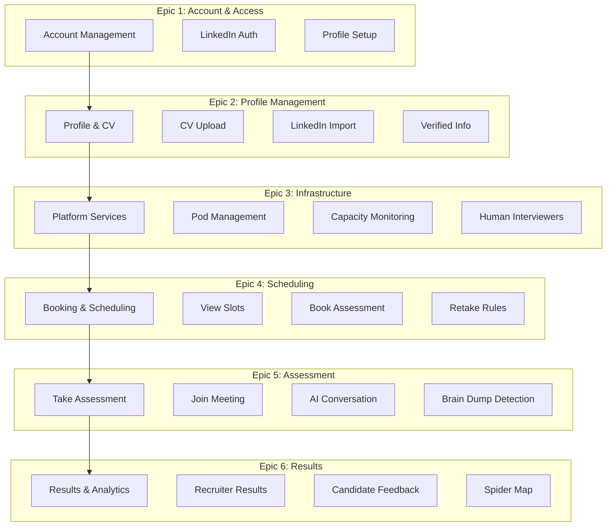
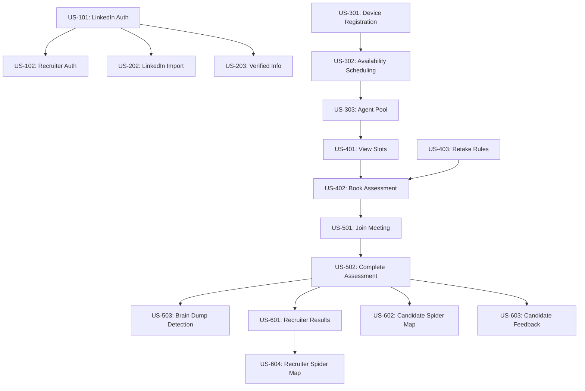

# Talent Mesh User Stories

## Document Overview

This document contains user stories organized by epic. Each story follows the format:

> **As a** [persona], **I want** [goal], **so that** [benefit]

Stories include acceptance criteria and are prioritized using MoSCoW method.

---

## Personas

| Persona | Name | Description | Phase |
|---------|------|-------------|-------|
| Candidate | Alex Kim | Software developer seeking new opportunities, takes assessments to showcase skills | MVP |
| Internal Recruiter | Sarah Chen | Talent Mesh recruiter, manages assessments and reviews candidate results | MVP |
| Human Interviewer | David Park | Engineering manager who joins hybrid AI+Human assessments | MVP |
| External Recruiter | Mike Rodriguez | Third-party recruiter using platform for client hiring | P2 (Future) |

---

## Story Map Overview

---

## Epic 1: Account & Access

### US-101: LinkedIn-Only Authentication

| Field | Value |
|-------|-------|
| ID | US-101 |
| Priority | Must Have |
| Persona | Alex Kim (Candidate) |
| Sprint | MVP |

**Story:**
> As a **candidate**, I want **to sign up and login exclusively with my LinkedIn account**, so that **my professional identity is verified and my profile is automatically imported**.

**Acceptance Criteria:**
1. Given I am on the login/signup page
   - When I view the authentication options
   - Then I see only "Continue with LinkedIn" button (no email/password option)

2. Given I click "Continue with LinkedIn"
   - When I am redirected to LinkedIn's OAuth consent screen
   - Then I see the permissions being requested (profile, email)

3. Given I approve LinkedIn access for the first time
   - When LinkedIn redirects back
   - Then my account is created and I am logged in

4. Given I have previously authenticated
   - When I click "Continue with LinkedIn"
   - Then I am logged in without re-consent

5. Given I approve LinkedIn access
   - When my account is created
   - Then my name, headline, photo, and skills are imported

**Technical Notes:**
- Request scopes: r_liteprofile, r_emailaddress
- Store LinkedIn ID as primary identifier
- No password storage required
- Handle LinkedIn API rate limits

---

### US-102: Recruiter LinkedIn Authentication

| Field | Value |
|-------|-------|
| ID | US-102 |
| Priority | Must Have |
| Persona | Sarah Chen (Internal Recruiter) |
| Sprint | MVP |

**Story:**
> As an **internal recruiter**, I want **to login with my LinkedIn account**, so that **I can access the recruiter dashboard**.

**Acceptance Criteria:**
1. Given I am a Talent Mesh employee
   - When I authenticate with LinkedIn
   - Then I am recognized as an internal recruiter

2. Given I am authenticated as internal recruiter
   - When I access the platform
   - Then I see the recruiter dashboard with candidate management features

3. Given I am not a Talent Mesh employee
   - When I authenticate with LinkedIn
   - Then I am registered as a candidate only

**Technical Notes:**
- Internal recruiters identified by Talent Mesh organization membership
- MVP: Talent Mesh is the only organization
- Multi-org support is P2 (future)

---

## Epic 2: Profile Management

### US-201: CV Upload

| Field | Value |
|-------|-------|
| ID | US-201 |
| Priority | Must Have |
| Persona | Alex Kim (Candidate) |
| Sprint | MVP |

**Story:**
> As a **candidate**, I want **to upload my CV**, so that **my profile is complete and assessments can reference my experience**.

**Acceptance Criteria:**
1. Given I am on my profile page
   - When I upload a PDF/DOC/DOCX file
   - Then the file is stored and processing begins

2. Given my CV is processing
   - When processing completes
   - Then I see extracted skills, experience, and education

3. Given my CV has been processed
   - When I view my profile
   - Then I see the structured data with ability to edit

4. Given I upload a new CV
   - When processing completes
   - Then the previous CV data is replaced

**Technical Notes:**
- Max file size: 10MB
- Processing via LLM for structure extraction
- Store original file and extracted JSON

---

### US-202: LinkedIn Profile Import

| Field | Value |
|-------|-------|
| ID | US-202 |
| Priority | Must Have |
| Persona | Alex Kim (Candidate) |
| Sprint | MVP |

**Story:**
> As a **candidate**, I want **my LinkedIn profile to be imported automatically**, so that **I don't have to re-enter my experience**.

**Acceptance Criteria:**
1. Given I have authenticated with LinkedIn
   - When the import completes
   - Then I see my experience, skills, and education

2. Given my LinkedIn and CV data differ
   - When I view my profile
   - Then I see both sources with discrepancies highlighted

3. Given I have imported LinkedIn data
   - When I manually edit a field
   - Then my edits take precedence

4. Given I have imported LinkedIn data
   - When I click "Refresh from LinkedIn"
   - Then the latest data is imported (preserving my edits)

---

### US-203: Verified Information (Blue Tick)

| Field | Value |
|-------|-------|
| ID | US-203 |
| Priority | Must Have |
| Persona | Alex Kim (Candidate) |
| Sprint | MVP |

**Story:**
> As a **candidate**, I want **to verify my salary, education, and experience**, so that **recruiters can trust my profile information**.

**Acceptance Criteria:**
1. Given I am on my profile page
   - When I view verifiable fields (salary, education, experience)
   - Then I see a verification status indicator

2. Given I want to verify my salary
   - When I upload supporting documentation (offer letter, pay stub)
   - Then the document is reviewed and verification status is updated

3. Given my information is verified
   - When recruiters view my profile
   - Then they see a blue tick next to verified fields

4. Given I have unverified claims
   - When I view my profile
   - Then I see prompts to verify information

5. Given a field is verified
   - When I try to edit that field
   - Then verification is removed and re-verification is required

**Technical Notes:**
- Verification documents stored securely in MinIO
- Initial verification may be manual, automated later
- Blue tick appears next to verified: salary, education degrees, work experience

---

### US-204: Profile Editing

| Field | Value |
|-------|-------|
| ID | US-204 |
| Priority | Must Have |
| Persona | Alex Kim (Candidate) |
| Sprint | MVP |

**Story:**
> As a **candidate**, I want **to edit my profile**, so that **my information is accurate and complete**.

**Acceptance Criteria:**
1. Given I am on my profile page
   - When I edit any field
   - Then changes are saved automatically

2. Given I edit my skills
   - When I add a skill
   - Then it appears with "unverified" status

3. Given I edit my experience
   - When I save changes
   - Then the profile completeness score updates

4. Given I have incomplete profile sections
   - When I view my profile
   - Then I see prompts to complete missing information

---

## Epic 3: Infrastructure

### US-301: AI Agent Pod Management

| Field | Value |
|-------|-------|
| ID | US-301 |
| Priority | Must Have |
| Persona | System Admin |
| Sprint | MVP |

**Story:**
> As a **system administrator**, I want **to monitor AI agent pods**, so that **assessment capacity is available**.

**Acceptance Criteria:**
1. Given I am on the admin dashboard
   - When I view the infrastructure status
   - Then I see all AI agent pods with status (running/pending/failed)

2. Given a pod is running
   - When it passes liveness/readiness probes
   - Then its status shows "available" for assessments

3. Given a pod fails
   - When the platform detects the failure
   - Then the pod is restarted and assessments are rerouted

4. Given cluster capacity is low
   - When I view recommendations
   - Then I see guidance to request capacity increase from platform team

**Technical Notes:**
- Hosted on OpenOva Platform (see [OpenOva Handbook](https://github.com/openova-io/handbook))
- Pods include: STT (Rust), TTS (Rust), LLM Gateway, Signaling (Rust)
- Scaling managed by OpenOva Platform team

---

### US-302: Cluster Capacity Monitoring

| Field | Value |
|-------|-------|
| ID | US-302 |
| Priority | Must Have |
| Persona | System Admin |
| Sprint | MVP |

**Story:**
> As a **system administrator**, I want **to monitor cluster capacity**, so that **I can plan for scaling**.

**Acceptance Criteria:**
1. Given I am on the admin dashboard
   - When I view capacity metrics
   - Then I see: total pods, active assessments, available slots

2. Given I am viewing metrics
   - When capacity is approaching limits
   - Then I see alerts recommending scaling

3. Given I need to scale
   - When I view scaling guidance
   - Then I see instructions to contact OpenOva Platform team

4. Given assessments are at capacity
   - When candidates try to book
   - Then they see queue position and estimated wait

**Technical Notes:**
- Infrastructure managed by OpenOva Platform
- MVP: 6-8 concurrent assessments capacity
- Scaling requests handled via platform team

---

### US-303: Human Interviewer Participation

| Field | Value |
|-------|-------|
| ID | US-303 |
| Priority | Must Have |
| Persona | David Park (Human Interviewer) |
| Sprint | MVP |

**Story:**
> As a **human interviewer**, I want **to join AI assessments mid-session**, so that **I can evaluate culture fit and ask follow-up questions**.

**Acceptance Criteria:**
1. Given an AI assessment is in progress
   - When I click the join link
   - Then I am connected to the WebRTC P2P mesh

2. Given I am in the assessment
   - When I speak
   - Then both the candidate and AI hear me

3. Given I want to ask questions
   - When I indicate I'm taking over
   - Then the AI pauses and I lead the conversation

4. Given I finish my questions
   - When I signal completion
   - Then the AI resumes the assessment

5. Given the assessment is complete
   - When I view the evaluation form
   - Then I can add my notes alongside the AI scores

**Technical Notes:**
- WebRTC P2P mesh supports up to 5 participants
- Human interviewer sees real-time transcript
- Human notes stored separately from AI scoring

---

## Epic 4: Scheduling

### US-401: View Available Slots

| Field | Value |
|-------|-------|
| ID | US-401 |
| Priority | Must Have |
| Persona | Alex Kim (Candidate) |
| Sprint | MVP |

**Story:**
> As a **candidate**, I want **to view available assessment slots**, so that **I can choose a convenient time**.

**Acceptance Criteria:**
1. Given I have a pending assessment
   - When I click the scheduling link
   - Then I see a calendar with available slots

2. Given I am viewing the calendar
   - When I change the date range
   - Then available slots for that period are shown

3. Given slots are displayed
   - When I view them
   - Then they are in my local timezone

4. Given no slots are available soon
   - When I view the calendar
   - Then I see when slots will become available

**Technical Notes:**
- Slots derived from K8s cluster capacity
- Real-time availability updates

---

### US-402: Book Assessment

| Field | Value |
|-------|-------|
| ID | US-402 |
| Priority | Must Have |
| Persona | Alex Kim (Candidate) |
| Sprint | MVP |

**Story:**
> As a **candidate**, I want **to book an assessment slot**, so that **my assessment is scheduled**.

**Acceptance Criteria:**
1. Given I am viewing available slots
   - When I select a slot
   - Then I see a confirmation dialog

2. Given I confirm the booking
   - When the booking is successful
   - Then I see a confirmation with date, time, and join link

3. Given my booking is confirmed
   - When I check my email
   - Then I have received a confirmation with calendar invite

4. Given a slot is selected
   - When another candidate books it first
   - Then I am shown an error and asked to select another slot

---

### US-403: Assessment Retake Rules

| Field | Value |
|-------|-------|
| ID | US-403 |
| Priority | Must Have |
| Persona | Alex Kim (Candidate) |
| Sprint | MVP |

**Story:**
> As a **candidate**, I want **to understand the retake policy**, so that **I can plan my assessment attempts**.

**Acceptance Criteria:**
1. Given I have completed an assessment
   - When I view my results
   - Then I see the retake policy (2-week wait, max 3 retakes)

2. Given I want to retake an assessment
   - When it has been less than 2 weeks since my last attempt
   - Then the retake option is disabled with countdown timer

3. Given I have retaken an assessment 3 times
   - When I try to schedule another retake
   - Then I am informed no more retakes are available

4. Given I want to retake an assessment
   - When it has been 2+ weeks and I have attempts remaining
   - Then I can schedule a retake if I have assessment credits

5. Given I have no assessment credits
   - When I try to book a retake
   - Then I am prompted to purchase credits

**Technical Notes:**
- Track attempt count per assessment type per candidate
- 2-week cooldown period between attempts
- Maximum 3 retake attempts (4 total including initial)
- Credit system for retakes

---

### US-404: On-Demand Assessment Start

| Field | Value |
|-------|-------|
| ID | US-404 |
| Priority | Must Have |
| Persona | Alex Kim (Candidate) |
| Sprint | MVP |

**Story:**
> As a **candidate**, I want **to start an assessment immediately if agents are available**, so that **I don't have to wait**.

**Acceptance Criteria:**
1. Given I have a pending assessment
   - When agents are available now
   - Then I see a "Start Now" button

2. Given I click "Start Now"
   - When an agent is allocated
   - Then I am taken directly to the assessment

3. Given no agents are available
   - When I view the page
   - Then I see my queue position and estimated wait time

4. Given I am in the queue
   - When an agent becomes available
   - Then I am notified and can start within 5 minutes

---

### US-405: Reschedule Assessment

| Field | Value |
|-------|-------|
| ID | US-405 |
| Priority | Must Have |
| Persona | Alex Kim (Candidate) |
| Sprint | MVP |

**Story:**
> As a **candidate**, I want **to reschedule my assessment**, so that **I can take it at a better time**.

**Acceptance Criteria:**
1. Given I have a scheduled assessment
   - When I am more than 2 hours before the start
   - Then I see a "Reschedule" option

2. Given I click "Reschedule"
   - When I select a new slot
   - Then my booking is updated

3. Given I have rescheduled twice
   - When I try to reschedule again
   - Then I am prevented and must contact support

4. Given it is less than 2 hours before my assessment
   - When I view my booking
   - Then the "Reschedule" option is disabled

---

## Epic 5: Take Assessment

### US-501: Join Assessment Meeting

| Field | Value |
|-------|-------|
| ID | US-501 |
| Priority | Must Have |
| Persona | Alex Kim (Candidate) |
| Sprint | MVP |

**Story:**
> As a **candidate**, I want **to join the assessment session**, so that **I can begin my assessment**.

**Acceptance Criteria:**
1. Given my assessment is starting
   - When I click the join link
   - Then I am taken to the Assessment Lobby

2. Given I am in the lobby
   - When I grant camera/mic permissions and pass system checks
   - Then I can join the assessment via WebRTC

3. Given I join the assessment
   - When WebRTC connects to an AI agent pod
   - Then I hear a greeting and introduction

4. Given I am having audio issues
   - When I cannot hear the AI
   - Then I see troubleshooting instructions

5. Given I join more than 10 minutes late
   - When the session has expired
   - Then I see instructions to reschedule

---

### US-502: Complete Technical Assessment

| Field | Value |
|-------|-------|
| ID | US-502 |
| Priority | Must Have |
| Persona | Alex Kim (Candidate) |
| Sprint | MVP |

**Story:**
> As a **candidate**, I want **to complete a technical assessment**, so that **my skills are evaluated**.

**Acceptance Criteria:**
1. Given I am in the assessment
   - When the AI asks a question
   - Then I hear it clearly and have time to respond

2. Given I am answering a question
   - When I finish speaking
   - Then the AI follows up or moves to the next topic

3. Given the AI asks a follow-up
   - When the question is based on my previous answer
   - Then the conversation feels natural

4. Given I have covered all topics
   - When the assessment ends
   - Then I hear a closing message and see a completion screen

---

### US-503: Brain Dumper Detection

| Field | Value |
|-------|-------|
| ID | US-503 |
| Priority | Must Have |
| Persona | System |
| Sprint | MVP |

**Story:**
> As the **system**, I want **to detect brain dumping behavior**, so that **assessment integrity is maintained**.

**Acceptance Criteria:**
1. Given a candidate is in an assessment
   - When they provide memorized/rehearsed responses without understanding
   - Then the system flags the response for review

2. Given the system detects brain dumping patterns
   - When scoring the assessment
   - Then an algorithmic penalty is applied to affected sections

3. Given brain dumping is detected
   - When the candidate receives results
   - Then they see a note about response authenticity concerns

4. Given a candidate has multiple brain dumping flags
   - When recruiters view the profile
   - Then they see an integrity warning indicator

5. Given the AI interviewer suspects brain dumping
   - When asking follow-up questions
   - Then it probes deeper to verify genuine understanding

**Technical Notes:**
- Detection signals: keyword matching without context, inability to elaborate, inconsistent depth
- Penalty applied algorithmically, not manual review
- Transparency: candidates informed of integrity scoring

---

### US-504: Handle Assessment Interruption

| Field | Value |
|-------|-------|
| ID | US-504 |
| Priority | Must Have |
| Persona | Alex Kim (Candidate) |
| Sprint | MVP |

**Story:**
> As a **candidate**, I want **to continue if I get disconnected**, so that **my progress is not lost**.

**Acceptance Criteria:**
1. Given I am disconnected for less than 2 minutes
   - When I rejoin
   - Then the assessment continues from where I left off

2. Given I am disconnected for more than 2 minutes
   - When I try to rejoin
   - Then I see a message that my assessment is saved and can be rescheduled

3. Given my audio stops working
   - When the bot detects silence
   - Then it pauses and displays troubleshooting steps

---

## Epic 6: Results & Analytics

### US-601: Recruiter View Assessment Results

| Field | Value |
|-------|-------|
| ID | US-601 |
| Priority | Must Have |
| Persona | Sarah Chen (Internal Recruiter) |
| Sprint | MVP |

**Story:**
> As an **internal recruiter**, I want **to view assessment results**, so that **I can evaluate candidates**.

**Acceptance Criteria:**
1. Given an assessment is complete
   - When I view the candidate
   - Then I see their score and pass/fail status

2. Given I am viewing results
   - When I click for details
   - Then I see dimension breakdown and question-by-question scores

3. Given the candidate passed
   - When I view results
   - Then I can access the recording

4. Given I am viewing multiple candidates
   - When I compare them
   - Then I see a side-by-side comparison

5. Given a candidate has brain dumping flags
   - When I view their results
   - Then I see the integrity indicator and affected sections

---

### US-602: Candidate View Spider Map

| Field | Value |
|-------|-------|
| ID | US-602 |
| Priority | Must Have |
| Persona | Alex Kim (Candidate) |
| Sprint | MVP |

**Story:**
> As a **candidate**, I want **to see my spider map**, so that **I understand my multi-dimensional skill profile**.

**Acceptance Criteria:**
1. Given I have completed an assessment
   - When I view my results
   - Then I see my spider/radar chart of evaluated dimensions

2. Given the spider map is displayed
   - When I hover over an axis
   - Then I see the score and brief explanation for that dimension

3. Given I have completed multiple assessments
   - When I view my profile
   - Then my spider map shows all evaluated dimensions

4. Given I have incomplete assessments
   - When I view the spider map
   - Then incomplete dimensions are shown differently (grayed out)

---

### US-603: Candidate Assessment Feedback

| Field | Value |
|-------|-------|
| ID | US-603 |
| Priority | Must Have |
| Persona | Alex Kim (Candidate) |
| Sprint | MVP |

**Story:**
> As a **candidate**, I want **to receive detailed feedback on my assessment**, so that **I can improve my skills**.

**Acceptance Criteria:**
1. Given I have completed an assessment
   - When results are processed
   - Then I receive an email notification that feedback is available

2. Given I view my feedback
   - When I access my results page
   - Then I see my overall score and dimension breakdown

3. Given I view my feedback
   - When I look at individual dimensions
   - Then I see strengths identified and areas for improvement

4. Given I performed poorly in a dimension
   - When I view that section
   - Then I see specific recommendations for improvement

5. Given I want to compare with benchmarks
   - When I view my spider map
   - Then I see how I compare to the role requirements

**Technical Notes:**
- Candidates always receive their results (transparency)
- Feedback available immediately after processing (~30 min)
- No waiting for recruiter release

---

### US-604: Recruiter View Spider Map

| Field | Value |
|-------|-------|
| ID | US-604 |
| Priority | Must Have |
| Persona | Sarah Chen (Internal Recruiter) |
| Sprint | MVP |

**Story:**
> As an **internal recruiter**, I want **to see candidate spider maps**, so that **I can evaluate their multi-dimensional profile**.

**Acceptance Criteria:**
1. Given a candidate has completed assessments
   - When I view their profile
   - Then I see a spider/radar chart of their skills

2. Given the spider map is displayed
   - When I hover over an axis
   - Then I see the assessment details for that dimension

3. Given I am comparing candidates
   - When I select multiple
   - Then their spider maps overlay for comparison

4. Given I have job requirements defined
   - When I view a candidate's spider map
   - Then I see the requirements overlay for gap analysis

---

### US-605: Standard Assessment Types

| Field | Value |
|-------|-------|
| ID | US-605 |
| Priority | Must Have |
| Persona | Sarah Chen (Internal Recruiter) |
| Sprint | MVP |

**Story:**
> As an **internal recruiter**, I want **to use standard assessment types**, so that **I can evaluate candidates consistently**.

**Acceptance Criteria:**
1. Given I am inviting a candidate
   - When I select an assessment type
   - Then I see standard options (e.g., Backend, Frontend, DevOps, Full Stack)

2. Given I select a standard assessment
   - When the candidate takes it
   - Then they are evaluated on predefined dimensions

3. Given an assessment is complete
   - When I view results
   - Then I see scores mapped to our standard spider map dimensions

**Technical Notes:**
- MVP: Standard assessment templates only
- Custom assessments are P2 (future)
- Standard dimensions define the spider map axes

---

## Epic 7: Administration

### US-701: System Dashboard

| Field | Value |
|-------|-------|
| ID | US-701 |
| Priority | Must Have |
| Persona | System Admin |
| Sprint | MVP |

**Story:**
> As a **system administrator**, I want **to view system health and metrics**, so that **I can ensure platform reliability**.

**Acceptance Criteria:**
1. Given I am on the admin dashboard
   - When I view system health
   - Then I see agent pool status, active sessions, and queue depth

2. Given I am viewing metrics
   - When I check performance
   - Then I see assessment completion rates and latency metrics

3. Given there are system issues
   - When alerts are triggered
   - Then I see them prominently displayed

4. Given I want historical data
   - When I select a date range
   - Then I see trends and patterns

---

## Future Features (P2)

The following stories are planned for future phases and are not part of MVP.

### US-801: Multi-Organization Support (P2)

| Field | Value |
|-------|-------|
| ID | US-801 |
| Priority | P2 (Future) |
| Persona | Mike Rodriguez (External Recruiter) |
| Sprint | Post-MVP |

**Story:**
> As an **external recruiter**, I want **to create my own organization**, so that **I can use Talent Mesh for my clients**.

**Acceptance Criteria:**
1. Given I am a registered user
   - When I create a new organization
   - Then I become the admin of that organization

2. Given I am an organization admin
   - When I invite team members by email
   - Then they receive invitation emails

3. Given I am using my organization
   - When candidates complete assessments
   - Then only my organization sees the results

**Technical Notes:**
- Multi-tenancy support required
- Organization billing and quotas
- Candidate consent for data sharing between orgs

---

### US-802: Infrastructure Scaling (P2)

| Field | Value |
|-------|-------|
| ID | US-802 |
| Priority | P2 (Future) |
| Persona | System Admin |
| Sprint | Post-MVP |

**Story:**
> As a **system administrator**, I want **to request additional platform capacity**, so that **we can handle more concurrent assessments**.

**Acceptance Criteria:**
1. Given we're approaching platform capacity
   - When I review scaling options
   - Then I can request additional capacity from platform team

2. Given scaling is approved
   - When additional capacity is provisioned
   - Then the cluster scales to handle more assessments

3. Given we have increased capacity
   - When assessments run
   - Then they are distributed across all available resources

**Technical Notes:**
- Scaling managed by OpenOva Platform team
- See [OpenOva Deployment Architecture](https://github.com/openova-io/handbook/blob/main/architecture/DEPLOYMENT_ARCHITECTURE.md)

---

### US-803: Custom Assessment Templates (P2)

| Field | Value |
|-------|-------|
| ID | US-803 |
| Priority | P2 (Future) |
| Persona | Mike Rodriguez (External Recruiter) |
| Sprint | Post-MVP |

**Story:**
> As an **external recruiter**, I want **to create custom assessment templates**, so that **I can evaluate candidates for specific roles**.

**Acceptance Criteria:**
1. Given I am creating an assessment
   - When I select "Custom Template"
   - Then I can define my own dimensions and questions

2. Given I have custom templates
   - When I use them
   - Then candidates are evaluated on my criteria

---

## Story Prioritization Summary

| Priority | Count | Examples |
|----------|-------|----------|
| Must Have (MVP) | 20 | LinkedIn Auth, Spider Maps, Candidate Feedback, Brain Dump Detection |
| P2 (Future) | 5 | Multi-org, Custom Assessments, Advanced Analytics |

---

## Story Dependencies

---

## MVP Scope Summary

| Feature | MVP Status | Notes |
|---------|------------|-------|
| Authentication | LinkedIn Only | No email/password |
| Organizations | Talent Mesh Only | Multi-org is P2 |
| Assessment Types | Standard Templates | Custom is P2 |
| Spider Maps | Yes | Core feature |
| Candidate Feedback | Yes | Candidates see results |
| Brain Dump Detection | Yes | Algorithmic penalty |
| Verified Info (Blue Tick) | Yes | Salary, education, experience |
| Retake Policy | 2-week wait, 3 max | Credits required |
| Infrastructure | OpenOva Platform | Managed by platform team |
| Human Interviewers | Yes | Hybrid AI+Human |
| Paid Cloud | No | P2 feature |

---

*Document Version: 3.1*
*Last Updated: 2026-01-07*
*Owner: Product Team*
