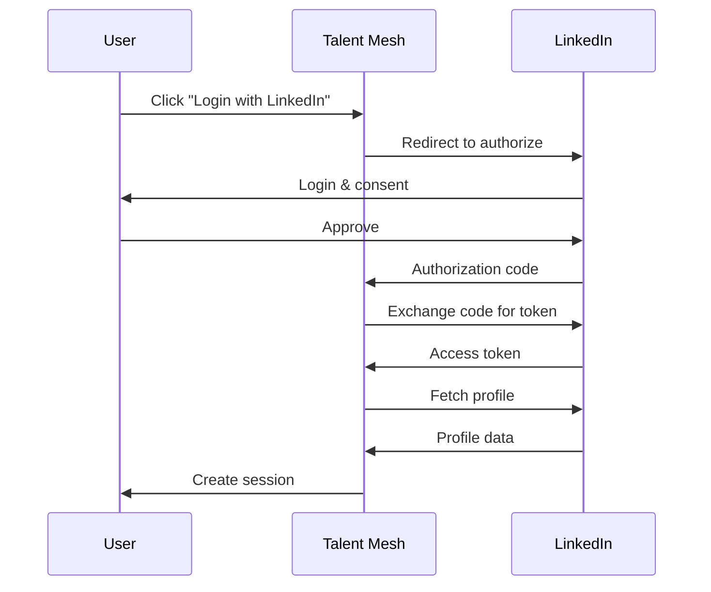

# Talent Mesh Security Architecture

## Overview

Security architecture for Talent Mesh, covering authentication, authorization, and data protection.

---

## Security Principles

1. **Defense in Depth** - Multiple security layers
2. **Least Privilege** - Minimum necessary access
3. **Zero Trust** - Verify explicitly
4. **Privacy by Design** - GDPR compliance from start

---

## Authentication

### LinkedIn-Only Authentication

> **Decision:** Talent Mesh uses LinkedIn OAuth as the sole authentication method. No password storage.

**Benefits:**
- No password storage liability
- Verified professional identity
- Pre-validated email addresses
- Reduced attack surface

### OAuth 2.0 Flow



**Scopes Requested:**
- `r_liteprofile` - Basic profile
- `r_emailaddress` - Email

### JWT Structure

```json
{
  "header": {
    "alg": "RS256",
    "typ": "JWT"
  },
  "payload": {
    "sub": "usr_abc123",
    "linkedin_id": "john-doe-12345",
    "name": "John Doe",
    "org_id": "org_xyz789",
    "roles": ["recruiter"],
    "exp": 1704070800,
    "iss": "https://api.talentmesh.io"
  }
}
```

### Token Lifecycle

| Token | Expiration | Storage |
|-------|------------|---------|
| Access Token | 1 hour | Memory |
| Refresh Token | 7 days | HttpOnly cookie |

---

## Authorization

### Role-Based Access Control

| Role | Description |
|------|-------------|
| candidate | Job seeker |
| recruiter | Hiring team |
| admin | Org admin |
| super_admin | Platform admin |

### Permission Matrix

| Resource | Candidate | Recruiter | Admin |
|----------|-----------|-----------|-------|
| Own profile | RW | - | - |
| Other profiles | - | R | R |
| Own assessments | R | - | - |
| Org assessments | - | RW | RW |
| Templates | - | RW | RW |
| Users | - | R | RW |

### Organization Scoping

All data access is scoped to organization:

```python
async def get_assessments(user_id: str, org_id: str, role: str):
    query = {"organization_id": org_id}
    if role == "candidate":
        query["user_id"] = user_id
    return await db.assessments.find(query)
```

---

## Data Protection

### Encryption at Rest

| Data Store | Encryption |
|------------|------------|
| PostgreSQL | AES-256 |
| MongoDB | AES-256 |
| MinIO | SSE |
| Backups | AES-256 |

### Encryption in Transit

| Connection | Protocol |
|------------|----------|
| External → Gateway | TLS 1.3 |
| Gateway → Services | mTLS (Istio) |
| Service → Database | TLS |

### PII Handling

| PII Type | Collection | Retention |
|----------|------------|-----------|
| Name | Required | Account lifetime |
| Email | Required | Account lifetime |
| CV | Optional | 2 years |
| Recordings | Auto | 90 days |

---

## API Security

### Rate Limiting

Via Istio EnvoyFilter:

| Endpoint | Limit | Window |
|----------|-------|--------|
| POST /auth/linkedin | 10 | 1 minute |
| GET /* | 100 | 1 minute |
| POST /* | 30 | 1 minute |

### Security Headers

```typescript
app.register(helmet, {
  contentSecurityPolicy: {
    directives: {
      defaultSrc: ["'self'"],
      scriptSrc: ["'self'"],
      connectSrc: ["'self'", "https://api.talentmesh.io"]
    }
  },
  hsts: { maxAge: 31536000, includeSubDomains: true }
});
```

### CORS Configuration

```typescript
app.register(cors, {
  origin: [
    'https://app.talentmesh.io',
    'https://staging.talentmesh.io'
  ],
  credentials: true
});
```

---

## Audit Logging

### Events Logged

| Event | Retention |
|-------|-----------|
| Authentication | 7 years |
| Authorization | 7 years |
| Data access | 7 years |
| Config changes | 7 years |

### Audit Log Format

```json
{
  "timestamp": "2024-01-15T10:30:00.000Z",
  "event_type": "data.accessed",
  "actor": {
    "id": "usr_abc123",
    "ip": "192.168.1.100"
  },
  "resource": {
    "type": "candidate_profile",
    "id": "prf_xyz789"
  },
  "action": "read",
  "result": "success"
}
```

---

## Compliance

### GDPR

| Requirement | Implementation |
|-------------|----------------|
| Right to access | Data export API |
| Right to erasure | Account deletion |
| Data portability | JSON export |
| Breach notification | 72-hour process |

### CCPA

| Requirement | Implementation |
|-------------|----------------|
| Right to know | Privacy policy |
| Right to delete | Deletion API |
| Right to opt-out | Do Not Sell toggle |

### EEOC

| Control | Implementation |
|---------|----------------|
| No protected characteristics | Question review |
| Uniform criteria | Standardized scoring |
| Adverse impact monitoring | Analytics dashboard |

---

## Incident Response

### Severity Levels

| Level | Response Time |
|-------|---------------|
| P1 (Data breach) | 15 minutes |
| P2 (Attempted breach) | 1 hour |
| P3 (Policy violation) | 4 hours |
| P4 (Improvement) | Next sprint |

### Breach Notification

- **Users:** Within 72 hours
- **Regulators:** Within 72 hours (GDPR)

---

## Security Testing

| Test Type | Frequency |
|-----------|-----------|
| SAST | Every PR |
| DAST | Weekly |
| Dependency scan | Daily |
| Penetration test | Quarterly |

---

## Related

- [ADR-006: LinkedIn Only Auth](../adrs/ADR-006-LINKEDIN-ONLY-AUTH.md)
- [OpenOva Secrets Management](https://github.com/openova-io/external-secrets/docs/SPEC-SECRETS-CONFIGURATION.md)

---

*Document Version: 1.0*
*Owner: Talent Mesh Security Team*
