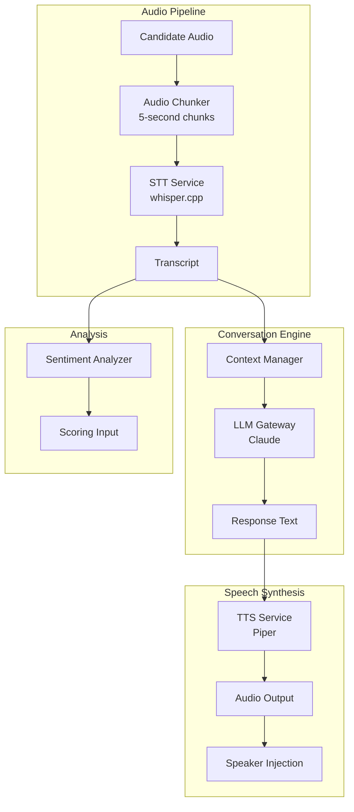
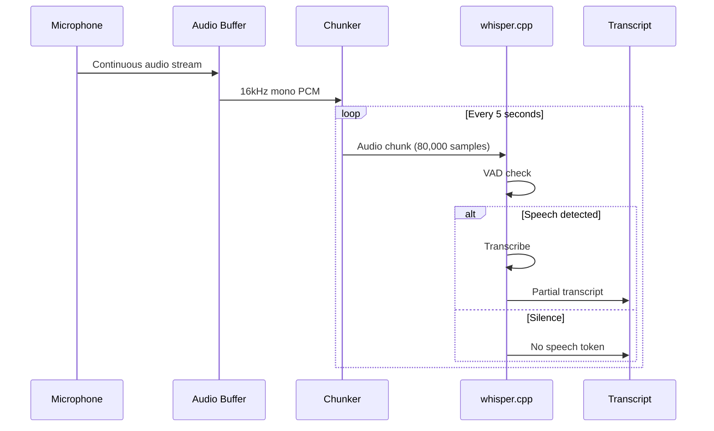
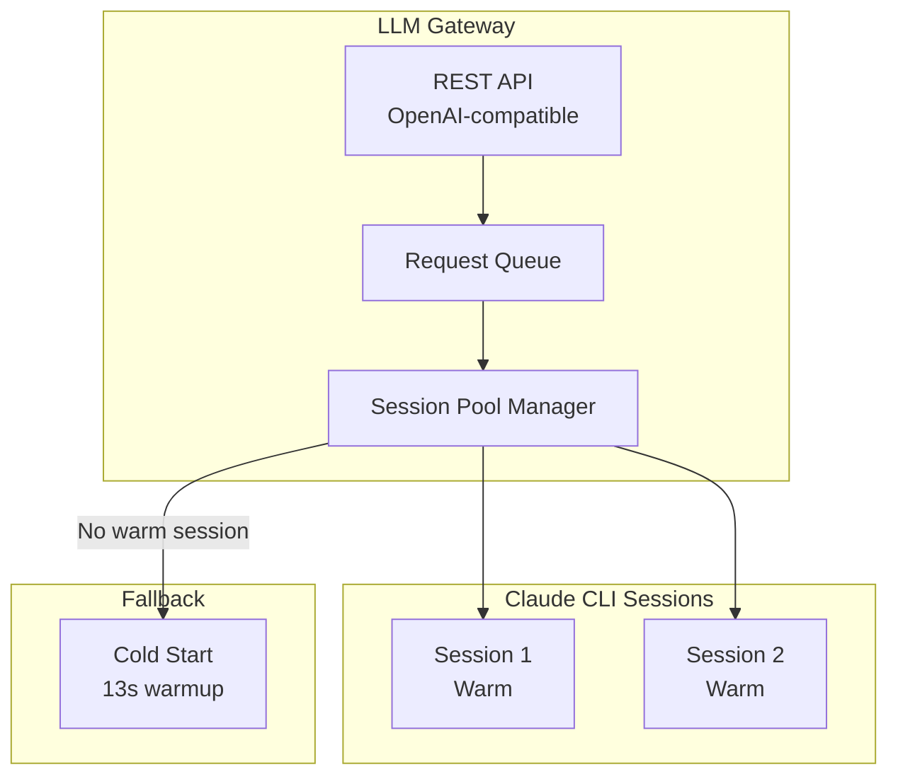
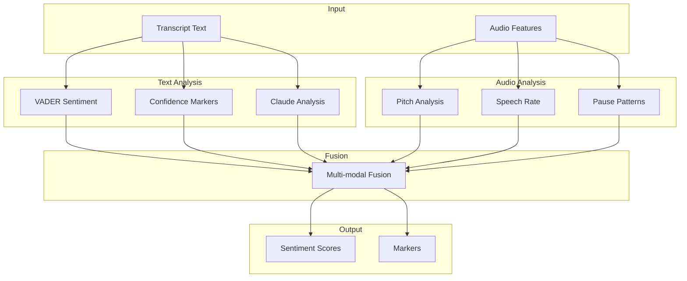

# Talent Mesh AI/ML Specifications

## Overview

This document specifies the AI/ML components of Talent Mesh, including Speech-to-Text (STT), Text-to-Speech (TTS), LLM conversation engine, and sentiment analysis.

---

## Component Architecture



---

## Speech-to-Text (STT)

### Technology: whisper.cpp (via whisper-rs)

**Why whisper.cpp (Rust bindings):**
- Runs efficiently on x86_64 (Contabo VPS instances)
- CPU optimized via AVX2/SSE SIMD
- No API costs
- Excellent accuracy for technical terms
- Rust bindings (whisper-rs) for integration with STT service

### Model Selection

| Model | Size | RAM | RTF | Accuracy | Selected |
|-------|------|-----|-----|----------|----------|
| tiny | 75 MB | 400 MB | 0.03 | Poor | No |
| small | 466 MB | 1 GB | 0.13 | OK | No |
| **medium** | 1.5 GB | 2.5 GB | 0.25 | Great | **Yes** |
| large-v3 | 2.9 GB | 5 GB | 0.50 | Best | No |

**Rationale for medium:**
- RTF 0.25 = 1.25s latency for 5s chunk (acceptable)
- Excellent accuracy for technical terms (>95%)
- Fits within resource budget
- Good balance of speed and accuracy

### Configuration

```yaml
# stt-service config
model: medium
language: en
beam_size: 5
best_of: 5
temperature: 0.0
compression_ratio_threshold: 2.4
logprob_threshold: -1.0
no_speech_threshold: 0.6
```

### Audio Processing Pipeline



### API Specification

```python
@app.post("/transcribe")
async def transcribe(
    audio: UploadFile,
    language: str = "en",
    stream: bool = False
) -> TranscriptionResponse:
    """
    Transcribe audio file.

    Args:
        audio: WAV file, 16kHz mono
        language: Language code
        stream: Return partial results

    Returns:
        TranscriptionResponse with text and confidence
    """
    pass

class TranscriptionResponse(BaseModel):
    text: str
    language: str
    confidence: float
    segments: list[Segment]
    processing_time_ms: int

class Segment(BaseModel):
    start: float  # seconds
    end: float
    text: str
    confidence: float
```

### Performance Targets

| Metric | Target | Measurement |
|--------|--------|-------------|
| Latency (5s chunk) | < 1.5s | P95 |
| Accuracy (tech terms) | > 95% | Manual validation |
| Word Error Rate | < 10% | Benchmark set |
| Throughput | 1 concurrent/pod | Per AI Agent Pod |

---

## Text-to-Speech (TTS)

### Technology: Piper (via piper-rs)

**Why Piper (Rust bindings):**
- Sub-200ms latency
- Natural sounding voices
- ONNX runtime (cross-platform)
- Open source, no API costs
- Rust bindings (piper-rs) for integration with TTS service

### Voice Selection

| Voice | Quality | Speed | Selected |
|-------|---------|-------|----------|
| en_US-lessac-medium | Natural | Fast | **Yes** |
| en_US-amy-medium | Natural | Fast | Backup |
| en_GB-alan-medium | British | Fast | Optional |

**Voice samples:** https://rhasspy.github.io/piper-samples/

### Configuration

```yaml
# tts-service config
model: en_US-lessac-medium
speaker_id: 0
length_scale: 1.0  # Speed (1.0 = normal)
noise_scale: 0.667  # Variation
noise_w: 0.8  # Phoneme duration noise
sentence_silence: 0.2  # Pause between sentences
```

### API Specification

```python
@app.post("/synthesize")
async def synthesize(
    text: str,
    voice: str = "en_US-lessac-medium",
    speed: float = 1.0
) -> Response:
    """
    Synthesize speech from text.

    Args:
        text: Text to synthesize
        voice: Voice model name
        speed: Speech rate (0.5-2.0)

    Returns:
        WAV audio stream
    """
    pass
```

### Performance Targets

| Metric | Target | Measurement |
|--------|--------|-------------|
| Latency | < 200ms | P95 |
| Audio quality | MOS > 4.0 | Subjective |
| Pronunciation | 99% correct | Tech terms test |

---

## LLM Conversation Engine

### Technology: Claude via CLI (in AI Agent Pods)

**Why Claude CLI (not API):**
- Zero API cost during development
- Same capabilities as API
- Session warmup avoids 13s cold start
- OpenAI-compatible wrapper for future migration
- Runs within each AI Agent Pod in K8s cluster

### Session Pool Architecture



### Session Management

```python
class ClaudeSessionPool:
    """
    Manages a pool of warm Claude CLI sessions.
    """

    def __init__(self, pool_size: int = 2):
        self.pool_size = pool_size
        self.sessions: list[ClaudeSession] = []
        self.lock = asyncio.Lock()

        # Initialize pool
        for _ in range(pool_size):
            self.sessions.append(self._spawn_session())

    def _spawn_session(self) -> ClaudeSession:
        """Spawn a new Claude CLI session."""
        process = pexpect.spawn(
            'claude',
            encoding='utf-8',
            timeout=60
        )
        # Wait for prompt
        process.expect('>')
        return ClaudeSession(process=process, status='ready')

    async def acquire(self) -> ClaudeSession:
        """Get an available session from pool."""
        async with self.lock:
            for session in self.sessions:
                if session.status == 'ready':
                    session.status = 'busy'
                    return session

            # No session available, cold start fallback
            return self._spawn_session()

    async def release(self, session: ClaudeSession):
        """Return session to pool."""
        session.status = 'ready'
        session.last_used = datetime.now()

    async def query(self, prompt: str) -> str:
        """Send prompt and get response."""
        session = await self.acquire()
        try:
            session.process.sendline(prompt)
            session.process.expect('>', timeout=60)
            response = session.process.before
            return response.strip()
        finally:
            await self.release(session)

    async def keep_alive(self):
        """Periodic ping to prevent session timeout."""
        while True:
            await asyncio.sleep(300)  # 5 minutes
            for session in self.sessions:
                if session.status == 'ready':
                    session.process.sendline('')
```

### Prompt Engineering

**System Prompt Template:**
```
You are an AI technical interviewer conducting a {assessment_type} assessment.

CONTEXT:
- Candidate: {candidate_name}
- Assessment Type: {assessment_type}
- Duration: {duration_minutes} minutes
- Topics to cover: {topics}

INSTRUCTIONS:
1. Ask one question at a time
2. Listen to the response and ask follow-up questions
3. Adapt difficulty based on responses
4. Cover all required topics
5. Be professional but conversational
6. Do not reveal if answers are correct/incorrect during assessment

EVALUATION CRITERIA:
{evaluation_criteria}

Current topic: {current_topic}
Questions asked: {questions_asked}
Time remaining: {time_remaining}

Previous exchange:
{conversation_history}

Based on the candidate's last response, generate your next question or follow-up.
```

### API Specification (OpenAI-compatible)

```python
@app.post("/v1/chat/completions")
async def chat_completions(request: ChatCompletionRequest) -> ChatCompletionResponse:
    """
    OpenAI-compatible chat completions endpoint.
    Internally routes to Claude CLI session pool.
    """
    pass

class ChatCompletionRequest(BaseModel):
    model: str = "claude-sonnet"  # Ignored
    messages: list[Message]
    max_tokens: int = 4096
    temperature: float = 0.7
    stream: bool = False

class Message(BaseModel):
    role: Literal["system", "user", "assistant"]
    content: str
```

### Performance Targets

| Metric | Target | Measurement |
|--------|--------|-------------|
| Response latency | < 700ms | P95 |
| Session warmup | < 500ms | After cold start |
| Cold start | < 15s | First request |
| Throughput | 2 concurrent | Per pool |

---

## Sentiment Analysis

### Architecture



### Sentiment Metrics

| Metric | Description | Range | Source |
|--------|-------------|-------|--------|
| confidence | Certainty in responses | 0-1 | Text + Audio |
| stress | Anxiety indicators | 0-1 | Audio |
| enthusiasm | Engagement level | 0-1 | Audio |
| authenticity | Genuine vs rehearsed | 0-1 | Text + Claude |

### Confidence Markers

**Hedging Words (decrease confidence):**
- "I think", "maybe", "probably", "I believe"
- "I'm not sure", "it might be", "possibly"
- "sort of", "kind of", "like"

**Confidence Words (increase confidence):**
- "definitely", "certainly", "absolutely"
- "I know", "without a doubt"
- "specifically", "exactly"

### Text Sentiment Analysis

```python
from vaderSentiment.vaderSentiment import SentimentIntensityAnalyzer

class TextSentimentAnalyzer:
    def __init__(self):
        self.vader = SentimentIntensityAnalyzer()
        self.hedging_patterns = [
            r'\bI think\b', r'\bmaybe\b', r'\bprobably\b',
            r'\bI believe\b', r'\bnot sure\b', r'\bmight be\b'
        ]
        self.confident_patterns = [
            r'\bdefinitely\b', r'\bcertainly\b', r'\babsolutely\b',
            r'\bI know\b', r'\bspecifically\b'
        ]

    def analyze(self, text: str) -> TextSentiment:
        # VADER sentiment
        vader_scores = self.vader.polarity_scores(text)

        # Confidence markers
        hedging_count = sum(
            len(re.findall(p, text, re.I))
            for p in self.hedging_patterns
        )
        confident_count = sum(
            len(re.findall(p, text, re.I))
            for p in self.confident_patterns
        )

        # Calculate confidence score
        word_count = len(text.split())
        hedging_ratio = hedging_count / max(word_count, 1)
        confident_ratio = confident_count / max(word_count, 1)

        confidence = 0.5 + (confident_ratio - hedging_ratio) * 2
        confidence = max(0, min(1, confidence))

        return TextSentiment(
            polarity=vader_scores['compound'],
            confidence=confidence,
            hedging_markers=hedging_count,
            confident_markers=confident_count
        )
```

### Audio Sentiment Analysis

```python
import librosa
import numpy as np

class AudioSentimentAnalyzer:
    def analyze(self, audio_path: str) -> AudioSentiment:
        # Load audio
        y, sr = librosa.load(audio_path, sr=16000)

        # Speech rate (words per minute approximation)
        tempo, _ = librosa.beat.beat_track(y=y, sr=sr)
        speech_rate = tempo * 2  # Rough approximation

        # Pitch analysis
        pitches, magnitudes = librosa.piptrack(y=y, sr=sr)
        pitch_mean = np.mean(pitches[pitches > 0])
        pitch_std = np.std(pitches[pitches > 0])

        # Pause detection
        intervals = librosa.effects.split(y, top_db=30)
        pause_count = len(intervals) - 1
        total_pause_time = sum(
            (intervals[i+1][0] - intervals[i][1]) / sr
            for i in range(len(intervals) - 1)
        )

        # Calculate stress from pitch variation
        stress = min(1, pitch_std / 50)  # Normalize

        # Calculate enthusiasm from speech rate and pitch
        enthusiasm = min(1, (speech_rate / 150) * 0.5 + (pitch_mean / 200) * 0.5)

        return AudioSentiment(
            speech_rate=speech_rate,
            pitch_mean=pitch_mean,
            pitch_std=pitch_std,
            pause_count=pause_count,
            total_pause_time=total_pause_time,
            stress=stress,
            enthusiasm=enthusiasm
        )
```

### Multi-modal Fusion

```python
class SentimentFusion:
    def fuse(
        self,
        text_sentiment: TextSentiment,
        audio_sentiment: AudioSentiment,
        claude_analysis: dict
    ) -> FusedSentiment:
        # Weighted fusion
        confidence = (
            text_sentiment.confidence * 0.4 +
            (1 - audio_sentiment.stress) * 0.3 +
            claude_analysis.get('confidence', 0.5) * 0.3
        )

        stress = audio_sentiment.stress

        enthusiasm = (
            audio_sentiment.enthusiasm * 0.6 +
            claude_analysis.get('enthusiasm', 0.5) * 0.4
        )

        authenticity = claude_analysis.get('authenticity', 0.5)

        return FusedSentiment(
            confidence=confidence,
            stress=stress,
            enthusiasm=enthusiasm,
            authenticity=authenticity,
            markers=self._extract_markers(text_sentiment, audio_sentiment)
        )
```

### API Specification

```python
@app.post("/analyze/combined")
async def analyze_combined(
    text: str,
    audio: Optional[UploadFile] = None
) -> SentimentAnalysis:
    """
    Combined text and audio sentiment analysis.
    """
    pass

class SentimentAnalysis(BaseModel):
    confidence: float
    stress: float
    enthusiasm: float
    authenticity: float
    markers: list[str]
    text_details: TextSentiment
    audio_details: Optional[AudioSentiment]
```

---

## End-to-End Latency Budget

| Component | Target | Budget |
|-----------|--------|--------|
| Audio capture | - | 0ms (real-time) |
| Audio chunking | - | ~5000ms (chunk size) |
| STT processing | < 1.5s | 1250ms |
| LLM response | < 0.7s | 700ms |
| TTS synthesis | < 0.2s | 200ms |
| Audio playback | - | ~50ms |
| **Total** | **< 2.5s** | **~2200ms** |

---

*Document Version: 3.0*
*Last Updated: 2026-01-04*
*Owner: AI Team*
