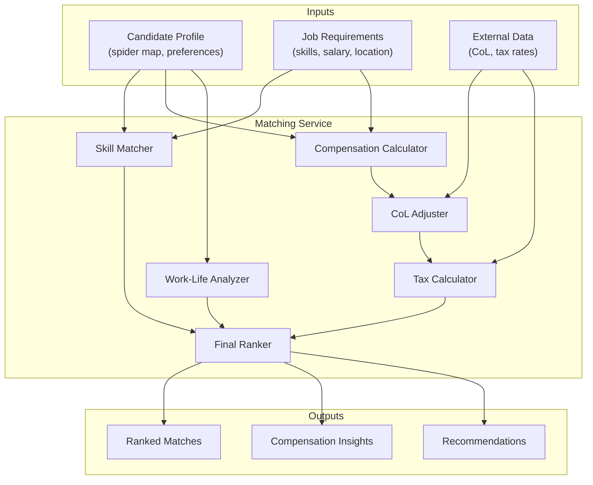

# Matching Algorithm Specification

## Overview

The Matching Service provides intelligent candidate-job matching by analyzing skills, compensation expectations, cost-of-living adjustments, tax implications, and work-life balance factors. This document specifies the matching algorithm and integration with external data sources.

---

## Architecture

### Service Overview

| Property | Value |
|----------|-------|
| **Language** | Python |
| **Framework** | FastAPI |
| **Database** | MongoDB (matches), PostgreSQL (jobs) |
| **External APIs** | Numbeo, Expatistan |
| **Memory** | ~256MB |
| **Replicas** | 2 |

### Component Diagram



---

## Matching Dimensions

### Dimension Weights

| Dimension | Weight | Description |
|-----------|--------|-------------|
| **Skills Match** | 30% | Technical skills alignment with spider map |
| **Experience Level** | 15% | Years and seniority alignment |
| **Compensation Fit** | 20% | Salary expectations vs. budget |
| **Location/Remote** | 15% | Work arrangement compatibility |
| **Cultural Fit** | 10% | Values and work style alignment |
| **Availability** | 10% | Start date and availability |

### Matching Formula

```
Match Score = Σ (Dimension Score × Weight) × Adjustment Factors

Where:
- Each Dimension Score is 0-100
- Adjustment Factors account for critical requirements
- Final score is normalized to 0-100
```

---

## Skills Matching Algorithm

### Spider Map Comparison

```python
from dataclasses import dataclass
from typing import List, Dict
import numpy as np

@dataclass
class SpiderMap:
    dimensions: List[str]
    scores: List[float]  # 0-100 for each dimension

@dataclass
class SkillRequirement:
    dimension: str
    minimum_score: float
    weight: float  # Importance of this skill

def calculate_skills_match(
    candidate: SpiderMap,
    requirements: List[SkillRequirement]
) -> float:
    """
    Calculate skills match score between candidate and job requirements.

    Algorithm:
    1. For each required skill, calculate gap (positive = exceeds, negative = gap)
    2. Apply penalty for skills below minimum
    3. Weight by skill importance
    4. Normalize to 0-100
    """
    total_weighted_score = 0.0
    total_weight = 0.0
    critical_failures = []

    for req in requirements:
        # Find candidate's score for this dimension
        try:
            idx = candidate.dimensions.index(req.dimension)
            candidate_score = candidate.scores[idx]
        except ValueError:
            candidate_score = 0  # Dimension not assessed

        # Calculate match for this skill
        if candidate_score >= req.minimum_score:
            # Meets or exceeds requirement
            skill_score = min(100, candidate_score)
        else:
            # Below requirement - apply penalty
            gap = req.minimum_score - candidate_score
            skill_score = max(0, 100 - (gap * 2))  # 2x penalty for gaps

            # Critical failure if gap > 20
            if gap > 20:
                critical_failures.append(req.dimension)

        total_weighted_score += skill_score * req.weight
        total_weight += req.weight

    if total_weight == 0:
        return 50.0  # Default if no requirements

    base_score = total_weighted_score / total_weight

    # Apply critical failure penalty
    if critical_failures:
        penalty = len(critical_failures) * 10
        base_score = max(0, base_score - penalty)

    return base_score
```

### Skill Gap Analysis

```python
@dataclass
class SkillGap:
    dimension: str
    required: float
    actual: float
    gap: float
    severity: str  # 'minor', 'moderate', 'critical'

def analyze_skill_gaps(
    candidate: SpiderMap,
    requirements: List[SkillRequirement]
) -> List[SkillGap]:
    """
    Identify and categorize skill gaps for candidate development.
    """
    gaps = []

    for req in requirements:
        try:
            idx = candidate.dimensions.index(req.dimension)
            actual = candidate.scores[idx]
        except ValueError:
            actual = 0

        if actual < req.minimum_score:
            gap = req.minimum_score - actual

            if gap <= 10:
                severity = 'minor'
            elif gap <= 25:
                severity = 'moderate'
            else:
                severity = 'critical'

            gaps.append(SkillGap(
                dimension=req.dimension,
                required=req.minimum_score,
                actual=actual,
                gap=gap,
                severity=severity
            ))

    return sorted(gaps, key=lambda g: g.gap, reverse=True)
```

---

## Compensation Analysis

### Cost-of-Living Integration

```python
from decimal import Decimal
from typing import Optional
import httpx

@dataclass
class LocationData:
    city: str
    country: str
    cost_of_living_index: float  # Relative to NYC = 100
    rent_index: float
    groceries_index: float
    purchasing_power_index: float

class CostOfLivingService:
    def __init__(self):
        self.numbeo_api_key = os.environ.get('NUMBEO_API_KEY')
        self.cache = {}  # city -> LocationData

    async def get_location_data(self, city: str, country: str) -> LocationData:
        """
        Fetch cost-of-living data from Numbeo API.
        Caches results for 24 hours.
        """
        cache_key = f"{city},{country}".lower()

        if cache_key in self.cache:
            return self.cache[cache_key]

        async with httpx.AsyncClient() as client:
            response = await client.get(
                "https://www.numbeo.com/api/city_prices",
                params={
                    "api_key": self.numbeo_api_key,
                    "city": city,
                    "country": country
                }
            )
            data = response.json()

        location = LocationData(
            city=city,
            country=country,
            cost_of_living_index=data.get('cost_of_living_index', 100),
            rent_index=data.get('rent_index', 100),
            groceries_index=data.get('groceries_index', 100),
            purchasing_power_index=data.get('purchasing_power_index', 100)
        )

        self.cache[cache_key] = location
        return location

    def adjust_salary(
        self,
        base_salary: Decimal,
        from_location: LocationData,
        to_location: LocationData
    ) -> Decimal:
        """
        Adjust salary between locations based on CoL difference.

        Example: $100k NYC salary → Dubai equivalent
        """
        col_ratio = to_location.cost_of_living_index / from_location.cost_of_living_index
        return base_salary * Decimal(str(col_ratio))
```

### Tax Calculation

```python
from dataclasses import dataclass
from typing import Dict, Tuple

@dataclass
class TaxEstimate:
    gross_salary: Decimal
    income_tax: Decimal
    social_security: Decimal
    other_deductions: Decimal
    net_salary: Decimal
    effective_tax_rate: float

# Simplified tax brackets (production would use comprehensive tax APIs)
TAX_BRACKETS: Dict[str, List[Tuple[Decimal, float]]] = {
    "US": [
        (Decimal("10275"), 0.10),
        (Decimal("41775"), 0.12),
        (Decimal("89075"), 0.22),
        (Decimal("170050"), 0.24),
        (Decimal("215950"), 0.32),
        (Decimal("539900"), 0.35),
        (Decimal("999999999"), 0.37),
    ],
    "UK": [
        (Decimal("12570"), 0.00),
        (Decimal("50270"), 0.20),
        (Decimal("125140"), 0.40),
        (Decimal("999999999"), 0.45),
    ],
    "UAE": [
        # No income tax
        (Decimal("999999999"), 0.00),
    ],
    "DE": [  # Germany simplified
        (Decimal("10908"), 0.00),
        (Decimal("62809"), 0.14),
        (Decimal("277825"), 0.42),
        (Decimal("999999999"), 0.45),
    ],
}

class TaxCalculator:
    def estimate_tax(
        self,
        gross_salary: Decimal,
        country: str,
        filing_status: str = "single"
    ) -> TaxEstimate:
        """
        Estimate income tax for a given salary and jurisdiction.

        This is a simplified model. Production should use
        country-specific tax calculation services.
        """
        brackets = TAX_BRACKETS.get(country, TAX_BRACKETS["US"])

        income_tax = Decimal("0")
        remaining = gross_salary
        prev_threshold = Decimal("0")

        for threshold, rate in brackets:
            if remaining <= 0:
                break

            taxable = min(remaining, threshold - prev_threshold)
            income_tax += taxable * Decimal(str(rate))
            remaining -= taxable
            prev_threshold = threshold

        # Social security estimate (varies by country)
        social_security = self._estimate_social_security(gross_salary, country)

        net_salary = gross_salary - income_tax - social_security
        effective_rate = float((income_tax + social_security) / gross_salary)

        return TaxEstimate(
            gross_salary=gross_salary,
            income_tax=income_tax,
            social_security=social_security,
            other_deductions=Decimal("0"),
            net_salary=net_salary,
            effective_tax_rate=effective_rate
        )

    def _estimate_social_security(
        self,
        gross_salary: Decimal,
        country: str
    ) -> Decimal:
        """Estimate social security/national insurance contributions."""
        rates = {
            "US": 0.0765,  # FICA
            "UK": 0.12,    # NI
            "DE": 0.20,    # Social contributions
            "UAE": 0.0,    # No social security
        }
        rate = rates.get(country, 0.10)
        return gross_salary * Decimal(str(rate))
```

### Net Benefit Calculation

```python
@dataclass
class CompensationComparison:
    candidate_current: TaxEstimate
    job_offer: TaxEstimate
    col_adjusted_net: Decimal
    real_increase_percentage: float
    recommendation: str

async def compare_compensation(
    candidate_salary: Decimal,
    candidate_location: str,
    job_salary: Decimal,
    job_location: str,
    col_service: CostOfLivingService,
    tax_calculator: TaxCalculator
) -> CompensationComparison:
    """
    Calculate real compensation difference considering CoL and taxes.

    Example:
    - Candidate: $80k in Austin, TX
    - Job: $120k in NYC
    - Real benefit may be negative due to CoL!
    """
    # Parse locations
    candidate_loc = await col_service.get_location_data(*parse_location(candidate_location))
    job_loc = await col_service.get_location_data(*parse_location(job_location))

    # Calculate taxes
    candidate_tax = tax_calculator.estimate_tax(candidate_salary, candidate_loc.country)
    job_tax = tax_calculator.estimate_tax(job_salary, job_loc.country)

    # Adjust job net salary for CoL difference
    col_adjustment = candidate_loc.cost_of_living_index / job_loc.cost_of_living_index
    col_adjusted_net = job_tax.net_salary * Decimal(str(col_adjustment))

    # Calculate real increase
    real_increase = (col_adjusted_net - candidate_tax.net_salary) / candidate_tax.net_salary
    real_increase_pct = float(real_increase) * 100

    # Generate recommendation
    if real_increase_pct > 15:
        recommendation = "Strong financial improvement"
    elif real_increase_pct > 5:
        recommendation = "Moderate financial improvement"
    elif real_increase_pct > -5:
        recommendation = "Similar purchasing power"
    elif real_increase_pct > -15:
        recommendation = "Slight decrease in purchasing power"
    else:
        recommendation = "Significant decrease in purchasing power"

    return CompensationComparison(
        candidate_current=candidate_tax,
        job_offer=job_tax,
        col_adjusted_net=col_adjusted_net,
        real_increase_percentage=real_increase_pct,
        recommendation=recommendation
    )
```

---

## Work-Life Balance Factors

### Factor Definitions

```python
@dataclass
class WorkLifeFactors:
    remote_policy: str  # 'full_remote', 'hybrid', 'office_only'
    commute_time_minutes: int
    work_hours_weekly: float
    vacation_days: int
    overtime_expectation: str  # 'none', 'occasional', 'frequent'
    flexibility: str  # 'rigid', 'moderate', 'flexible'

def calculate_wlb_score(
    candidate_preferences: WorkLifeFactors,
    job_offer: WorkLifeFactors
) -> float:
    """
    Calculate work-life balance compatibility score.

    Higher score = better match with candidate preferences.
    """
    score = 100.0
    penalties = []

    # Remote policy matching
    remote_match = {
        ('full_remote', 'full_remote'): 0,
        ('full_remote', 'hybrid'): 15,
        ('full_remote', 'office_only'): 40,
        ('hybrid', 'full_remote'): 5,
        ('hybrid', 'hybrid'): 0,
        ('hybrid', 'office_only'): 20,
        ('office_only', 'full_remote'): 5,
        ('office_only', 'hybrid'): 5,
        ('office_only', 'office_only'): 0,
    }
    penalty = remote_match.get(
        (candidate_preferences.remote_policy, job_offer.remote_policy),
        10
    )
    score -= penalty
    if penalty > 0:
        penalties.append(f"Remote policy mismatch: -{penalty}")

    # Commute penalty (if not full remote)
    if job_offer.remote_policy != 'full_remote':
        if job_offer.commute_time_minutes > 60:
            penalty = (job_offer.commute_time_minutes - 60) * 0.5
            score -= penalty
            penalties.append(f"Long commute: -{penalty:.1f}")

    # Work hours
    if job_offer.work_hours_weekly > 45:
        penalty = (job_offer.work_hours_weekly - 45) * 2
        score -= penalty
        penalties.append(f"Long hours: -{penalty:.1f}")

    # Vacation days (assume 20 is baseline)
    vacation_diff = candidate_preferences.vacation_days - job_offer.vacation_days
    if vacation_diff > 0:
        penalty = vacation_diff * 2
        score -= penalty
        penalties.append(f"Fewer vacation days: -{penalty}")

    return max(0, min(100, score))
```

---

## Ranking Algorithm

### Final Score Calculation

```python
@dataclass
class MatchResult:
    candidate_id: str
    job_id: str
    overall_score: float
    dimension_scores: Dict[str, float]
    skill_gaps: List[SkillGap]
    compensation: CompensationComparison
    wlb_score: float
    recommendation: str
    rank: int

async def calculate_match(
    candidate: CandidateProfile,
    job: JobPosting,
    col_service: CostOfLivingService,
    tax_calculator: TaxCalculator
) -> MatchResult:
    """
    Calculate comprehensive match score between candidate and job.
    """
    # Skills (30%)
    skills_score = calculate_skills_match(
        candidate.spider_map,
        job.skill_requirements
    )
    skill_gaps = analyze_skill_gaps(candidate.spider_map, job.skill_requirements)

    # Experience (15%)
    exp_score = calculate_experience_match(
        candidate.years_experience,
        job.experience_range
    )

    # Compensation (20%)
    comp_comparison = await compare_compensation(
        candidate.current_salary,
        candidate.location,
        job.salary_range.midpoint,
        job.location,
        col_service,
        tax_calculator
    )
    # Score based on real increase
    if comp_comparison.real_increase_percentage >= 10:
        comp_score = 100
    elif comp_comparison.real_increase_percentage >= 0:
        comp_score = 70 + comp_comparison.real_increase_percentage * 3
    else:
        comp_score = max(0, 70 + comp_comparison.real_increase_percentage * 2)

    # Location/Remote (15%)
    location_score = calculate_wlb_score(
        candidate.work_preferences,
        job.work_arrangement
    )

    # Cultural Fit (10%) - based on values alignment
    cultural_score = calculate_cultural_fit(candidate, job)

    # Availability (10%)
    availability_score = calculate_availability_match(
        candidate.availability,
        job.start_date
    )

    # Weighted total
    weights = {
        'skills': 0.30,
        'experience': 0.15,
        'compensation': 0.20,
        'location': 0.15,
        'cultural': 0.10,
        'availability': 0.10
    }

    dimension_scores = {
        'skills': skills_score,
        'experience': exp_score,
        'compensation': comp_score,
        'location': location_score,
        'cultural': cultural_score,
        'availability': availability_score
    }

    overall_score = sum(
        score * weights[dim]
        for dim, score in dimension_scores.items()
    )

    # Generate recommendation
    if overall_score >= 80:
        recommendation = "Excellent match - highly recommended"
    elif overall_score >= 65:
        recommendation = "Good match - worth considering"
    elif overall_score >= 50:
        recommendation = "Moderate match - some gaps to address"
    else:
        recommendation = "Limited match - significant gaps"

    return MatchResult(
        candidate_id=candidate.id,
        job_id=job.id,
        overall_score=overall_score,
        dimension_scores=dimension_scores,
        skill_gaps=skill_gaps,
        compensation=comp_comparison,
        wlb_score=location_score,
        recommendation=recommendation,
        rank=0  # Set during batch ranking
    )
```

### Batch Ranking

```python
async def rank_candidates_for_job(
    job_id: str,
    candidate_ids: List[str],
    db: Database,
    col_service: CostOfLivingService,
    tax_calculator: TaxCalculator
) -> List[MatchResult]:
    """
    Rank all candidates for a specific job.
    """
    job = await db.jobs.find_one({"_id": job_id})
    results = []

    for candidate_id in candidate_ids:
        candidate = await db.candidates.find_one({"_id": candidate_id})
        if candidate:
            match = await calculate_match(
                candidate, job, col_service, tax_calculator
            )
            results.append(match)

    # Sort by overall score descending
    results.sort(key=lambda r: r.overall_score, reverse=True)

    # Assign ranks
    for i, result in enumerate(results):
        result.rank = i + 1

    return results
```

---

## API Endpoints

### Calculate Match

```yaml
POST /api/v1/matching/calculate
Content-Type: application/json

Request:
{
  "candidate_id": "uuid",
  "job_id": "uuid"
}

Response:
{
  "match": {
    "overall_score": 78.5,
    "dimension_scores": {
      "skills": 85,
      "experience": 70,
      "compensation": 82,
      "location": 75,
      "cultural": 68,
      "availability": 90
    },
    "skill_gaps": [
      {
        "dimension": "System Design",
        "required": 75,
        "actual": 60,
        "gap": 15,
        "severity": "moderate"
      }
    ],
    "compensation_insights": {
      "current_net": 72000,
      "offer_net": 95000,
      "col_adjusted_net": 81000,
      "real_increase_pct": 12.5,
      "recommendation": "Moderate financial improvement"
    },
    "recommendation": "Good match - worth considering"
  }
}
```

### Rank Candidates

```yaml
POST /api/v1/matching/rank
Content-Type: application/json

Request:
{
  "job_id": "uuid",
  "candidate_ids": ["uuid1", "uuid2", "uuid3"],
  "limit": 10
}

Response:
{
  "rankings": [
    {
      "rank": 1,
      "candidate_id": "uuid2",
      "overall_score": 85.2,
      "highlights": ["Strong skills match", "Available immediately"]
    },
    {
      "rank": 2,
      "candidate_id": "uuid1",
      "overall_score": 78.5,
      "highlights": ["Good experience", "Minor skill gaps"]
    }
  ]
}
```

---

## Event Flow

### Redpanda Events

```yaml
# Trigger: scoring.completed
topic: scoring-events
key: candidate_id
value:
  event_type: "scoring.completed"
  candidate_id: "uuid"
  spider_map: { ... }

# Action: Re-calculate matches for this candidate
# Matching Service subscribes and updates all relevant matches

# Output: matching.updated
topic: matching-events
key: candidate_id
value:
  event_type: "matching.updated"
  candidate_id: "uuid"
  matches_updated: 15
  top_match: {
    job_id: "uuid",
    score: 85.2
  }
```

---

## Caching Strategy

```yaml
caching:
  cost_of_living:
    backend: "dragonfly"
    ttl: "24h"
    key_pattern: "col:{city}:{country}"

  tax_brackets:
    backend: "dragonfly"
    ttl: "7d"
    key_pattern: "tax:{country}:{year}"

  match_results:
    backend: "dragonfly"
    ttl: "1h"
    key_pattern: "match:{candidate_id}:{job_id}"
    invalidation:
      - "candidate profile updated"
      - "job requirements changed"
      - "new assessment completed"
```

---

## Configuration

```yaml
# matching-service/config.yaml
matching:
  weights:
    skills: 0.30
    experience: 0.15
    compensation: 0.20
    location: 0.15
    cultural: 0.10
    availability: 0.10

  thresholds:
    excellent_match: 80
    good_match: 65
    moderate_match: 50

  skill_matching:
    critical_gap_threshold: 20
    penalty_multiplier: 2

external_apis:
  numbeo:
    base_url: "https://www.numbeo.com/api"
    rate_limit: 100  # requests per day
    cache_ttl_hours: 24

  expatistan:
    base_url: "https://www.expatistan.com/api"
    rate_limit: 50
    cache_ttl_hours: 24

tax_data:
  update_frequency: "quarterly"
  fallback_country: "US"
```

---

## References

- [Numbeo API](https://www.numbeo.com/common/api.jsp)
- [Expatistan API](https://www.expatistan.com/api)
- [SCORING_SERVICE_SPEC.md](/docs/06-technical-specs/SCORING_SERVICE_SPEC.md)

---

*Document Version: 1.0*
*Last Updated: 2026-01-07*
