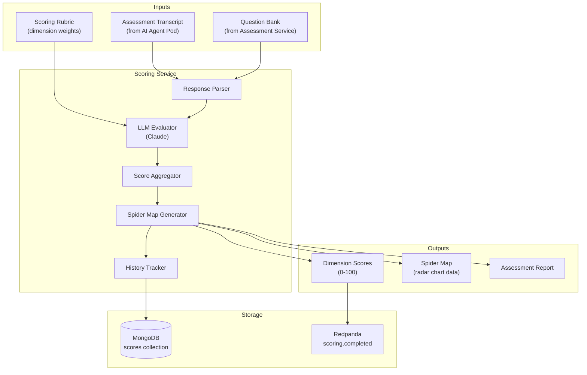
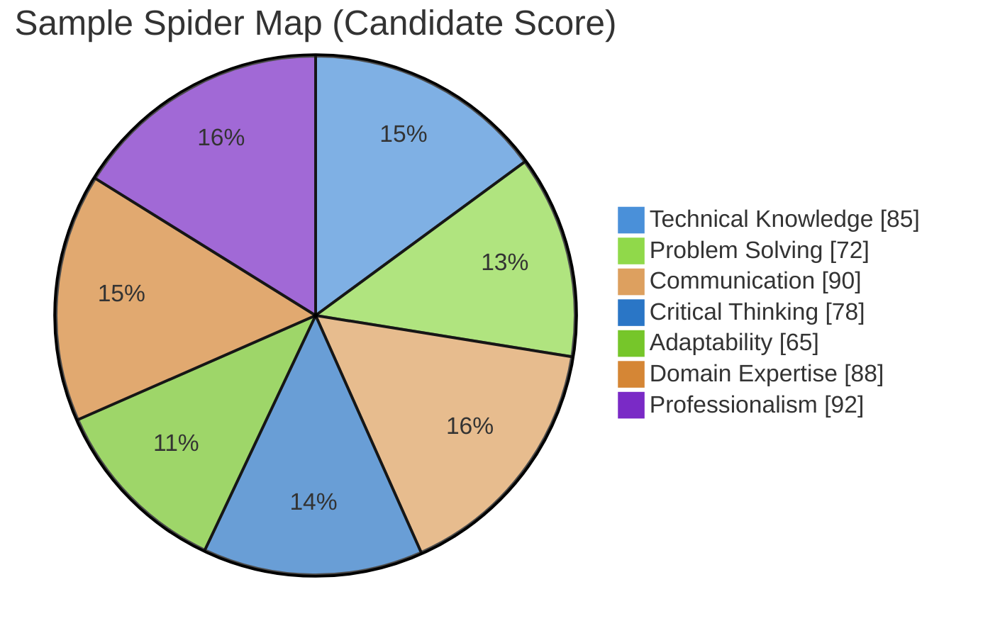

# Scoring Service Specification

## Overview

The Scoring Service evaluates assessment responses and generates multi-dimensional "spider maps" that visualize candidate competencies across various dimensions. This document specifies the scoring algorithms, data models, and integration patterns.

---

## Architecture

### Service Overview

| Property | Value |
|----------|-------|
| **Language** | Python |
| **Framework** | FastAPI |
| **Database** | MongoDB (scores, spider maps) |
| **Events** | Redpanda (assessment.completed → scoring.completed) |
| **Memory** | ~256MB |
| **Replicas** | 2 |

### Component Diagram



---

## Spider Map Dimensions

### Default Assessment Dimensions

| Dimension | Weight | Description | Evaluation Criteria |
|-----------|--------|-------------|---------------------|
| **Technical Knowledge** | 25% | Domain expertise | Accuracy, depth, terminology |
| **Problem Solving** | 20% | Analytical thinking | Approach, methodology, edge cases |
| **Communication** | 15% | Clarity of expression | Structure, articulation, conciseness |
| **Critical Thinking** | 15% | Reasoning ability | Logic, assumptions, evidence |
| **Adaptability** | 10% | Handling new scenarios | Flexibility, learning, pivoting |
| **Domain Expertise** | 10% | Industry knowledge | Context, best practices, trends |
| **Professionalism** | 5% | Conduct & demeanor | Composure, ethics, engagement |

### Spider Map Visualization



---

## Scoring Algorithm

### Phase 1: Response Extraction

```python
from dataclasses import dataclass
from typing import List, Optional
import re

@dataclass
class AssessmentResponse:
    question_id: str
    question_text: str
    response_text: str
    audio_duration_seconds: float
    confidence_score: float  # STT confidence
    timestamps: dict  # start/end times

@dataclass
class ParsedAssessment:
    assessment_id: str
    candidate_id: str
    responses: List[AssessmentResponse]
    total_duration_seconds: float
    completion_rate: float  # answered / total questions

def parse_transcript(transcript: dict, questions: List[dict]) -> ParsedAssessment:
    """
    Parse raw assessment transcript into structured responses.

    Maps each question to its corresponding response segment
    from the transcript using timestamps.
    """
    responses = []

    for question in questions:
        # Find response segment for this question
        response_segment = find_response_segment(
            transcript["segments"],
            question["asked_at"],
            question["next_question_at"]
        )

        responses.append(AssessmentResponse(
            question_id=question["id"],
            question_text=question["text"],
            response_text=response_segment["text"],
            audio_duration_seconds=response_segment["duration"],
            confidence_score=response_segment["avg_confidence"],
            timestamps={
                "start": response_segment["start"],
                "end": response_segment["end"]
            }
        ))

    return ParsedAssessment(
        assessment_id=transcript["assessment_id"],
        candidate_id=transcript["candidate_id"],
        responses=responses,
        total_duration_seconds=sum(r.audio_duration_seconds for r in responses),
        completion_rate=len(responses) / len(questions)
    )
```

### Phase 2: LLM-Based Evaluation

```python
from pydantic import BaseModel
from typing import List
import json

class DimensionScore(BaseModel):
    dimension: str
    score: int  # 0-100
    confidence: float  # 0-1
    evidence: List[str]  # Supporting quotes
    reasoning: str

class ResponseEvaluation(BaseModel):
    question_id: str
    dimension_scores: List[DimensionScore]
    overall_quality: int  # 0-100
    strengths: List[str]
    improvements: List[str]

EVALUATION_PROMPT = """
You are evaluating a candidate's response to an assessment question.

Question: {question}

Candidate's Response: {response}

Scoring Rubric:
{rubric}

Evaluate the response on each dimension listed. For each dimension:
1. Assign a score from 0-100
2. Provide specific evidence (quotes) supporting your score
3. Explain your reasoning briefly

Return your evaluation as JSON:
{{
    "dimension_scores": [
        {{
            "dimension": "Technical Knowledge",
            "score": 85,
            "confidence": 0.9,
            "evidence": ["The candidate correctly explained...", "Demonstrated understanding of..."],
            "reasoning": "Strong technical foundation with accurate terminology..."
        }},
        ...
    ],
    "overall_quality": 82,
    "strengths": ["Clear explanation of...", "Good use of..."],
    "improvements": ["Could have addressed...", "Missing consideration of..."]
}}
"""

async def evaluate_response(
    response: AssessmentResponse,
    rubric: dict,
    llm_client: LLMClient
) -> ResponseEvaluation:
    """
    Use LLM to evaluate a single response against the rubric.
    """
    prompt = EVALUATION_PROMPT.format(
        question=response.question_text,
        response=response.response_text,
        rubric=json.dumps(rubric, indent=2)
    )

    result = await llm_client.generate(
        prompt=prompt,
        max_tokens=2000,
        temperature=0.3  # Lower temperature for consistent scoring
    )

    # Parse JSON response
    evaluation_data = json.loads(result)

    return ResponseEvaluation(
        question_id=response.question_id,
        **evaluation_data
    )
```

### Phase 3: Score Aggregation

```python
from collections import defaultdict
from typing import Dict, List
import numpy as np

@dataclass
class AggregatedScore:
    dimension: str
    raw_score: float  # Average across questions
    weighted_score: float  # After dimension weight applied
    confidence: float  # Average confidence
    question_scores: List[int]  # Individual question scores

@dataclass
class SpiderMapData:
    dimensions: List[str]
    scores: List[float]  # 0-100 for each dimension
    confidences: List[float]
    overall_score: float
    percentile: Optional[int]  # Compared to other candidates

def aggregate_scores(
    evaluations: List[ResponseEvaluation],
    dimension_weights: Dict[str, float]
) -> SpiderMapData:
    """
    Aggregate individual response evaluations into spider map data.

    Algorithm:
    1. Group scores by dimension across all responses
    2. Calculate weighted average per dimension
    3. Apply dimension weights for overall score
    4. Normalize to 0-100 scale
    """
    # Group scores by dimension
    dimension_scores = defaultdict(list)
    dimension_confidences = defaultdict(list)

    for eval in evaluations:
        for dim_score in eval.dimension_scores:
            dimension_scores[dim_score.dimension].append(dim_score.score)
            dimension_confidences[dim_score.dimension].append(dim_score.confidence)

    # Calculate aggregated scores per dimension
    aggregated = []
    for dimension, weight in dimension_weights.items():
        scores = dimension_scores.get(dimension, [50])  # Default to 50 if missing
        confidences = dimension_confidences.get(dimension, [0.5])

        raw_score = np.mean(scores)
        weighted_score = raw_score * weight
        confidence = np.mean(confidences)

        aggregated.append(AggregatedScore(
            dimension=dimension,
            raw_score=raw_score,
            weighted_score=weighted_score,
            confidence=confidence,
            question_scores=scores
        ))

    # Build spider map data
    dimensions = [a.dimension for a in aggregated]
    scores = [a.raw_score for a in aggregated]
    confidences = [a.confidence for a in aggregated]

    # Overall score is weighted sum
    overall_score = sum(a.weighted_score for a in aggregated)

    return SpiderMapData(
        dimensions=dimensions,
        scores=scores,
        confidences=confidences,
        overall_score=overall_score,
        percentile=None  # Calculated separately
    )
```

### Phase 4: Percentile Calculation

```python
from motor.motor_asyncio import AsyncIOMotorClient
from typing import Optional

async def calculate_percentile(
    score: float,
    assessment_type: str,
    db: AsyncIOMotorClient
) -> int:
    """
    Calculate candidate's percentile compared to historical assessments.

    Uses MongoDB aggregation to find position in score distribution.
    """
    # Get all scores for this assessment type
    pipeline = [
        {"$match": {"assessment_type": assessment_type}},
        {"$project": {"overall_score": 1}},
        {"$sort": {"overall_score": 1}}
    ]

    cursor = db.scores.aggregate(pipeline)
    all_scores = [doc["overall_score"] async for doc in cursor]

    if not all_scores:
        return 50  # Default to median if no historical data

    # Calculate percentile
    count_below = sum(1 for s in all_scores if s < score)
    percentile = int((count_below / len(all_scores)) * 100)

    return percentile
```

---

## Brain Dumper Detection

### Overview

Brain dumpers are candidates who memorize and recite answers without genuine understanding. The scoring system includes algorithmic detection.

### Detection Signals

| Signal | Weight | Detection Method |
|--------|--------|------------------|
| **Response Time** | 20% | Too fast = memorized |
| **Verbatim Matching** | 25% | Compare to known answers |
| **Follow-up Performance** | 30% | Struggles with variations |
| **Consistency** | 25% | Inconsistent depth across topics |

### Detection Algorithm

```python
from dataclasses import dataclass
from typing import List, Tuple
import difflib

@dataclass
class BrainDumpIndicators:
    response_time_ratio: float  # Actual / expected time
    verbatim_similarity: float  # 0-1 similarity to known answers
    followup_performance: float  # Score on follow-up questions
    consistency_variance: float  # Variance in topic scores
    overall_suspicion: float  # Combined indicator

async def detect_brain_dumping(
    parsed: ParsedAssessment,
    evaluations: List[ResponseEvaluation],
    known_answers_db: AnswerDatabase
) -> BrainDumpIndicators:
    """
    Detect potential brain dumping behavior.

    Returns indicators that flag suspicious patterns without
    automatically penalizing (human review required).
    """

    # 1. Response Time Analysis
    # Brain dumpers often respond faster than expected
    expected_times = [get_expected_time(r.question_text) for r in parsed.responses]
    actual_times = [r.audio_duration_seconds for r in parsed.responses]
    time_ratios = [a / e for a, e in zip(actual_times, expected_times)]
    avg_time_ratio = sum(time_ratios) / len(time_ratios)

    # Flag if significantly faster than expected
    time_suspicion = max(0, 1 - avg_time_ratio) if avg_time_ratio < 0.5 else 0

    # 2. Verbatim Matching
    # Compare responses to known "perfect answers" in database
    similarities = []
    for response in parsed.responses:
        known_answers = await known_answers_db.get_answers(response.question_id)
        if known_answers:
            max_similarity = max(
                difflib.SequenceMatcher(None, response.response_text, ka).ratio()
                for ka in known_answers
            )
            similarities.append(max_similarity)

    verbatim_score = sum(similarities) / len(similarities) if similarities else 0

    # 3. Follow-up Performance
    # Brain dumpers struggle with follow-up/clarification questions
    followup_scores = [
        e.overall_quality
        for e in evaluations
        if is_followup_question(e.question_id)
    ]
    base_scores = [
        e.overall_quality
        for e in evaluations
        if not is_followup_question(e.question_id)
    ]

    if followup_scores and base_scores:
        followup_ratio = (sum(followup_scores) / len(followup_scores)) / \
                        (sum(base_scores) / len(base_scores))
    else:
        followup_ratio = 1.0

    followup_suspicion = max(0, 1 - followup_ratio) if followup_ratio < 0.7 else 0

    # 4. Consistency Analysis
    # Brain dumpers show high variance (memorized some topics, not others)
    dimension_scores = defaultdict(list)
    for eval in evaluations:
        for ds in eval.dimension_scores:
            dimension_scores[ds.dimension].append(ds.score)

    variances = [np.var(scores) for scores in dimension_scores.values()]
    consistency_variance = sum(variances) / len(variances) if variances else 0

    # Normalize variance (higher = more suspicious)
    consistency_suspicion = min(1, consistency_variance / 500)  # 500 is threshold

    # Combined suspicion score
    overall_suspicion = (
        time_suspicion * 0.20 +
        verbatim_score * 0.25 +
        followup_suspicion * 0.30 +
        consistency_suspicion * 0.25
    )

    return BrainDumpIndicators(
        response_time_ratio=avg_time_ratio,
        verbatim_similarity=verbatim_score,
        followup_performance=followup_ratio,
        consistency_variance=consistency_variance,
        overall_suspicion=overall_suspicion
    )
```

### Suspicion Thresholds

| Suspicion Level | Score Range | Action |
|-----------------|-------------|--------|
| Low | 0.0 - 0.3 | No flag |
| Medium | 0.3 - 0.6 | Flag for review |
| High | 0.6 - 1.0 | Manual review required |

---

## Assessment History Tracking

### Data Model

```python
from datetime import datetime
from typing import List, Optional
from pydantic import BaseModel

class AssessmentAttempt(BaseModel):
    attempt_id: str
    assessment_id: str
    candidate_id: str
    assessment_type: str
    timestamp: datetime
    spider_map: SpiderMapData
    brain_dump_indicators: BrainDumpIndicators
    overall_score: float
    duration_seconds: int
    completion_rate: float

class CandidateHistory(BaseModel):
    candidate_id: str
    attempts: List[AssessmentAttempt]
    best_attempt_id: Optional[str]
    average_score: float
    improvement_trend: float  # Positive = improving
    retake_count: int
    last_assessment_date: datetime
```

### Retake Rules

| Rule | Value | Enforcement |
|------|-------|-------------|
| Minimum wait between retakes | 2 weeks | `last_assessment_date + 14 days` |
| Maximum retakes | 3 per assessment type | `retake_count < 3` |
| Score visibility | All attempts visible to employers | Stored in history |
| Retake cost | Credits required | Checked before scheduling |

### History Storage (MongoDB)

```javascript
// scores collection schema
{
  "_id": ObjectId,
  "assessment_id": "uuid",
  "candidate_id": "uuid",
  "assessment_type": "backend-engineering",
  "timestamp": ISODate,

  "spider_map": {
    "dimensions": ["Technical Knowledge", "Problem Solving", ...],
    "scores": [85, 72, 90, 78, 65, 88, 92],
    "confidences": [0.9, 0.85, 0.92, 0.88, 0.78, 0.91, 0.95],
    "overall_score": 81.5,
    "percentile": 78
  },

  "brain_dump_indicators": {
    "response_time_ratio": 0.85,
    "verbatim_similarity": 0.12,
    "followup_performance": 0.95,
    "consistency_variance": 120,
    "overall_suspicion": 0.15
  },

  "responses": [
    {
      "question_id": "uuid",
      "dimension_scores": [...],
      "evidence": [...],
      "strengths": [...],
      "improvements": [...]
    }
  ],

  "metadata": {
    "duration_seconds": 1847,
    "completion_rate": 1.0,
    "audio_quality": 0.92,
    "attempt_number": 1
  }
}

// Indexes
db.scores.createIndex({ "candidate_id": 1, "assessment_type": 1 })
db.scores.createIndex({ "timestamp": -1 })
db.scores.createIndex({ "spider_map.overall_score": -1 })
```

---

## API Endpoints

### Score Assessment

```yaml
POST /api/v1/scoring/assess
Content-Type: application/json

Request:
{
  "assessment_id": "uuid",
  "candidate_id": "uuid",
  "transcript": { ... },
  "questions": [ ... ]
}

Response:
{
  "scoring_id": "uuid",
  "status": "processing",
  "estimated_completion_seconds": 30
}
```

### Get Spider Map

```yaml
GET /api/v1/scoring/spider-map/{candidate_id}?assessment_type=backend-engineering

Response:
{
  "candidate_id": "uuid",
  "assessment_type": "backend-engineering",
  "spider_map": {
    "dimensions": ["Technical Knowledge", "Problem Solving", ...],
    "scores": [85, 72, 90, 78, 65, 88, 92],
    "overall_score": 81.5,
    "percentile": 78
  },
  "history": {
    "attempt_count": 2,
    "best_score": 81.5,
    "improvement_trend": 8.2
  }
}
```

### Compare Candidates

```yaml
POST /api/v1/scoring/compare
Content-Type: application/json

Request:
{
  "candidate_ids": ["uuid1", "uuid2", "uuid3"],
  "assessment_type": "backend-engineering"
}

Response:
{
  "comparison": [
    {
      "candidate_id": "uuid1",
      "spider_map": { ... },
      "rank": 1
    },
    ...
  ],
  "dimension_leaders": {
    "Technical Knowledge": "uuid2",
    "Problem Solving": "uuid1",
    ...
  }
}
```

---

## Event Flow

### Redpanda Events

```yaml
# Input: assessment.completed
topic: assessment-events
key: assessment_id
value:
  event_type: "assessment.completed"
  assessment_id: "uuid"
  candidate_id: "uuid"
  transcript_url: "s3://minio/recordings/..."
  questions: [...]
  timestamp: "2026-01-07T12:00:00Z"

# Output: scoring.completed
topic: scoring-events
key: assessment_id
value:
  event_type: "scoring.completed"
  assessment_id: "uuid"
  candidate_id: "uuid"
  spider_map:
    overall_score: 81.5
    percentile: 78
  brain_dump_suspicion: 0.15
  timestamp: "2026-01-07T12:00:30Z"

# Output: scoring.flagged (if brain dump suspected)
topic: scoring-events
key: assessment_id
value:
  event_type: "scoring.flagged"
  assessment_id: "uuid"
  candidate_id: "uuid"
  reason: "brain_dump_suspected"
  suspicion_score: 0.72
  requires_review: true
  timestamp: "2026-01-07T12:00:30Z"
```

---

## Configuration

```yaml
# scoring-service/config.yaml
scoring:
  dimensions:
    - name: "Technical Knowledge"
      weight: 0.25
      min_questions: 3
    - name: "Problem Solving"
      weight: 0.20
      min_questions: 2
    - name: "Communication"
      weight: 0.15
      min_questions: 2
    - name: "Critical Thinking"
      weight: 0.15
      min_questions: 2
    - name: "Adaptability"
      weight: 0.10
      min_questions: 1
    - name: "Domain Expertise"
      weight: 0.10
      min_questions: 2
    - name: "Professionalism"
      weight: 0.05
      min_questions: 1

brain_dump_detection:
  enabled: true
  thresholds:
    low: 0.3
    medium: 0.6
    high: 0.8
  auto_flag_threshold: 0.6

llm:
  model: "claude-3-5-sonnet"
  temperature: 0.3
  max_tokens: 2000
  timeout_seconds: 30

retake_rules:
  min_wait_days: 14
  max_attempts: 3
  credit_cost: 1
```

---

## Monitoring

### Metrics

```yaml
metrics:
  - name: scoring_assessments_total
    type: counter
    labels: [assessment_type, status]

  - name: scoring_duration_seconds
    type: histogram
    buckets: [5, 10, 20, 30, 60, 120]

  - name: scoring_llm_calls_total
    type: counter
    labels: [model, status]

  - name: scoring_brain_dump_flags_total
    type: counter
    labels: [severity]

  - name: scoring_average_score
    type: gauge
    labels: [assessment_type, dimension]
```

### Alerts

```yaml
groups:
  - name: scoring-service
    rules:
      - alert: ScoringLatencyHigh
        expr: histogram_quantile(0.95, scoring_duration_seconds) > 60
        for: 5m
        labels:
          severity: warning

      - alert: HighBrainDumpRate
        expr: rate(scoring_brain_dump_flags_total{severity="high"}[1h]) > 0.1
        for: 15m
        labels:
          severity: warning
        annotations:
          summary: "High rate of brain dump detection flags"
```

---

## References

- [DOMAIN_MODEL.md](/docs/05-data-model/DOMAIN_MODEL.md) - Scoring entity definitions
- [ASSESSMENT_SERVICE_SPEC.md](/docs/06-technical-specs/) - Assessment data flow
- [ADR-026: Event Streaming](/docs/09-adrs/ADR-026-EVENT-STREAMING-REDPANDA.md) - Redpanda integration

---

*Document Version: 1.0*
*Last Updated: 2026-01-07*
