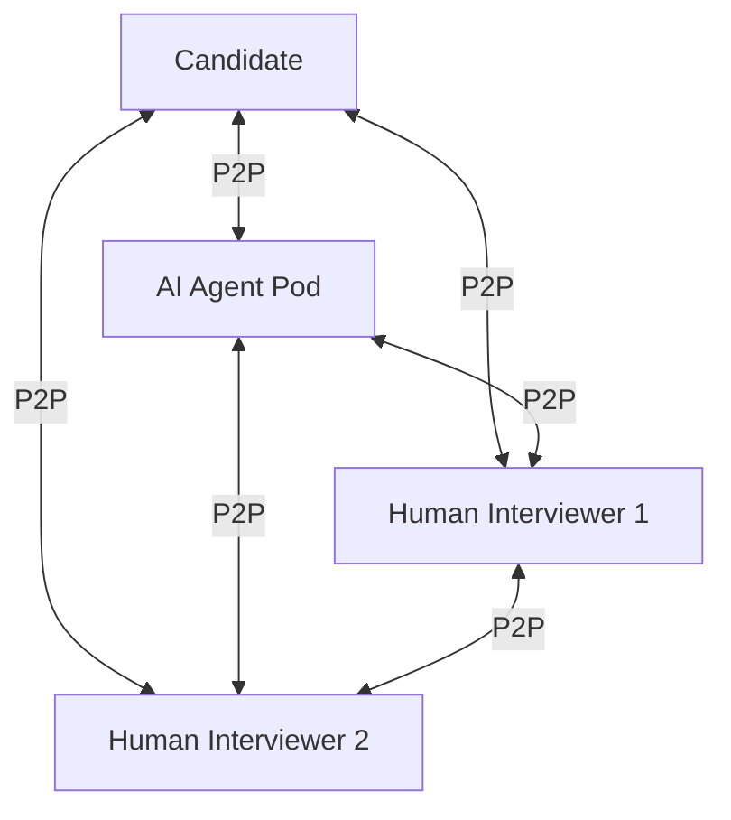

# talentmesh Application Technology Stack

## Overview

This document details the application-level technology choices for talentmesh, the AI-powered talent assessment platform.

> **Platform Infrastructure:** For kubernetes, networking, observability, and other infrastructure components, see [openova Platform Tech Stack](https://github.com/openova-io/handbook/blob/main/technical/PLATFORM_TECH_STACK.md).

---

## Application Summary

| Category | Technology | Version | Purpose |
|----------|------------|---------|---------|
| **Frontend** | Next.js | 14.x | Assessment Portal (WebRTC) |
| **WebRTC** | simple-peer | Latest | P2P media streaming (up to 5 participants) |
| **Platform Services** | Node.js | 20.x LTS | REST APIs |
| **Signaling** | Rust (tokio/axum) | Latest | WebRTC signaling |
| **TURN Server** | STUNner | Latest | K8s-native TURN (NAT fallback) |
| **STT** | whisper-rs (Rust) | Latest | Speech-to-text (in AI Agent Pods) |
| **TTS** | piper-rs (Rust) | Latest | Text-to-speech (in AI Agent Pods) |
| **LLM** | Claude CLI/API | Latest | AI conversation (in AI Agent Pods) |
| **Primary DB** | PostgreSQL | 15+ | Relational data |
| **Document DB** | MongoDB | 7.0+ | Flexible documents |

---

## Language & Technology Balance

### Philosophy: "Vibe Coding" First

Our primary goal is development velocity through AI-assisted "vibe coding." Each service must stay under ~50k LOC to fit in Claude's context window.

### Language Selection Guidelines

| Language | Use Cases | Rationale |
|----------|-----------|-----------|
| **TypeScript** | Platform services, Frontend | Vibe coding friendly, rapid development |
| **Python** | ML/AI services, LLM Gateway | AI ecosystem, Claude CLI integration |
| **Rust** | Signaling, STT, TTS | Performance-critical, low latency |

### Decision Framework

| Factor | Node.js/TypeScript | Python | Rust |
|--------|-------------------|--------|------|
| Development Speed | Excellent | Excellent | Slower |
| AI-Assisted Coding | Excellent | Excellent | Good |
| Performance | Good | Moderate | Excellent |
| Latency | Good | Moderate | Excellent |

---

## Frontend

### Next.js 14

**Choice:** Next.js with App Router

**Rationale:**
- Server-side rendering for SEO and performance
- React Server Components for optimal bundle sizes
- Excellent TypeScript support
- Large ecosystem and community

**Key Libraries:**
```json
{
  "dependencies": {
    "next": "^14.0.0",
    "react": "^18.2.0",
    "@tanstack/react-query": "^5.0.0",
    "zustand": "^4.4.0",
    "tailwindcss": "^3.4.0",
    "shadcn/ui": "latest",
    "recharts": "^2.10.0",
    "simple-peer": "^9.11.0"
  }
}
```

---

## WebRTC Stack

### P2P Media Streaming

**Choice:** WebRTC with simple-peer wrapper

**Rationale:**
- Direct peer-to-peer connection (~80% of cases)
- Reduces central infrastructure load
- Sub-second latency for real-time assessment
- DTLS-SRTP encryption built-in

**Key Components:**

| Component | Technology | Purpose |
|-----------|------------|---------|
| WebRTC Client | simple-peer | Browser-side P2P mesh (up to 5 participants) |
| Signaling Server | Rust (tokio + axum) | SDP/ICE exchange |
| STUN Server | Google public STUN | NAT discovery (free) |
| TURN Server | STUNner | K8s-native NAT traversal |

### NAT Traversal Strategy

| Connection Type | Expected Rate |
|-----------------|---------------|
| Direct P2P (STUN) | ~80% |
| STUNner Relay | ~20% |

### Hybrid Interview Support (up to 5 participants)



### Signaling Protocol

**WebSocket Message Types:**

| Type | Direction | Purpose |
|------|-----------|---------|
| `join` | Client → Server | Join signaling room |
| `offer` | Client → Server → Client | SDP offer |
| `answer` | Client → Server → Client | SDP answer |
| `ice-candidate` | Client → Server → Client | ICE candidate |
| `leave` | Client → Server | Leave room |

---

## Backend Services

### Node.js 20 LTS (Platform Services)

**Choice:** Node.js with Fastify framework

**Key Libraries:**
```json
{
  "dependencies": {
    "fastify": "^4.24.0",
    "@fastify/cors": "^8.4.0",
    "@fastify/jwt": "^7.2.0",
    "prisma": "^5.6.0",
    "zod": "^3.22.0",
    "kafkajs": "^2.2.0",
    "ioredis": "^5.3.0"
  }
}
```

### Python 3.11+ (AI Services)

**Choice:** Python with FastAPI for AI services

**Key Libraries:**
```python
# requirements.txt
fastapi>=0.104.0
uvicorn>=0.24.0
pydantic>=2.5.0
anthropic>=0.7.0
pexpect>=4.8.0
numpy>=1.26.0
soundfile>=0.12.0
```

---

## AI/ML Stack

### AI Agent Pod Architecture

```
AI Agent Pod Components:
├── STT Service (Rust)        - whisper-rs bindings
├── TTS Service (Rust)        - piper-rs bindings
├── LLM Gateway (Python)      - Claude CLI wrapper
└── Audio Router (Rust)       - WebRTC audio handling
```

### whisper.cpp (Speech-to-Text)

**Choice:** whisper.cpp with medium model

| Metric | Value |
|--------|-------|
| Model | medium |
| Disk | 1.5 GB |
| RAM | ~2.5 GB |
| RTF | 0.25 |
| Latency (5s chunk) | ~1.25s |
| Technical term accuracy | >95% |

### Piper TTS (Text-to-Speech)

**Choice:** Piper with en_US-lessac-medium voice

| Metric | Value |
|--------|-------|
| Latency | 50-200ms |
| Quality | Natural |
| RAM | ~200 MB |

### Claude CLI/API (Zero Development Cost)

**Cost Model:**

| Environment | Backend | Cost |
|-------------|---------|------|
| Development | Claude CLI | $0 (included in Claude subscription) |
| Staging | Claude CLI | $0 |
| Production | Claude API | ~$0.05/assessment |

**Session Pool Strategy:**
```python
import os
from enum import Enum

class LLMBackend(Enum):
    CLI = "cli"
    API = "api"

# Configuration via environment variable
LLM_BACKEND = os.getenv("LLM_BACKEND", "cli")  # Default to CLI for development

class ClaudeSessionPool:
    """Session pool for warm CLI starts - $0 development cost"""

    def __init__(self, pool_size=2):
        self.sessions = []
        for _ in range(pool_size):
            self.sessions.append(self._spawn_session())

    async def query(self, prompt: str) -> str:
        session = await self.acquire()
        try:
            return session.send(prompt)
        finally:
            await self.release(session)

def get_llm_client():
    """Factory function based on LLM_BACKEND environment variable"""
    if LLM_BACKEND == "api":
        return ClaudeAPIClient()
    return ClaudeSessionPool()
```

**Migration Path:**
```bash
# Development (default)
export LLM_BACKEND=cli

# Production
export LLM_BACKEND=api
export ANTHROPIC_API_KEY=sk-ant-...
```

---

## Databases

### PostgreSQL 15+ (Transactional Data)

**Use Cases:**
- User accounts (auth schema)
- Sessions
- Organizations
- Bookings
- Audit logs

### MongoDB 7.0+ (Document Storage)

**Use Cases:**
- Candidate profiles
- Assessment transcripts
- Templates
- Spider maps

---

## Authentication

**Choice:** LinkedIn OAuth 2.0 Only

**Rationale:**
- Professional network verification built-in
- No password management overhead
- Reduces attack surface (no credential storage)
- Simplified auth flow

**No Password Libraries Required:**
- No bcrypt/argon2 (no passwords to hash)
- No password reset flows
- No credential validation logic

**OAuth Flow:**
```
User -> LinkedIn OAuth -> JWT issued -> API access
```

---

## Testing Stack

| Tool | Purpose |
|------|---------|
| Vitest | Unit testing (Node.js) |
| pytest | Unit testing (Python) |
| Playwright | E2E testing |
| k6 | Load testing |

---

## Version Matrix

| Component | Dev Version | Prod Version | EOL |
|-----------|-------------|--------------|-----|
| Node.js | 20.10.0 | 20 LTS | April 2026 |
| Python | 3.11.6 | 3.11 | October 2027 |
| PostgreSQL | 15.4 | 15 | November 2027 |
| MongoDB | 7.0.4 | 7.0 | TBD |

---

## Cost Summary

| Component | Development | Production |
|-----------|-------------|------------|
| Claude LLM | $0 (CLI) | ~$0.05/assessment |
| Public STUN | $0 (Google/Twilio) | $0 (Google/Twilio) |
| STUNner TURN | Self-hosted | Self-hosted |
| **Per Assessment** | **~$0** | **~$0.05** |

---

## Related Documents

- [AI/ML Specifications](./AI_ML_SPECIFICATIONS.md)
- [Claude Wrapper Spec](./CLAUDE_WRAPPER_SPEC.md)
- [WebRTC Mesh Spec](./WEBRTC_MESH_SPEC.md)
- [Scoring Service Spec](./SCORING_SERVICE_SPEC.md)

---

*Document Version: 1.0*
*Last Updated: 2026-01-10*
*Owner: Engineering Team*
