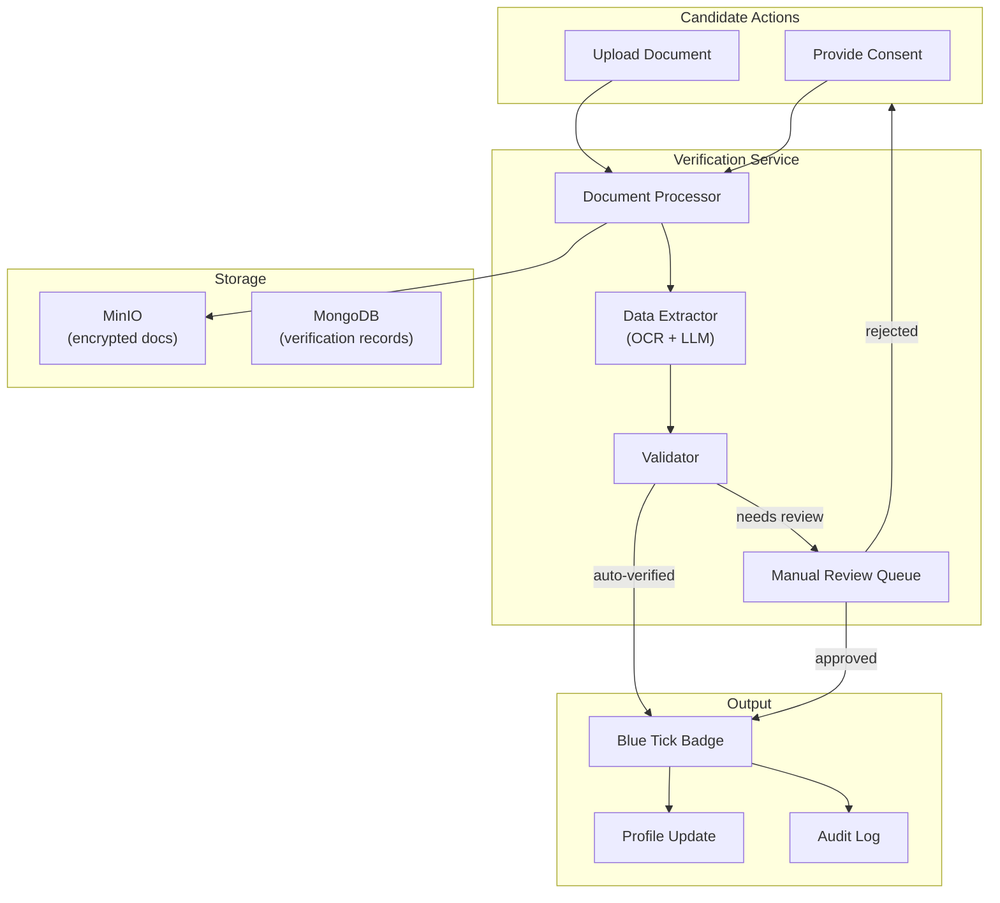
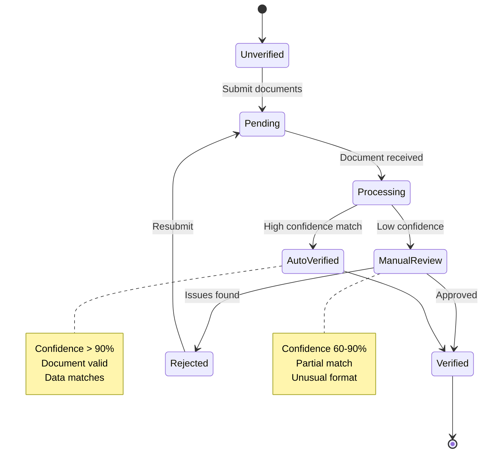

# Verification System Specification

## Overview

The Verification System enables candidates to verify their professional information (salary, education, experience) to earn "blue tick" badges that increase employer trust. This document specifies the verification flows, document processing, and badge management.

---

## Architecture

### System Overview



### Service Specification

| Property | Value |
|----------|-------|
| **Service** | User Service (verification module) |
| **Language** | Node.js / TypeScript |
| **Storage** | MongoDB (records), MinIO (documents) |
| **OCR** | Tesseract.js |
| **LLM** | Claude (data extraction) |
| **Memory** | Part of User Service |

---

## Verification Types

### Supported Verifications

| Type | Documents Accepted | Badge |
|------|-------------------|-------|
| **Salary** | Payslips, Tax returns, Offer letters | 💰 Verified Salary |
| **Education** | Degrees, Transcripts, Certificates | 🎓 Verified Education |
| **Experience** | Employment letters, LinkedIn export | 💼 Verified Experience |
| **Identity** | Government ID (optional) | ✓ ID Verified |

### Verification Levels



---

## Document Processing

### Upload Flow

```typescript
// verification.service.ts
import { createHash } from 'crypto';
import { MinioClient } from './minio.client';
import { OCRService } from './ocr.service';
import { LLMService } from './llm.service';

interface VerificationRequest {
  candidateId: string;
  verificationType: 'salary' | 'education' | 'experience' | 'identity';
  document: Buffer;
  documentType: string; // 'pdf', 'image', etc.
  metadata: {
    expectedAmount?: number; // For salary verification
    expectedDegree?: string; // For education
    expectedCompany?: string; // For experience
  };
  consent: {
    dataProcessing: boolean;
    documentStorage: boolean;
    employerSharing: boolean;
    timestamp: Date;
  };
}

interface VerificationResult {
  verificationId: string;
  status: 'auto_verified' | 'pending_review' | 'rejected';
  confidence: number;
  extractedData: Record<string, any>;
  issues?: string[];
}

class VerificationService {
  constructor(
    private minio: MinioClient,
    private ocr: OCRService,
    private llm: LLMService,
    private db: Database
  ) {}

  async processVerification(request: VerificationRequest): Promise<VerificationResult> {
    // 1. Validate consent
    if (!this.validateConsent(request.consent)) {
      throw new Error('Valid consent required for verification');
    }

    // 2. Generate document hash for deduplication
    const documentHash = createHash('sha256')
      .update(request.document)
      .digest('hex');

    // 3. Check for duplicate submission
    const existing = await this.db.verifications.findOne({
      candidateId: request.candidateId,
      documentHash,
      status: { $in: ['verified', 'pending_review'] }
    });

    if (existing) {
      return {
        verificationId: existing._id,
        status: existing.status,
        confidence: existing.confidence,
        extractedData: existing.extractedData
      };
    }

    // 4. Store encrypted document
    const documentId = await this.storeDocument(request);

    // 5. Extract text via OCR
    const ocrResult = await this.ocr.extractText(request.document, request.documentType);

    // 6. Extract structured data via LLM
    const extractedData = await this.extractData(
      request.verificationType,
      ocrResult.text,
      request.metadata
    );

    // 7. Validate extracted data
    const validation = await this.validateData(
      request.verificationType,
      extractedData,
      request.metadata
    );

    // 8. Determine verification status
    const status = this.determineStatus(validation);

    // 9. Store verification record
    const verificationId = await this.db.verifications.insertOne({
      candidateId: request.candidateId,
      verificationType: request.verificationType,
      documentId,
      documentHash,
      extractedData,
      validation,
      status,
      confidence: validation.confidence,
      consent: request.consent,
      createdAt: new Date(),
      updatedAt: new Date()
    });

    // 10. If auto-verified, award badge
    if (status === 'auto_verified') {
      await this.awardBadge(request.candidateId, request.verificationType, extractedData);
    }

    return {
      verificationId,
      status,
      confidence: validation.confidence,
      extractedData
    };
  }

  private async storeDocument(request: VerificationRequest): Promise<string> {
    const documentId = crypto.randomUUID();
    const encryptedPath = `verifications/${request.candidateId}/${documentId}`;

    // Store with server-side encryption
    await this.minio.putObject(
      'verification-docs',
      encryptedPath,
      request.document,
      {
        'Content-Type': this.getMimeType(request.documentType),
        'x-amz-server-side-encryption': 'AES256'
      }
    );

    return documentId;
  }
}
```

### Data Extraction

```typescript
// llm-extractor.ts
const EXTRACTION_PROMPTS = {
  salary: `
    Extract salary information from this document.
    Return JSON with:
    {
      "document_type": "payslip" | "offer_letter" | "tax_return" | "other",
      "employer_name": string,
      "employee_name": string,
      "period": {
        "start": "YYYY-MM-DD",
        "end": "YYYY-MM-DD"
      },
      "amounts": {
        "gross_salary": number,
        "net_salary": number,
        "currency": "USD" | "EUR" | "GBP" | etc,
        "frequency": "monthly" | "annual" | "biweekly"
      },
      "confidence": 0-100,
      "issues": string[]
    }
  `,

  education: `
    Extract education information from this document.
    Return JSON with:
    {
      "document_type": "degree" | "transcript" | "certificate",
      "institution_name": string,
      "student_name": string,
      "degree": {
        "level": "bachelor" | "master" | "phd" | "certificate",
        "field": string,
        "title": string
      },
      "dates": {
        "start": "YYYY-MM-DD",
        "graduation": "YYYY-MM-DD"
      },
      "grade": string | null,
      "confidence": 0-100,
      "issues": string[]
    }
  `,

  experience: `
    Extract employment information from this document.
    Return JSON with:
    {
      "document_type": "employment_letter" | "reference" | "linkedin_export",
      "employer_name": string,
      "employee_name": string,
      "position": string,
      "dates": {
        "start": "YYYY-MM-DD",
        "end": "YYYY-MM-DD" | "present"
      },
      "responsibilities": string[],
      "confidence": 0-100,
      "issues": string[]
    }
  `
};

async function extractData(
  verificationType: string,
  ocrText: string,
  metadata: Record<string, any>
): Promise<ExtractedData> {
  const prompt = `
    ${EXTRACTION_PROMPTS[verificationType]}

    Document text:
    """
    ${ocrText}
    """

    Expected data to match against:
    ${JSON.stringify(metadata)}
  `;

  const response = await llmClient.generate({
    prompt,
    maxTokens: 1000,
    temperature: 0.1 // Low temperature for consistent extraction
  });

  return JSON.parse(response);
}
```

### Validation Logic

```typescript
// validator.ts
interface ValidationResult {
  isValid: boolean;
  confidence: number;
  matches: {
    field: string;
    expected: any;
    extracted: any;
    match: boolean;
  }[];
  issues: string[];
}

class DocumentValidator {
  async validateSalary(
    extracted: SalaryData,
    expected: { amount: number; currency: string }
  ): Promise<ValidationResult> {
    const matches = [];
    const issues = [];

    // Validate amount (allow 10% variance for taxes/deductions)
    const annualizedExtracted = this.annualizeSalary(
      extracted.amounts.gross_salary,
      extracted.amounts.frequency
    );
    const variance = Math.abs(annualizedExtracted - expected.amount) / expected.amount;
    const amountMatch = variance <= 0.10;

    matches.push({
      field: 'salary',
      expected: expected.amount,
      extracted: annualizedExtracted,
      match: amountMatch
    });

    if (!amountMatch) {
      issues.push(`Salary variance ${(variance * 100).toFixed(1)}% exceeds threshold`);
    }

    // Validate document freshness (within 6 months)
    const docDate = new Date(extracted.period.end);
    const monthsOld = this.monthsDifference(docDate, new Date());
    if (monthsOld > 6) {
      issues.push(`Document is ${monthsOld} months old`);
    }

    // Validate document authenticity signals
    const authenticityScore = this.assessAuthenticity(extracted);

    const confidence = this.calculateConfidence({
      amountMatch,
      monthsOld,
      authenticityScore,
      llmConfidence: extracted.confidence
    });

    return {
      isValid: confidence >= 60 && issues.length === 0,
      confidence,
      matches,
      issues
    };
  }

  async validateEducation(
    extracted: EducationData,
    expected: { degree: string; institution?: string }
  ): Promise<ValidationResult> {
    const matches = [];
    const issues = [];

    // Validate degree
    const degreeMatch = this.fuzzyMatch(
      extracted.degree.title,
      expected.degree,
      0.8
    );

    matches.push({
      field: 'degree',
      expected: expected.degree,
      extracted: extracted.degree.title,
      match: degreeMatch
    });

    // Validate institution if provided
    if (expected.institution) {
      const institutionMatch = this.fuzzyMatch(
        extracted.institution_name,
        expected.institution,
        0.85
      );

      matches.push({
        field: 'institution',
        expected: expected.institution,
        extracted: extracted.institution_name,
        match: institutionMatch
      });

      if (!institutionMatch) {
        issues.push('Institution name does not match');
      }
    }

    const confidence = this.calculateConfidence({
      degreeMatch,
      llmConfidence: extracted.confidence
    });

    return {
      isValid: confidence >= 60,
      confidence,
      matches,
      issues
    };
  }

  private fuzzyMatch(a: string, b: string, threshold: number): boolean {
    const similarity = this.stringSimilarity(
      a.toLowerCase(),
      b.toLowerCase()
    );
    return similarity >= threshold;
  }

  private calculateConfidence(factors: Record<string, any>): number {
    // Weighted confidence calculation
    let score = factors.llmConfidence || 50;

    // Adjust based on validation results
    for (const [key, value] of Object.entries(factors)) {
      if (typeof value === 'boolean') {
        score += value ? 10 : -15;
      }
    }

    return Math.max(0, Math.min(100, score));
  }
}
```

---

## Badge Management

### Badge Data Model

```typescript
interface VerificationBadge {
  id: string;
  candidateId: string;
  type: 'salary' | 'education' | 'experience' | 'identity';
  status: 'active' | 'expired' | 'revoked';

  verifiedData: {
    // Salary badge
    salaryRange?: {
      min: number;
      max: number;
      currency: string;
      asOf: Date;
    };

    // Education badge
    education?: {
      degree: string;
      institution: string;
      graduationYear: number;
    };

    // Experience badge
    experience?: {
      company: string;
      role: string;
      years: number;
    };
  };

  verification: {
    verificationId: string;
    method: 'document' | 'api' | 'manual';
    verifiedAt: Date;
    expiresAt: Date;
  };

  visibility: {
    showToEmployers: boolean;
    showOnProfile: boolean;
  };

  audit: {
    createdAt: Date;
    updatedAt: Date;
    revokedAt?: Date;
    revokeReason?: string;
  };
}
```

### Badge Award Flow

```typescript
async function awardBadge(
  candidateId: string,
  verificationType: string,
  extractedData: ExtractedData
): Promise<VerificationBadge> {
  // Check for existing badge
  const existingBadge = await db.badges.findOne({
    candidateId,
    type: verificationType,
    status: 'active'
  });

  if (existingBadge) {
    // Update existing badge with newer data
    return updateBadge(existingBadge, extractedData);
  }

  // Create new badge
  const badge: VerificationBadge = {
    id: crypto.randomUUID(),
    candidateId,
    type: verificationType,
    status: 'active',
    verifiedData: formatVerifiedData(verificationType, extractedData),
    verification: {
      verificationId: extractedData.verificationId,
      method: 'document',
      verifiedAt: new Date(),
      expiresAt: calculateExpiry(verificationType)
    },
    visibility: {
      showToEmployers: true,
      showOnProfile: true
    },
    audit: {
      createdAt: new Date(),
      updatedAt: new Date()
    }
  };

  await db.badges.insertOne(badge);

  // Emit event
  await redpanda.produce('user-events', {
    event_type: 'badge.awarded',
    candidate_id: candidateId,
    badge_type: verificationType,
    timestamp: new Date().toISOString()
  });

  return badge;
}

function calculateExpiry(verificationType: string): Date {
  const now = new Date();
  const expiryMonths = {
    salary: 12,      // Salary badges expire after 1 year
    education: 120,  // Education badges last 10 years
    experience: 24,  // Experience badges last 2 years
    identity: 60     // ID verification lasts 5 years
  };

  const months = expiryMonths[verificationType] || 12;
  now.setMonth(now.getMonth() + months);
  return now;
}
```

---

## Privacy & Security

### Document Handling

```yaml
document_security:
  storage:
    encryption: "AES-256-GCM"
    location: "MinIO (in-cluster)"
    access: "Candidate + authorized reviewers only"

  retention:
    verified_documents: "90 days after verification"
    rejected_documents: "30 days"
    audit_logs: "7 years"

  access_control:
    - candidate: "read own documents"
    - reviewer: "read pending documents"
    - admin: "read all + revoke"
    - employer: "NO document access (badges only)"

  deletion:
    on_request: "Immediate deletion within 24 hours"
    cascade: "Revoke related badges"
```

### Privacy Controls

```typescript
interface PrivacySettings {
  candidateId: string;

  sharing: {
    // What employers see
    showVerifiedSalary: boolean;
    salaryDisplay: 'exact' | 'range' | 'hidden';

    showVerifiedEducation: boolean;
    showVerifiedExperience: boolean;
  };

  consent: {
    documentProcessing: boolean;
    thirdPartySharing: boolean;
    anonymizedAnalytics: boolean;
  };
}

// Employer view (privacy-respecting)
interface EmployerBadgeView {
  type: string;
  status: 'verified' | 'unverified';
  verifiedAt: Date;

  // Only if candidate allows
  details?: {
    salaryRange?: string; // "$80k-100k" format
    degree?: string;
    experienceYears?: number;
  };
}
```

---

## Manual Review

### Review Queue

```typescript
interface ReviewItem {
  verificationId: string;
  candidateId: string;
  verificationType: string;
  documentUrl: string; // Presigned URL, expires in 1 hour
  extractedData: Record<string, any>;
  expectedData: Record<string, any>;
  confidence: number;
  issues: string[];
  submittedAt: Date;
  priority: 'high' | 'normal' | 'low';
}

interface ReviewDecision {
  verificationId: string;
  reviewerId: string;
  decision: 'approve' | 'reject' | 'request_more_info';
  reason?: string;
  adjustedData?: Record<string, any>; // Reviewer corrections
  reviewedAt: Date;
}

class ReviewService {
  async getNextReviewItem(reviewerId: string): Promise<ReviewItem | null> {
    // Get highest priority item not already being reviewed
    return db.verifications.findOneAndUpdate(
      {
        status: 'pending_review',
        lockedBy: null
      },
      {
        $set: {
          lockedBy: reviewerId,
          lockedAt: new Date()
        }
      },
      {
        sort: { priority: -1, submittedAt: 1 }
      }
    );
  }

  async submitDecision(decision: ReviewDecision): Promise<void> {
    const verification = await db.verifications.findOne({
      _id: decision.verificationId
    });

    if (decision.decision === 'approve') {
      // Update verification status
      await db.verifications.updateOne(
        { _id: decision.verificationId },
        {
          $set: {
            status: 'verified',
            reviewedBy: decision.reviewerId,
            reviewedAt: decision.reviewedAt,
            extractedData: decision.adjustedData || verification.extractedData
          }
        }
      );

      // Award badge
      await this.awardBadge(
        verification.candidateId,
        verification.verificationType,
        decision.adjustedData || verification.extractedData
      );

    } else if (decision.decision === 'reject') {
      await db.verifications.updateOne(
        { _id: decision.verificationId },
        {
          $set: {
            status: 'rejected',
            reviewedBy: decision.reviewerId,
            reviewedAt: decision.reviewedAt,
            rejectionReason: decision.reason
          }
        }
      );

      // Notify candidate
      await this.notifyRejection(verification.candidateId, decision.reason);
    }

    // Audit log
    await this.logReviewDecision(decision);
  }
}
```

---

## API Endpoints

### Submit Verification

```yaml
POST /api/v1/users/{candidateId}/verifications
Content-Type: multipart/form-data

Request:
- document: (file) PDF or image
- type: "salary" | "education" | "experience"
- metadata: JSON object with expected values
- consent: JSON object with consent flags

Response:
{
  "verificationId": "uuid",
  "status": "processing",
  "message": "Document received, processing typically takes 1-5 minutes"
}
```

### Get Verification Status

```yaml
GET /api/v1/users/{candidateId}/verifications/{verificationId}

Response:
{
  "verificationId": "uuid",
  "type": "salary",
  "status": "verified",
  "confidence": 95,
  "badge": {
    "id": "uuid",
    "type": "salary",
    "verifiedData": {
      "salaryRange": {
        "min": 95000,
        "max": 105000,
        "currency": "USD"
      }
    },
    "verifiedAt": "2026-01-07T12:00:00Z",
    "expiresAt": "2027-01-07T12:00:00Z"
  }
}
```

### Get Candidate Badges

```yaml
GET /api/v1/users/{candidateId}/badges

Response:
{
  "badges": [
    {
      "type": "salary",
      "status": "active",
      "verifiedAt": "2026-01-07T12:00:00Z",
      "displayValue": "$95k-105k"
    },
    {
      "type": "education",
      "status": "active",
      "verifiedAt": "2026-01-01T12:00:00Z",
      "displayValue": "M.S. Computer Science, Stanford"
    }
  ],
  "verificationScore": 85
}
```

---

## Event Flow

### Redpanda Events

```yaml
# Input: User uploads document
topic: user-events
value:
  event_type: "verification.submitted"
  candidate_id: "uuid"
  verification_type: "salary"
  timestamp: "2026-01-07T12:00:00Z"

# Output: Verification completed
topic: user-events
value:
  event_type: "verification.completed"
  candidate_id: "uuid"
  verification_id: "uuid"
  status: "verified"
  badge_awarded: true
  timestamp: "2026-01-07T12:05:00Z"

# Output: Badge awarded
topic: user-events
value:
  event_type: "badge.awarded"
  candidate_id: "uuid"
  badge_type: "salary"
  expires_at: "2027-01-07T12:00:00Z"
  timestamp: "2026-01-07T12:05:00Z"
```

---

## UI Components

### Badge Display

```
┌─────────────────────────────────────┐
│  John Doe's Verified Profile        │
│                                     │
│  💰 Verified Salary                 │
│     $95k - $105k (as of Jan 2026)  │
│     ✓ Document verified            │
│                                     │
│  🎓 Verified Education              │
│     M.S. Computer Science          │
│     Stanford University, 2020      │
│     ✓ Transcript verified          │
│                                     │
│  💼 Verified Experience             │
│     Senior Engineer, 5+ years      │
│     ✓ Employment verified          │
│                                     │
│  Verification Score: ██████░░░ 75% │
└─────────────────────────────────────┘
```

### Employer View

```
┌─────────────────────────────────────┐
│  Candidate: John D.                 │
│                                     │
│  Verified Information:              │
│  ✓ Salary verified (range visible) │
│  ✓ Education verified              │
│  ✓ 5+ years experience verified    │
│                                     │
│  Trust Score: ████████░░ 80%       │
│                                     │
│  [View Full Profile]                │
└─────────────────────────────────────┘
```

---

## References

- [DOMAIN_MODEL.md](/docs/05-data-model/DOMAIN_MODEL.md) - Verification entities
- [Tesseract.js](https://tesseract.projectnaptha.com/) - OCR library
- [GDPR Article 17](https://gdpr-info.eu/art-17-gdpr/) - Right to erasure

---

*Document Version: 1.0*
*Last Updated: 2026-01-07*
