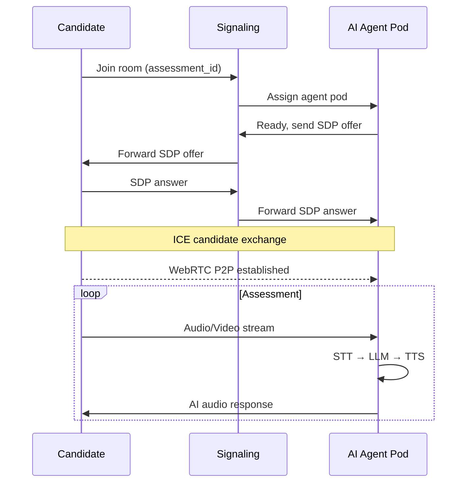
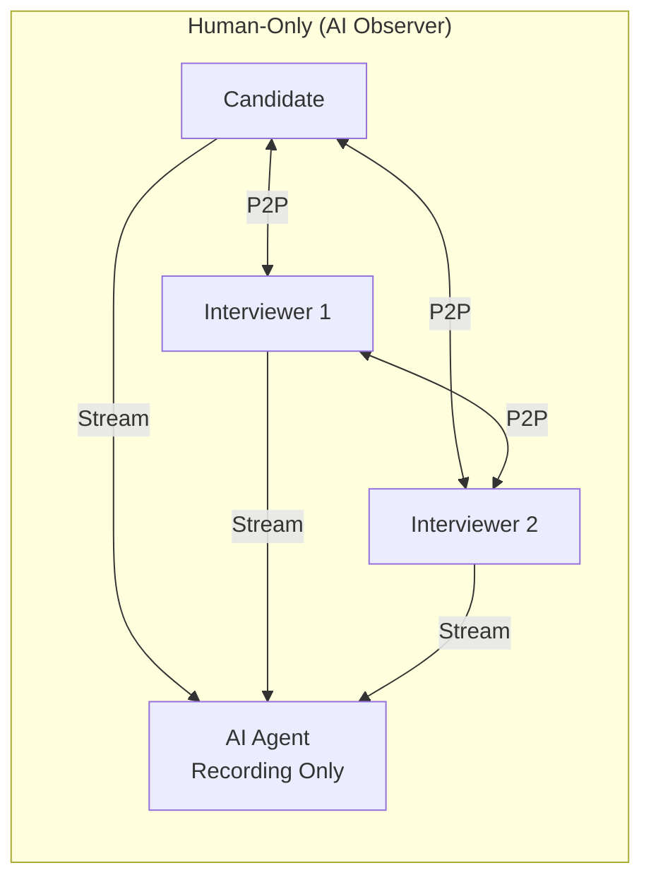
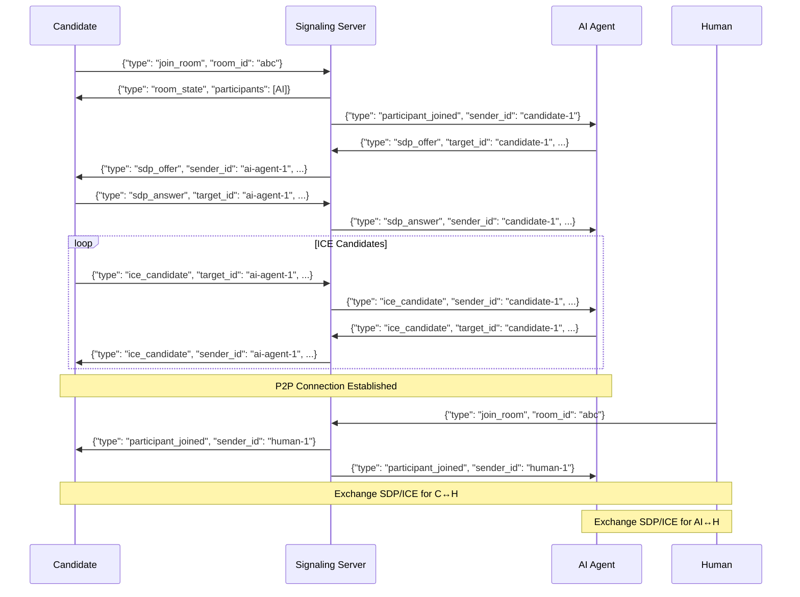
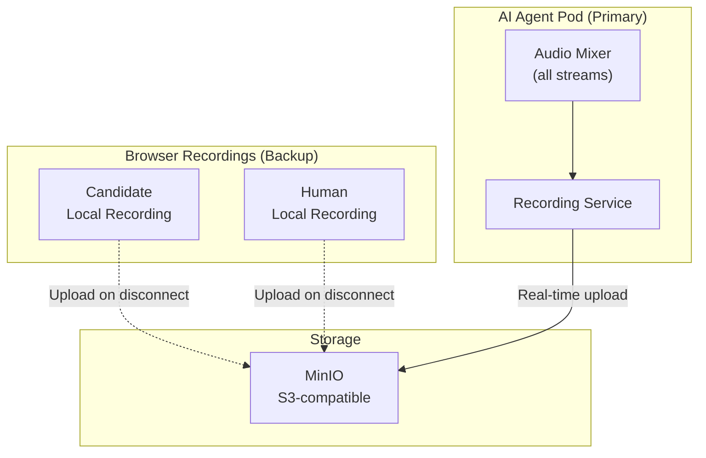

# WebRTC Mesh Specification

## Overview

This document specifies the WebRTC peer-to-peer mesh architecture for Talent Mesh assessments, supporting up to 5 participants (1 candidate + 1 AI agent + up to 3 human interviewers) in a full mesh topology.

---

## Architecture

### Mesh Topology

```mermaid
graph TB
    subgraph "Full Mesh - 5 Participants Max"
        C[Candidate<br/>Browser]
        AI[AI Agent Pod<br/>K8s]
        H1[Human 1<br/>Browser]
        H2[Human 2<br/>Browser]
        H3[Human 3<br/>Browser]

        C <-->|P2P| AI
        C <-->|P2P| H1
        C <-->|P2P| H2
        C <-->|P2P| H3
        AI <-->|P2P| H1
        AI <-->|P2P| H2
        AI <-->|P2P| H3
        H1 <-->|P2P| H2
        H1 <-->|P2P| H3
        H2 <-->|P2P| H3
    end

    subgraph "Signaling"
        SIG[Signaling Service<br/>Rust - WebSocket]
    end

    subgraph "NAT Traversal"
        STUN[Google/Twilio STUN<br/>Free]
        TURN[STUNner TURN<br/>K8s-native ~20%]
    end

    C & AI & H1 & H2 & H3 --> SIG
    C & AI & H1 & H2 & H3 -.->|ICE candidates| STUN
    C & AI & H1 & H2 & H3 -.->|Fallback relay| TURN
```



### Connection Count

| Participants | Connections (n*(n-1)/2) | Bandwidth per Participant |
|--------------|-------------------------|---------------------------|
| 2 (Candidate + AI) | 1 | ~1.5 Mbps |
| 3 (+ 1 Human) | 3 | ~3 Mbps |
| 4 (+ 2 Humans) | 6 | ~4.5 Mbps |
| 5 (+ 3 Humans) | 10 | ~6 Mbps |

---

## Session Modes

### Mode 1: AI-Only Assessment (Default)



### Mode 2: Hybrid Interview (Human Joins Mid-Session)

```mermaid
sequenceDiagram
    participant C as Candidate
    participant AI as AI Agent
    participant S as Signaling
    participant H as Human Interviewer

    Note over C,AI: Session in progress (AI-only)

    H->>S: Request to join room
    S->>S: Validate permissions
    S->>C: New participant notification
    S->>AI: New participant notification

    H->>S: SDP offer
    S->>C: Forward offer (for H↔C)
    S->>AI: Forward offer (for H↔AI)

    C->>S: SDP answer (to H)
    AI->>S: SDP answer (to H)
    S->>H: Forward answers

    Note over C,H: ICE exchange
    Note over AI,H: ICE exchange

    C-->>H: P2P established
    AI-->>H: P2P established

    Note over C,AI,H: Full mesh active

    H->>AI: "Pause AI" command
    AI->>AI: Mute TTS output
    H->>C: Human asks questions
    H->>AI: "Resume AI" command
```

### Mode 3: Human-Only Interview



In this mode, AI receives streams but doesn't output audio (recording/transcription only).

---

## Signaling Protocol

### WebSocket Messages

```typescript
// Base message structure
interface SignalingMessage {
  type: MessageType;
  room_id: string;
  sender_id: string;
  timestamp: string;
  payload: unknown;
}

// Message types
type MessageType =
  | 'join_room'
  | 'leave_room'
  | 'participant_joined'
  | 'participant_left'
  | 'sdp_offer'
  | 'sdp_answer'
  | 'ice_candidate'
  | 'room_state'
  | 'ai_control'
  | 'error';

// Join room
interface JoinRoomPayload {
  participant_type: 'candidate' | 'ai_agent' | 'human_interviewer';
  display_name: string;
  capabilities: {
    video: boolean;
    audio: boolean;
    screen_share: boolean;
  };
}

// SDP offer/answer
interface SDPPayload {
  target_id: string;  // Recipient participant ID
  sdp: RTCSessionDescriptionInit;
}

// ICE candidate
interface ICECandidatePayload {
  target_id: string;
  candidate: RTCIceCandidateInit;
}

// AI control commands
interface AIControlPayload {
  command: 'pause' | 'resume' | 'mute' | 'unmute' | 'end_session';
  issued_by: string;  // Human interviewer ID
}

// Room state (sent on join)
interface RoomStatePayload {
  participants: Array<{
    id: string;
    type: 'candidate' | 'ai_agent' | 'human_interviewer';
    display_name: string;
    joined_at: string;
    is_muted: boolean;
    has_video: boolean;
  }>;
  session_status: 'waiting' | 'in_progress' | 'paused' | 'completed';
  ai_status: 'active' | 'paused' | 'muted';
  recording_status: 'recording' | 'paused' | 'stopped';
}
```

### Message Flow Example



---

## Client Implementation

### Browser (Candidate/Human)

```typescript
// webrtc-client.ts
import { EventEmitter } from 'events';

interface PeerConnection {
  id: string;
  connection: RTCPeerConnection;
  dataChannel?: RTCDataChannel;
  streams: MediaStream[];
}

class WebRTCMeshClient extends EventEmitter {
  private ws: WebSocket;
  private peers: Map<string, PeerConnection> = new Map();
  private localStream?: MediaStream;
  private participantId: string;
  private roomId: string;

  private readonly rtcConfig: RTCConfiguration = {
    iceServers: [
      { urls: 'stun:stun.l.google.com:19302' },
      { urls: 'stun:stun1.l.google.com:19302' },
      {
        urls: 'turn:turn.talentmesh.io:3478',
        username: 'user',
        credential: 'pass'
      }
    ],
    iceCandidatePoolSize: 10
  };

  constructor(signalingUrl: string, roomId: string) {
    super();
    this.roomId = roomId;
    this.participantId = crypto.randomUUID();
    this.ws = new WebSocket(signalingUrl);
    this.setupSignaling();
  }

  async joinRoom(localStream: MediaStream, participantType: string): Promise<void> {
    this.localStream = localStream;

    this.ws.send(JSON.stringify({
      type: 'join_room',
      room_id: this.roomId,
      sender_id: this.participantId,
      timestamp: new Date().toISOString(),
      payload: {
        participant_type: participantType,
        display_name: 'Participant',
        capabilities: {
          video: localStream.getVideoTracks().length > 0,
          audio: localStream.getAudioTracks().length > 0,
          screen_share: true
        }
      }
    }));
  }

  private setupSignaling(): void {
    this.ws.onmessage = async (event) => {
      const message = JSON.parse(event.data);

      switch (message.type) {
        case 'room_state':
          await this.handleRoomState(message.payload);
          break;
        case 'participant_joined':
          await this.handleParticipantJoined(message.sender_id, message.payload);
          break;
        case 'participant_left':
          this.handleParticipantLeft(message.sender_id);
          break;
        case 'sdp_offer':
          await this.handleOffer(message.sender_id, message.payload);
          break;
        case 'sdp_answer':
          await this.handleAnswer(message.sender_id, message.payload);
          break;
        case 'ice_candidate':
          await this.handleIceCandidate(message.sender_id, message.payload);
          break;
      }
    };
  }

  private async handleRoomState(state: RoomStatePayload): Promise<void> {
    // Create connections to existing participants
    for (const participant of state.participants) {
      if (participant.id !== this.participantId) {
        await this.createPeerConnection(participant.id, true);
      }
    }
  }

  private async handleParticipantJoined(peerId: string, payload: any): Promise<void> {
    // New participant joined, create connection (they will initiate)
    this.emit('participant_joined', { id: peerId, ...payload });
  }

  private async createPeerConnection(peerId: string, initiator: boolean): Promise<void> {
    const pc = new RTCPeerConnection(this.rtcConfig);

    // Add local tracks
    if (this.localStream) {
      this.localStream.getTracks().forEach(track => {
        pc.addTrack(track, this.localStream!);
      });
    }

    // Handle remote tracks
    pc.ontrack = (event) => {
      this.emit('remote_stream', {
        peerId,
        stream: event.streams[0]
      });
    };

    // Handle ICE candidates
    pc.onicecandidate = (event) => {
      if (event.candidate) {
        this.ws.send(JSON.stringify({
          type: 'ice_candidate',
          room_id: this.roomId,
          sender_id: this.participantId,
          timestamp: new Date().toISOString(),
          payload: {
            target_id: peerId,
            candidate: event.candidate.toJSON()
          }
        }));
      }
    };

    // Connection state monitoring
    pc.onconnectionstatechange = () => {
      this.emit('connection_state', {
        peerId,
        state: pc.connectionState
      });
    };

    this.peers.set(peerId, { id: peerId, connection: pc, streams: [] });

    // If we're the initiator, create and send offer
    if (initiator) {
      const offer = await pc.createOffer();
      await pc.setLocalDescription(offer);

      this.ws.send(JSON.stringify({
        type: 'sdp_offer',
        room_id: this.roomId,
        sender_id: this.participantId,
        timestamp: new Date().toISOString(),
        payload: {
          target_id: peerId,
          sdp: offer
        }
      }));
    }
  }

  private async handleOffer(peerId: string, payload: SDPPayload): Promise<void> {
    if (!this.peers.has(peerId)) {
      await this.createPeerConnection(peerId, false);
    }

    const peer = this.peers.get(peerId)!;
    await peer.connection.setRemoteDescription(payload.sdp);

    const answer = await peer.connection.createAnswer();
    await peer.connection.setLocalDescription(answer);

    this.ws.send(JSON.stringify({
      type: 'sdp_answer',
      room_id: this.roomId,
      sender_id: this.participantId,
      timestamp: new Date().toISOString(),
      payload: {
        target_id: peerId,
        sdp: answer
      }
    }));
  }

  private async handleAnswer(peerId: string, payload: SDPPayload): Promise<void> {
    const peer = this.peers.get(peerId);
    if (peer) {
      await peer.connection.setRemoteDescription(payload.sdp);
    }
  }

  private async handleIceCandidate(peerId: string, payload: ICECandidatePayload): Promise<void> {
    const peer = this.peers.get(peerId);
    if (peer) {
      await peer.connection.addIceCandidate(payload.candidate);
    }
  }

  private handleParticipantLeft(peerId: string): void {
    const peer = this.peers.get(peerId);
    if (peer) {
      peer.connection.close();
      this.peers.delete(peerId);
      this.emit('participant_left', { id: peerId });
    }
  }

  leaveRoom(): void {
    this.ws.send(JSON.stringify({
      type: 'leave_room',
      room_id: this.roomId,
      sender_id: this.participantId,
      timestamp: new Date().toISOString(),
      payload: {}
    }));

    this.peers.forEach(peer => peer.connection.close());
    this.peers.clear();
    this.ws.close();
  }
}
```

### AI Agent Pod (Rust)

```rust
// ai-agent/webrtc.rs
use webrtc::api::APIBuilder;
use webrtc::peer_connection::RTCPeerConnection;
use webrtc::peer_connection::configuration::RTCConfiguration;
use webrtc::ice_transport::ice_server::RTCIceServer;
use tokio::sync::mpsc;
use tokio_tungstenite::{connect_async, WebSocketStream};
use futures_util::{StreamExt, SinkExt};

pub struct AIAgentWebRTC {
    peer_connections: HashMap<String, Arc<RTCPeerConnection>>,
    signaling_ws: WebSocketStream<MaybeTlsStream<TcpStream>>,
    audio_tx: mpsc::Sender<Vec<u8>>,  // Send to STT
    audio_rx: mpsc::Receiver<Vec<u8>>, // Receive from TTS
}

impl AIAgentWebRTC {
    pub async fn new(
        signaling_url: &str,
        room_id: &str,
        audio_tx: mpsc::Sender<Vec<u8>>,
        audio_rx: mpsc::Receiver<Vec<u8>>,
    ) -> Result<Self, Box<dyn std::error::Error>> {
        let (ws_stream, _) = connect_async(signaling_url).await?;

        let mut agent = AIAgentWebRTC {
            peer_connections: HashMap::new(),
            signaling_ws: ws_stream,
            audio_tx,
            audio_rx,
        };

        // Join room as AI agent
        agent.send_message(SignalingMessage {
            msg_type: "join_room".to_string(),
            room_id: room_id.to_string(),
            sender_id: "ai-agent-1".to_string(),
            payload: serde_json::json!({
                "participant_type": "ai_agent",
                "display_name": "AI Interviewer",
                "capabilities": {
                    "video": false,
                    "audio": true,
                    "screen_share": false
                }
            }),
        }).await?;

        Ok(agent)
    }

    pub async fn create_peer_connection(&mut self, peer_id: &str) -> Result<(), Box<dyn std::error::Error>> {
        let config = RTCConfiguration {
            ice_servers: vec![
                RTCIceServer {
                    urls: vec!["stun:stun.l.google.com:19302".to_string()],
                    ..Default::default()
                },
                RTCIceServer {
                    urls: vec!["turn:turn.talentmesh.io:3478".to_string()],
                    username: "user".to_string(),
                    credential: "pass".to_string(),
                    ..Default::default()
                },
            ],
            ..Default::default()
        };

        let api = APIBuilder::new().build();
        let peer_connection = Arc::new(api.new_peer_connection(config).await?);

        // Add audio track for TTS output
        let audio_track = Arc::new(TrackLocalStaticRTP::new(
            RTCRtpCodecCapability {
                mime_type: MIME_TYPE_OPUS.to_owned(),
                ..Default::default()
            },
            "audio".to_string(),
            "ai-agent".to_string(),
        ));

        peer_connection.add_track(audio_track.clone()).await?;

        // Handle incoming audio (for STT)
        let audio_tx = self.audio_tx.clone();
        peer_connection.on_track(Box::new(move |track, _, _| {
            let audio_tx = audio_tx.clone();
            Box::pin(async move {
                // Forward audio to STT pipeline
                while let Ok((rtp_packet, _)) = track.read_rtp().await {
                    if let Err(_) = audio_tx.send(rtp_packet.payload.to_vec()).await {
                        break;
                    }
                }
            })
        }));

        // Handle ICE candidates
        let ws_clone = self.signaling_ws.clone();
        let peer_id_clone = peer_id.to_string();
        peer_connection.on_ice_candidate(Box::new(move |candidate| {
            // Send ICE candidate via signaling
            Box::pin(async move {
                if let Some(c) = candidate {
                    // Send via WebSocket
                }
            })
        }));

        self.peer_connections.insert(peer_id.to_string(), peer_connection);
        Ok(())
    }

    pub async fn handle_offer(&mut self, peer_id: &str, sdp: &str) -> Result<String, Box<dyn std::error::Error>> {
        if !self.peer_connections.contains_key(peer_id) {
            self.create_peer_connection(peer_id).await?;
        }

        let pc = self.peer_connections.get(peer_id).unwrap();

        let offer = RTCSessionDescription::offer(sdp.to_string())?;
        pc.set_remote_description(offer).await?;

        let answer = pc.create_answer(None).await?;
        pc.set_local_description(answer.clone()).await?;

        Ok(answer.sdp)
    }

    pub async fn run(&mut self) -> Result<(), Box<dyn std::error::Error>> {
        loop {
            tokio::select! {
                // Handle signaling messages
                Some(msg) = self.signaling_ws.next() => {
                    if let Ok(msg) = msg {
                        self.handle_signaling_message(msg).await?;
                    }
                }

                // Send TTS audio to peers
                Some(audio_data) = self.audio_rx.recv() => {
                    self.broadcast_audio(audio_data).await?;
                }
            }
        }
    }
}
```

---

## NAT Traversal

### ICE Configuration

```yaml
ice_servers:
  stun:
    - url: "stun:stun.l.google.com:19302"
    - url: "stun:stun1.l.google.com:19302"
    - url: "stun:stun.twilio.com:3478"

  turn:
    - url: "turn:turn.talentmesh.io:3478"
      transport: udp
      username: "${TURN_USERNAME}"
      credential: "${TURN_PASSWORD}"
    - url: "turns:turn.talentmesh.io:5349"
      transport: tcp
      username: "${TURN_USERNAME}"
      credential: "${TURN_PASSWORD}"

ice_candidate_pooling: 10
ice_transport_policy: "all"  # "all" or "relay" for TURN-only
```

### STUNner Configuration (K8s)

```yaml
# STUNner Gateway
apiVersion: gateway.networking.k8s.io/v1
kind: Gateway
metadata:
  name: stunner-gateway
  namespace: webrtc
spec:
  gatewayClassName: stunner-gatewayclass
  listeners:
    - name: turn-udp
      port: 3478
      protocol: TURN-UDP
    - name: turn-tcp
      port: 3478
      protocol: TURN-TCP
    - name: turns-tcp
      port: 5349
      protocol: TURN-TLS
---
# Route to AI Agent Pods
apiVersion: stunner.l7mp.io/v1
kind: UDPRoute
metadata:
  name: ai-agent-route
  namespace: webrtc
spec:
  parentRefs:
    - name: stunner-gateway
  rules:
    - backendRefs:
        - name: ai-agent-pod
          namespace: ai-agents
```

### Connection Success Rates

| Scenario | Direct (STUN) | Relayed (TURN) |
|----------|---------------|----------------|
| Both on same network | 100% | N/A |
| Both behind symmetric NAT | 20% | 100% |
| One behind corporate firewall | 60% | 100% |
| Average expected | ~80% | ~20% (fallback) |

---

## Media Configuration

### Video Constraints

```typescript
const videoConstraints: MediaTrackConstraints = {
  width: { ideal: 1280, max: 1920 },
  height: { ideal: 720, max: 1080 },
  frameRate: { ideal: 24, max: 30 },
  facingMode: 'user'
};
```

### Audio Constraints

```typescript
const audioConstraints: MediaTrackConstraints = {
  echoCancellation: true,
  noiseSuppression: true,
  autoGainControl: true,
  sampleRate: 48000,
  channelCount: 1
};
```

### Bandwidth Management

```typescript
// Adapt bitrate based on participant count
function getTargetBitrate(participantCount: number): number {
  const baseBitrate = 2500000; // 2.5 Mbps for video

  // Reduce per additional participant
  const reduction = Math.min(0.8, 1 - (participantCount - 2) * 0.15);

  return Math.floor(baseBitrate * reduction);
}

// Apply via RTCRtpSender.setParameters()
async function updateBitrate(pc: RTCPeerConnection, bitrate: number) {
  const senders = pc.getSenders();
  for (const sender of senders) {
    if (sender.track?.kind === 'video') {
      const params = sender.getParameters();
      params.encodings[0].maxBitrate = bitrate;
      await sender.setParameters(params);
    }
  }
}
```

---

## Recording

### Recording Strategy



### Recording Format

```yaml
recording:
  format: "webm"
  video_codec: "VP9"
  audio_codec: "Opus"
  container: "matroska"

  tracks:
    - name: "mixed_audio"
      type: "audio"
      description: "All participants mixed"
    - name: "candidate_video"
      type: "video"
      description: "Candidate camera"
    - name: "screen_share"
      type: "video"
      optional: true
      description: "Candidate screen share"
```

---

## Error Handling

### Connection Failures

```typescript
interface ConnectionError {
  type: 'ice_failed' | 'signaling_error' | 'media_error' | 'timeout';
  peer_id?: string;
  message: string;
  recoverable: boolean;
}

async function handleConnectionError(error: ConnectionError): Promise<void> {
  switch (error.type) {
    case 'ice_failed':
      // Try TURN-only reconnection
      await reconnectWithTurnOnly(error.peer_id!);
      break;
    case 'signaling_error':
      // Reconnect WebSocket
      await reconnectSignaling();
      break;
    case 'media_error':
      // Request new media permissions
      await requestMediaPermissions();
      break;
    case 'timeout':
      // Full reconnection
      await fullReconnect();
      break;
  }
}
```

### Graceful Degradation

| Failure | Degradation |
|---------|-------------|
| Video fails | Audio-only mode |
| One peer disconnects | Continue with remaining |
| TURN unavailable | STUN-only (some may fail) |
| AI agent crash | K8s restart, session pause |

---

## Monitoring

### Metrics

```yaml
metrics:
  - name: webrtc_connections_total
    type: counter
    labels: [participant_type, status]

  - name: webrtc_ice_candidates_total
    type: counter
    labels: [type, transport]

  - name: webrtc_connection_duration_seconds
    type: histogram
    labels: [participant_count]

  - name: webrtc_bandwidth_bytes
    type: counter
    labels: [direction, media_type]

  - name: webrtc_packet_loss_ratio
    type: gauge
    labels: [peer_id]

  - name: webrtc_turn_relay_ratio
    type: gauge
    description: "Percentage of connections using TURN relay"
```

### Connection Quality Stats

```typescript
// Collect stats every 5 seconds
async function collectStats(pc: RTCPeerConnection): Promise<ConnectionStats> {
  const stats = await pc.getStats();

  let packetLoss = 0;
  let jitter = 0;
  let rtt = 0;

  stats.forEach(report => {
    if (report.type === 'inbound-rtp') {
      packetLoss = report.packetsLost / report.packetsReceived;
      jitter = report.jitter;
    }
    if (report.type === 'candidate-pair' && report.state === 'succeeded') {
      rtt = report.currentRoundTripTime;
    }
  });

  return { packetLoss, jitter, rtt };
}
```

---

## Security

### Authentication

1. **Room access** - JWT token in WebSocket connection
2. **Participant validation** - Server validates participant type
3. **Human join authorization** - Only authorized interviewers can join

### Media Security

1. **DTLS-SRTP** - All media encrypted
2. **Secure signaling** - WSS (WebSocket over TLS)
3. **TURN credentials** - Short-lived, per-session

---

## References

- [WebRTC API (MDN)](https://developer.mozilla.org/en-US/docs/Web/API/WebRTC_API)
- [STUNner Documentation](https://github.com/l7mp/stunner)
- [simple-peer Library](https://github.com/feross/simple-peer)
- [webrtc-rs (Rust)](https://github.com/webrtc-rs/webrtc)

---

*Document Version: 1.0*
*Last Updated: 2026-01-07*
