# Talent Mesh User Flows

## Overview

This document defines the key user flows through Talent Mesh, covering all primary user journeys.

---

## Flow Index

| Flow | Actors | Description |
|------|--------|-------------|
| [F1: Candidate Onboarding](#f1-candidate-onboarding) | Candidate | LinkedIn-only signup to profile completion |
| [F2: Verification Upload](#f2-verification-upload) | Candidate | Upload verification documents for blue tick |
| [F3: Schedule Assessment](#f3-schedule-assessment) | Candidate | Booking an assessment slot |
| [F4: Take Assessment](#f4-take-assessment) | Candidate | Complete AI assessment |
| [F5: Assessment Retake](#f5-assessment-retake) | Candidate | Request retake after 2-week wait (max 3) |
| [F6: View Spider Map](#f6-view-spider-map) | Candidate | View personal assessment spider map |
| [F7: Hybrid Interview](#f7-hybrid-interview) | Candidate, Recruiter | AI assessment with optional human interviewer |
| [F8: Recruiter Review](#f8-recruiter-review) | Recruiter | Review candidate results |
| [F9: Template Creation](#f9-template-creation) | Admin | Create assessment template |
| [F10: Organization Setup](#f10-organization-setup) | Admin | Initial org configuration |

---

## F1: Candidate Onboarding

### Flow Diagram

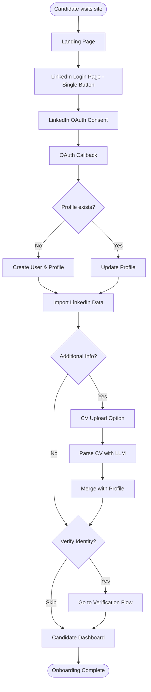

### Screen Sequence

| Step | Screen | Actions | Data |
|------|--------|---------|------|
| 1 | Landing | View value proposition | - |
| 2 | LinkedIn Login | Click single "Continue with LinkedIn" button | - |
| 3 | LinkedIn OAuth | Grant permissions | r_liteprofile, r_emailaddress |
| 4 | Processing | Auto redirect | LinkedIn data |
| 5 | Profile Setup | Review imported data, upload CV | Name, title, skills |
| 6 | Verification Prompt | Choose to verify or skip | - |
| 7 | Dashboard | View available assessments | Profile, assessments |

### State Transitions

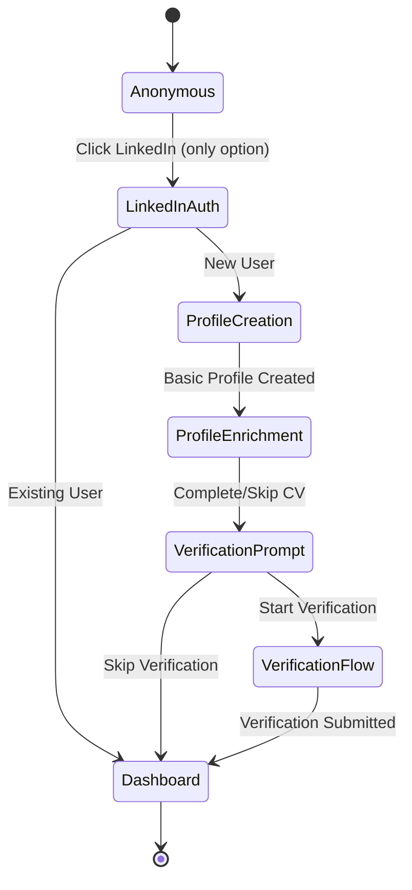

### Authentication Note

**LinkedIn-Only Authentication**: Talent Mesh uses LinkedIn as the sole authentication method. This ensures:
- Professional identity verification
- Reduced fake accounts
- Streamlined onboarding with pre-populated profile data
- No password management overhead

### Error Handling

| Error | Handling | User Message |
|-------|----------|--------------|
| OAuth denied | Return to landing | "Sign-in cancelled. Try again with LinkedIn." |
| LinkedIn API error | Retry with backoff | "Unable to connect to LinkedIn. Retrying..." |
| LinkedIn account issue | Show help | "Please ensure your LinkedIn account is active." |
| CV parse failure | Allow manual entry | "Couldn't read CV. Enter details manually." |

---

## F2: Verification Upload

### Flow Diagram

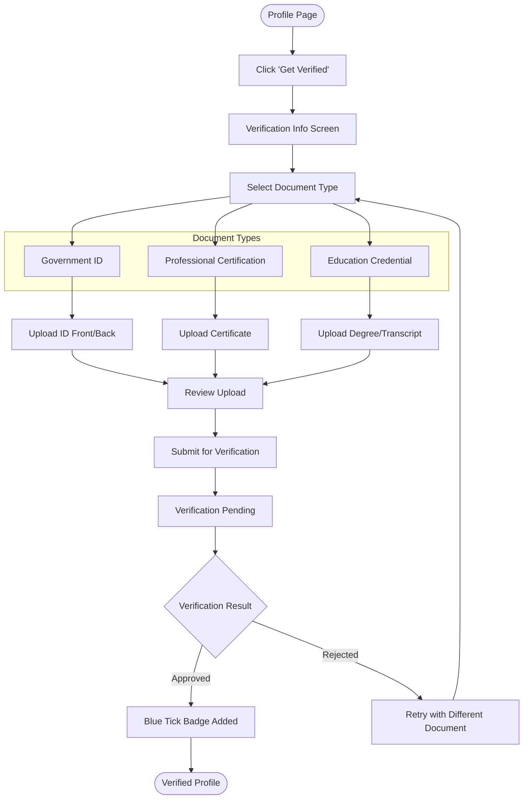

### Document Requirements

| Document Type | Accepted Formats | Max Size | Processing Time |
|---------------|------------------|----------|-----------------|
| Government ID | JPG, PNG, PDF | 10MB | 24-48 hours |
| Professional Cert | PDF | 10MB | 24-48 hours |
| Education Credential | PDF | 10MB | 24-48 hours |

### Verification States

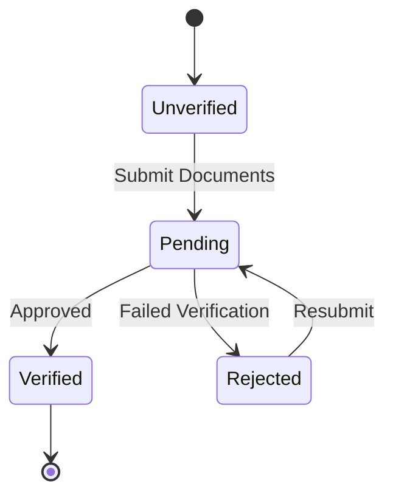

### Screen Sequence

| Step | Screen | Actions | Data |
|------|--------|---------|------|
| 1 | Profile | Click "Get Verified" button | - |
| 2 | Verification Info | Read requirements, continue | - |
| 3 | Document Type | Select document category | Type selection |
| 4 | Upload | Drag/drop or select files | Document files |
| 5 | Review | Confirm uploads, submit | - |
| 6 | Pending | View status, wait | Submission ID |
| 7 | Result | View approval/rejection | Badge or retry option |

### Error Handling

| Error | Handling | User Message |
|-------|----------|--------------|
| File too large | Reject upload | "File exceeds 10MB limit. Please compress." |
| Invalid format | Reject upload | "Please upload JPG, PNG, or PDF files." |
| Blurry image | Warn user | "Image may be too blurry. Consider retaking." |
| Document expired | Reject | "Document has expired. Please upload valid ID." |

---

## F3: Schedule Assessment

### Flow Diagram

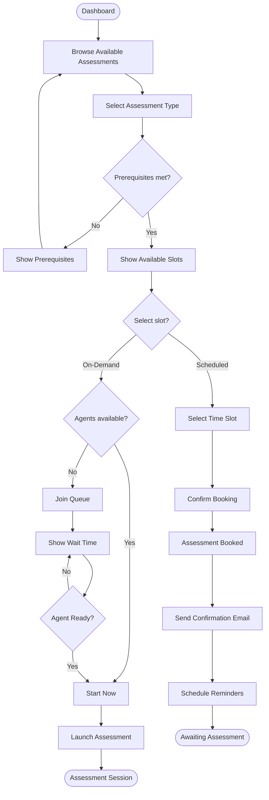

### Calendar View States

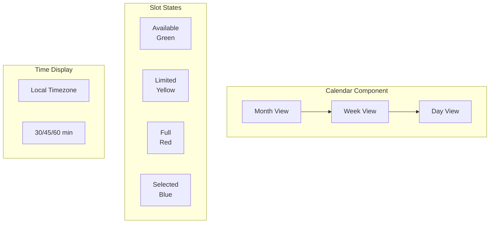

### Booking Confirmation

```json
{
  "booking": {
    "id": "bkg_abc123",
    "assessmentType": "DevOps Assessment",
    "dateTime": "2024-01-20T10:00:00Z",
    "duration": 45,
    "timezone": "America/New_York",
    "assessmentUrl": "https://assess.talentmesh.io/session/abc123",
    "lobbyOpensMinutesBefore": 10,
    "reminders": ["24h", "1h", "10m"]
  }
}
```

---

## F4: Take Assessment

### Flow Diagram

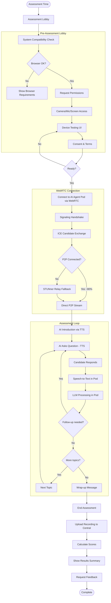

### Assessment Interface (WebRTC Portal)

The assessment runs directly in the browser, connecting peer-to-peer with an AI Agent Pod that handles STT, TTS, and LLM processing.

```
┌─────────────────────────────────────────────────────────────────┐
│  Talent Mesh Assessment                          [00:23:45]     │
├─────────────────────────────────────────────────────────────────┤
│                                                                 │
│  ┌──────────────────────┐  ┌────────────────────────────────┐  │
│  │                      │  │  Current Question:              │  │
│  │   Candidate Video    │  │  "Explain how Kubernetes       │  │
│  │   (Self-view)        │  │   handles pod scheduling..."   │  │
│  │                      │  │                                 │  │
│  └──────────────────────┘  │  Topic: Kubernetes              │  │
│                            │  Progress: ████████░░ 40%       │  │
│  ┌──────────────────────┐  └────────────────────────────────┘  │
│  │                      │                                      │
│  │   AI Interviewer     │  ┌────────────────────────────────┐  │
│  │   [Avatar/Waveform]  │  │  Code Editor (when needed)     │  │
│  │                      │  │  ─────────────────────────────  │  │
│  └──────────────────────┘  │  function example() {          │  │
│                            │    // Write your solution      │  │
│  Connection: P2P to AI Pod    │  }                              │  │
│                            └────────────────────────────────┘  │
│                                                                 │
│  ┌─────────────────────────────────────────────────────────┐   │
│  │  🎤 Listening...                                        │   │
│  │  ░░░░░░░░░░░░░░░░░░░░░░░░░░░░░░░░░ (Audio Waveform)    │   │
│  └─────────────────────────────────────────────────────────┘   │
│                                                                 │
│  [Mute]  [Camera]  [Screen Share]  [Help]  [End Session]       │
│                                                                 │
└─────────────────────────────────────────────────────────────────┘
```

### Pre-Assessment Lobby

```
┌─────────────────────────────────────────────────────────────────┐
│  Assessment Lobby                                               │
├─────────────────────────────────────────────────────────────────┤
│                                                                 │
│  DevOps Technical Assessment                                    │
│  Scheduled: Today at 2:00 PM (starts in 5 minutes)              │
│                                                                 │
├─────────────────────────────────────────────────────────────────┤
│  System Check                                                   │
│  ─────────────────────────────────────────────────────────────  │
│                                                                 │
│  [x] Browser: Chrome 120 (supported)                            │
│  [x] Camera: Logitech HD Webcam                                 │
│  [x] Microphone: Built-in Microphone                            │
│  [ ] Permissions: Click to allow camera/mic                     │
│                                                                 │
│  ┌─────────────────────────────────────────────────────────┐   │
│  │                                                         │   │
│  │              Camera Preview                             │   │
│  │              (Your video will appear here)              │   │
│  │                                                         │   │
│  └─────────────────────────────────────────────────────────┘   │
│                                                                 │
│  [Test Audio]  [Test Video]                                     │
│                                                                 │
│  [ ] I agree to the assessment terms and recording consent      │
│                                                                 │
│  [Join Assessment]                                              │
│                                                                 │
└─────────────────────────────────────────────────────────────────┘
```

### Screen Sequence

| Step | Screen | Actions | Technical Details |
|------|--------|---------|-------------------|
| 1 | Assessment Lobby | View booking details | Load session info |
| 2 | System Check | Browser/device compatibility | WebRTC support check |
| 3 | Permissions | Grant camera/mic/screen | MediaDevices API |
| 4 | Device Test | Test audio/video | Preview media streams |
| 5 | Consent | Accept terms | Recording consent |
| 6 | Connecting | WebRTC handshake | Signaling → ICE → P2P/TURN |
| 7 | Assessment | Interactive AI interview | Audio/video via WebRTC |
| 8 | Complete | View summary | Upload recording |
| 9 | Results | View scores/feedback | Spider map display |

### Connection States

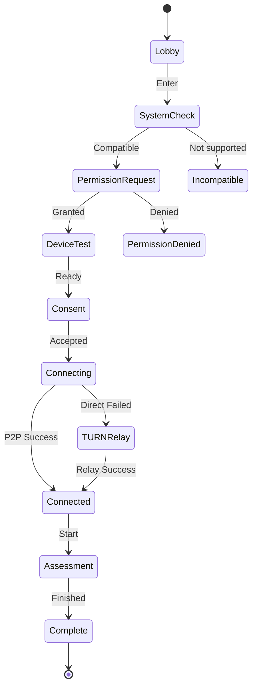

### Real-time Transcript View (Optional)

```
┌─────────────────────────────────────────────────────────────────┐
│  Live Transcript                                     [Toggle]   │
├─────────────────────────────────────────────────────────────────┤
│                                                                 │
│  [10:23:15] AI: Can you explain how Kubernetes handles         │
│  pod scheduling and what factors influence placement            │
│  decisions?                                                     │
│                                                                 │
│  [10:23:45] You: Sure, Kubernetes uses the scheduler           │
│  component to assign pods to nodes. It considers several        │
│  factors like resource requests, node affinity...               │
│  (typing indicator)                                             │
│                                                                 │
└─────────────────────────────────────────────────────────────────┘
```

### Sentiment Indicators (Internal)

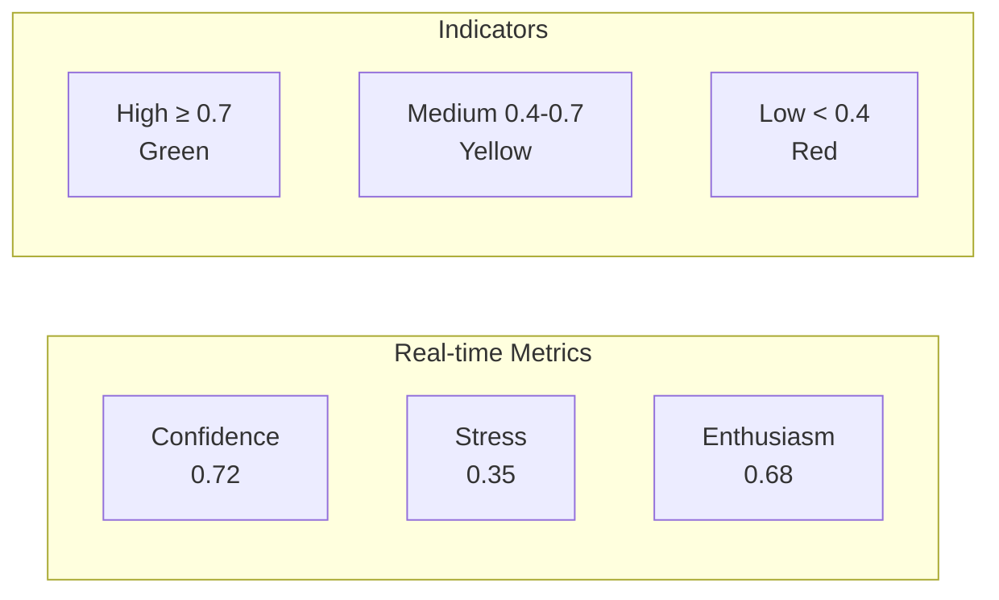

---

## F5: Assessment Retake

### Flow Diagram

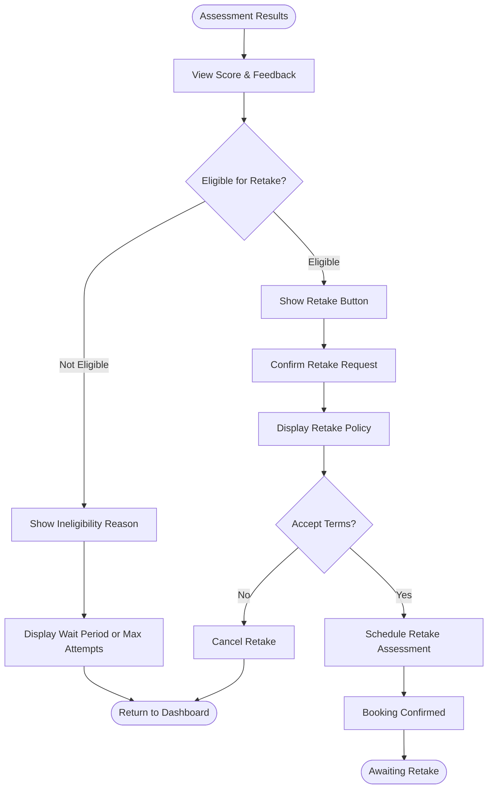

### Retake Policy

| Rule | Value | Description |
|------|-------|-------------|
| Waiting Period | 14 days | Minimum time between assessment attempts |
| Maximum Attempts | 3 | Total attempts allowed per assessment type |
| Score Retention | Latest | Most recent score is used for evaluation |
| Cooling Period | 6 months | After 3 attempts, wait 6 months to reset |

### Eligibility Check Logic

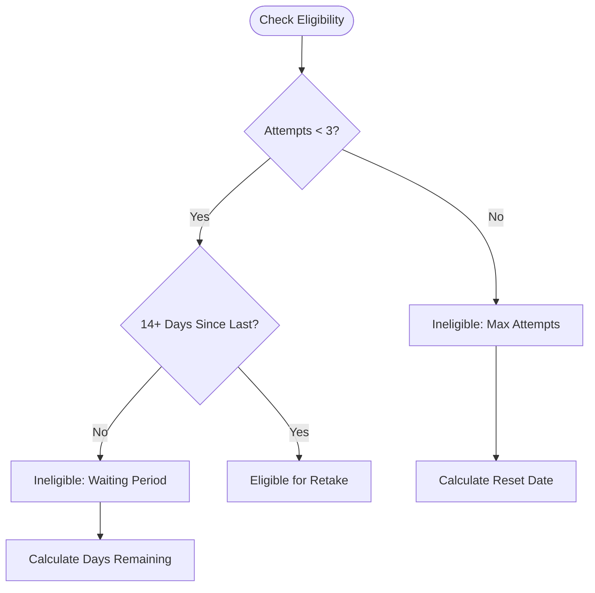

### Screen Sequence

| Step | Screen | Actions | Data |
|------|--------|---------|------|
| 1 | Results | View score, check retake eligibility | Score, attempt count |
| 2 | Retake Info | Review policy, confirm intent | Waiting period status |
| 3 | Confirmation | Accept terms, proceed | - |
| 4 | Scheduling | Select new assessment slot | Available times |
| 5 | Confirmed | View booking details | Retake booking |

### Assessment History Display

```
┌─────────────────────────────────────────────────────────────────┐
│  DevOps Assessment History                                       │
├─────────────────────────────────────────────────────────────────┤
│                                                                 │
│  Attempt 1    Jan 5, 2026      Score: 62      [View Details]    │
│  Attempt 2    Jan 20, 2026     Score: 71      [View Details]    │
│  ─────────────────────────────────────────────────────────────  │
│  Retake Eligibility: 1 attempt remaining                        │
│  Next eligible date: Feb 3, 2026 (14 days)                      │
│                                                                 │
│  [Request Retake - Available Feb 3]                             │
│                                                                 │
└─────────────────────────────────────────────────────────────────┘
```

### Error Handling

| Error | Handling | User Message |
|-------|----------|--------------|
| Max attempts reached | Show reset date | "Maximum attempts reached. Eligible again on [date]." |
| Within waiting period | Show countdown | "Please wait [X] days before retaking." |
| Assessment unavailable | Show alternatives | "This assessment is currently unavailable." |

---

## F6: View Spider Map

### Flow Diagram

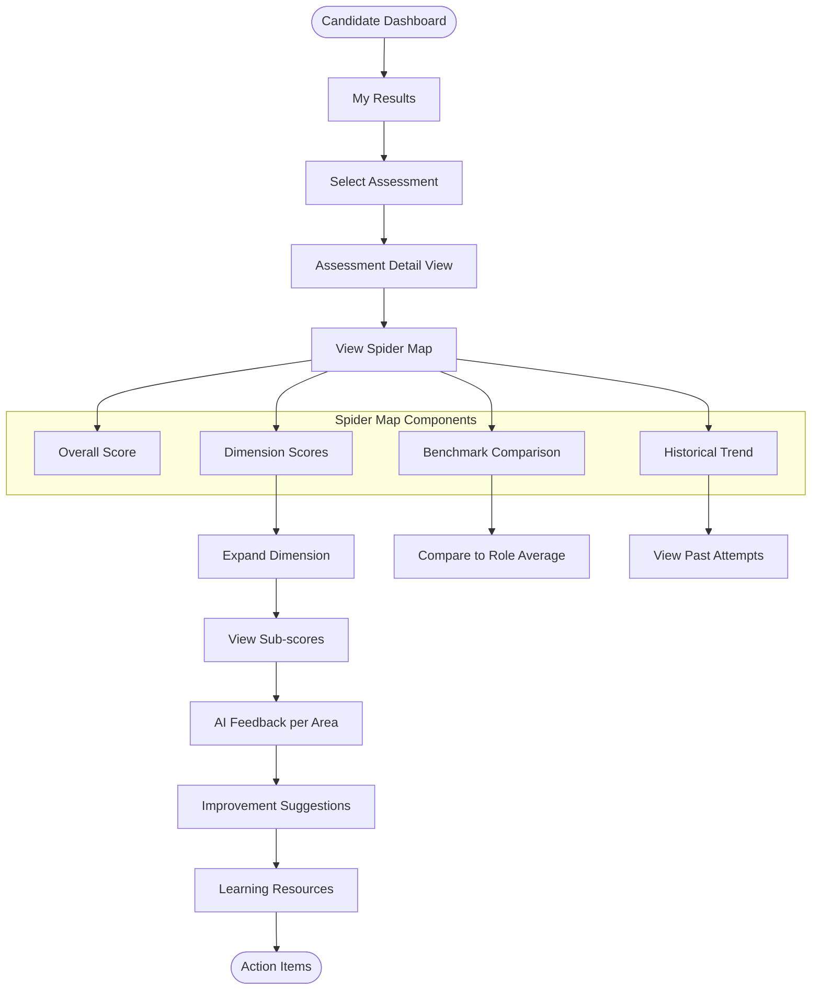

### Spider Map Display

```
┌─────────────────────────────────────────────────────────────────┐
│  Your DevOps Assessment Results                    Score: 78    │
├─────────────────────────────────────────────────────────────────┤
│                                                                 │
│                      Technical Skills                           │
│                           85                                    │
│                            *                                    │
│                          * | *                                  │
│                        *   |   *                                │
│                      *     |     *                              │
│           Problem  *       |       * Communication              │
│           Solving *        |        *  72                       │
│              82   *        |        *                           │
│                    *       |       *                            │
│                      *     |     *                              │
│                        *   |   *                                │
│                          * | *                                  │
│                            *                                    │
│                      Leadership                                 │
│                          71                                     │
│                                                                 │
│  ━━━ Your Score    ┄┄┄ Role Benchmark (75)                      │
│                                                                 │
├─────────────────────────────────────────────────────────────────┤
│  Strengths: Technical Skills, Problem Solving                   │
│  Areas to Improve: Leadership, Communication                    │
│                                                                 │
│  [View Detailed Breakdown]  [Download Report]  [Share]          │
│                                                                 │
└─────────────────────────────────────────────────────────────────┘
```

### Screen Sequence

| Step | Screen | Actions | Data |
|------|--------|---------|------|
| 1 | Dashboard | Click "My Results" | - |
| 2 | Results List | Select assessment | Assessment list |
| 3 | Spider Map | View overall visualization | Dimension scores |
| 4 | Dimension Detail | Click dimension for breakdown | Sub-scores, feedback |
| 5 | Improvement | View suggestions and resources | Learning links |

### Dimension Breakdown View

```
┌─────────────────────────────────────────────────────────────────┐
│  Technical Skills Breakdown                        Score: 85    │
├─────────────────────────────────────────────────────────────────┤
│                                                                 │
│  Kubernetes & Orchestration        ████████████████░░░░  88%    │
│  CI/CD Pipelines                   ███████████████░░░░░  82%    │
│  Infrastructure as Code            █████████████████░░░  90%    │
│  Monitoring & Observability        ██████████████░░░░░░  78%    │
│                                                                 │
├─────────────────────────────────────────────────────────────────┤
│  AI Feedback:                                                   │
│  "Strong understanding of Kubernetes concepts. Consider         │
│   deepening knowledge in monitoring and alerting strategies."   │
│                                                                 │
│  Suggested Resources:                                           │
│  - Prometheus & Grafana Fundamentals (Udemy)                    │
│  - SRE Book - Monitoring Chapter (Google)                       │
│                                                                 │
└─────────────────────────────────────────────────────────────────┘
```

---

## F7: Hybrid Interview

### Flow Diagram

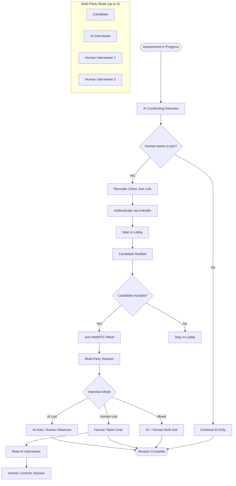

### Hybrid Interview Interface

```
┌─────────────────────────────────────────────────────────────────┐
│  Talent Mesh Assessment (Hybrid)                   [00:23:45]   │
├─────────────────────────────────────────────────────────────────┤
│                                                                 │
│  ┌─────────────┐  ┌─────────────┐  ┌─────────────┐             │
│  │  Candidate  │  │ AI Agent    │  │ Sarah Chen  │             │
│  │  [Video]    │  │ [Waveform]  │  │ [Video]     │             │
│  │             │  │             │  │  (Recruiter)│             │
│  └─────────────┘  └─────────────┘  └─────────────┘             │
│                                                                 │
│  Current Speaker: AI Interviewer                                │
│  Mode: [AI Led ▼]                                               │
│                                                                 │
│  ┌─────────────────────────────────────────────────────────┐   │
│  │  Current Question:                                      │   │
│  │  "Can you explain your approach to designing a          │   │
│  │   microservices architecture?"                          │   │
│  └─────────────────────────────────────────────────────────┘   │
│                                                                 │
│  [Mute AI] [Take Over] [Ask Question] [Leave]                  │
│                                                                 │
└─────────────────────────────────────────────────────────────────┘
```

### Recruiter Join Flow

```
┌─────────────────────────────────────────────────────────────────┐
│  Join Live Assessment                                           │
├─────────────────────────────────────────────────────────────────┤
│                                                                 │
│  DevOps Assessment - John Smith                                 │
│  Started: 10:15 AM | Duration: 23:45                            │
│  Current Topic: Kubernetes                                      │
│                                                                 │
│  ────────────────────────────────────────────────────────────   │
│                                                                 │
│  Status: AI Interview in Progress                               │
│                                                                 │
│  You will join as an observer. The candidate will be            │
│  notified and must accept your presence.                        │
│                                                                 │
│  Options:                                                       │
│  ○ Join as Observer (listen only)                               │
│  ● Join as Co-Interviewer (can ask questions)                   │
│                                                                 │
│  [Cancel]                              [Join Assessment]        │
│                                                                 │
└─────────────────────────────────────────────────────────────────┘
```

### Screen Sequence

| Step | Screen | Actions | Data |
|------|--------|---------|------|
| 1 | Recruiter Dashboard | Click "Join Live" on active assessment | Assessment ID |
| 2 | Join Options | Select observer or co-interviewer mode | Role |
| 3 | Lobby | Wait for candidate acceptance | - |
| 4 | Assessment | Join multi-party session | WebRTC mesh |
| 5 | Controls | Use AI controls, ask questions | - |
| 6 | Complete | Session ends, scores generated | Report |

### Multi-Party WebRTC Mesh

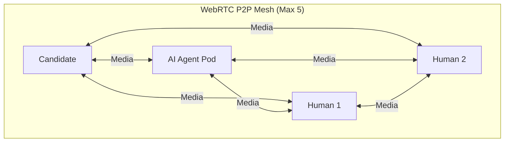

### Error Handling

| Error | Handling | User Message |
|-------|----------|--------------|
| Session full | Prevent join | "Maximum 5 participants reached." |
| Candidate declined | Return to dashboard | "Candidate declined your join request." |
| Connection failed | Retry or fallback | "Connection failed. Retrying via relay..." |
| AI takeover conflict | Queue request | "Another interviewer is controlling AI. Wait for handover." |

---

## F8: Recruiter Review

### Flow Diagram

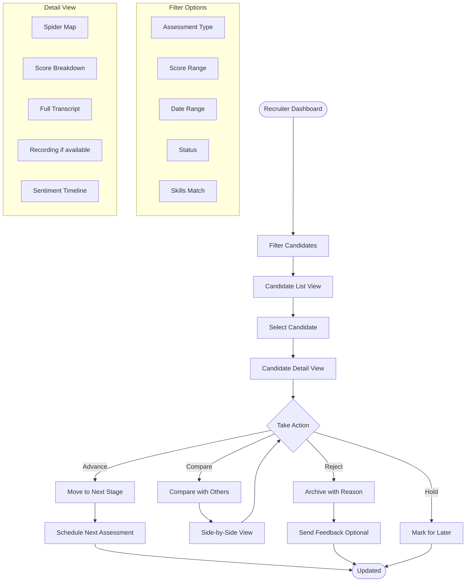

### Candidate List View

```
┌─────────────────────────────────────────────────────────────────────────┐
│  Candidates                                              [+ New Invite] │
├─────────────────────────────────────────────────────────────────────────┤
│  Filters: [DevOps ▼] [Score ≥70 ▼] [This Week ▼] [All Status ▼]        │
├─────────────────────────────────────────────────────────────────────────┤
│                                                                         │
│  ┌─────┬──────────────────┬──────────────┬───────┬─────────┬─────────┐ │
│  │ ☐   │ Candidate        │ Assessment   │ Score │ Date    │ Status  │ │
│  ├─────┼──────────────────┼──────────────┼───────┼─────────┼─────────┤ │
│  │ ☐   │ 👤 John Smith    │ DevOps       │ 85    │ Jan 15  │ ✅ Pass │ │
│  │ ☐   │ 👤 Sarah Chen    │ DevOps       │ 78    │ Jan 14  │ ✅ Pass │ │
│  │ ☐   │ 👤 Mike Johnson  │ DevOps       │ 65    │ Jan 14  │ ⏳ Review│ │
│  │ ☐   │ 👤 Lisa Park     │ DevOps       │ 72    │ Jan 13  │ ✅ Pass │ │
│  │ ☐   │ 👤 David Brown   │ DevOps       │ 45    │ Jan 13  │ ❌ Fail │ │
│  └─────┴──────────────────┴──────────────┴───────┴─────────┴─────────┘ │
│                                                                         │
│  Showing 5 of 23 candidates                        [< 1 2 3 4 5 >]     │
│                                                                         │
└─────────────────────────────────────────────────────────────────────────┘
```

### Spider Map Visualization

```
                    Technical Skills
                         100
                          │
                          │
              80 ─────────┼───────── 80
            ╱             │             ╲
          ╱               │               ╲
Problem   ╲               │               ╱  Communication
Solving    ╲              │              ╱
             ╲            │            ╱
               ╲          │          ╱
                 ╲        │        ╱
                   ╲      │      ╱
                     ╲    │    ╱
                       ╲  │  ╱
              Adaptability─┴─Leadership


Legend:
━━━ Candidate Score
┄┄┄ Role Benchmark
░░░ Team Average
```

---

## F9: Template Creation

### Flow Diagram

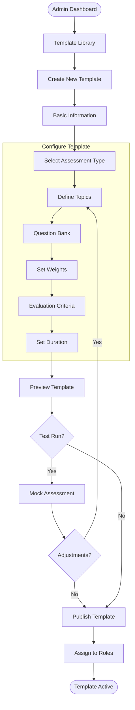

### Template Configuration

```
┌─────────────────────────────────────────────────────────────────────────┐
│  Create Assessment Template                                             │
├─────────────────────────────────────────────────────────────────────────┤
│                                                                         │
│  Template Name: [Senior DevOps Engineer Assessment        ]             │
│                                                                         │
│  Type: [Technical ▼]    Duration: [45 min ▼]    Difficulty: [Senior ▼] │
│                                                                         │
├─────────────────────────────────────────────────────────────────────────┤
│  TOPICS & WEIGHTS                                            [+ Add]   │
├─────────────────────────────────────────────────────────────────────────┤
│                                                                         │
│  ┌──────────────────────────────────────────────────────────────────┐  │
│  │  1. Kubernetes & Orchestration                                   │  │
│  │     Weight: [25%]  Questions: 5-7                                │  │
│  │     ☐ Pod lifecycle  ☐ Networking  ☐ Security  ☐ Scaling        │  │
│  ├──────────────────────────────────────────────────────────────────┤  │
│  │  2. CI/CD Pipelines                                              │  │
│  │     Weight: [20%]  Questions: 4-5                                │  │
│  │     ☐ GitHub Actions  ☐ Jenkins  ☐ ArgoCD  ☐ Testing            │  │
│  ├──────────────────────────────────────────────────────────────────┤  │
│  │  3. Infrastructure as Code                                       │  │
│  │     Weight: [20%]  Questions: 4-5                                │  │
│  │     ☐ Terraform  ☐ Ansible  ☐ CloudFormation                    │  │
│  ├──────────────────────────────────────────────────────────────────┤  │
│  │  4. Problem Solving                                              │  │
│  │     Weight: [20%]  Questions: 3-4                                │  │
│  │     ☐ Debugging  ☐ Incident Response  ☐ Optimization            │  │
│  ├──────────────────────────────────────────────────────────────────┤  │
│  │  5. Communication & Soft Skills                                  │  │
│  │     Weight: [15%]  Questions: 2-3                                │  │
│  │     ☐ Explanation  ☐ Collaboration  ☐ Documentation             │  │
│  └──────────────────────────────────────────────────────────────────┘  │
│                                                                         │
│  [Cancel]                                    [Save Draft] [Preview]     │
│                                                                         │
└─────────────────────────────────────────────────────────────────────────┘
```

---

## F10: Organization Setup

### Flow Diagram

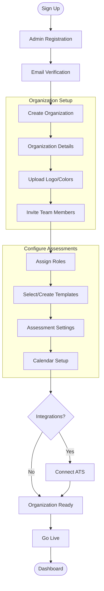

### Setup Wizard

```
┌─────────────────────────────────────────────────────────────────────────┐
│  Welcome to Talent Mesh!                                                │
│  Let's set up your organization                          Step 2 of 5   │
├─────────────────────────────────────────────────────────────────────────┤
│                                                                         │
│  ● Organization  ● Team  ○ Templates  ○ Calendar  ○ Go Live            │
│  ━━━━━━━━━━━━━━━━━━━━━━━━━░░░░░░░░░░░░░░░░░░░░░░░░░░░░░░░░░░░░░░░░░   │
│                                                                         │
├─────────────────────────────────────────────────────────────────────────┤
│                                                                         │
│  INVITE TEAM MEMBERS                                                    │
│                                                                         │
│  ┌─────────────────────────────────────────────────────────────────┐   │
│  │  Email                              │  Role                     │   │
│  ├─────────────────────────────────────┼───────────────────────────┤   │
│  │  john@company.com                   │  [Admin ▼]                │   │
│  │  sarah@company.com                  │  [Recruiter ▼]            │   │
│  │  mike@company.com                   │  [Recruiter ▼]            │   │
│  │  [+ Add another member]             │                           │   │
│  └─────────────────────────────────────┴───────────────────────────┘   │
│                                                                         │
│  💡 Team members will receive an email invitation to join.              │
│                                                                         │
│  [← Back]                                              [Skip] [Next →]  │
│                                                                         │
└─────────────────────────────────────────────────────────────────────────┘
```

---

## Navigation Map

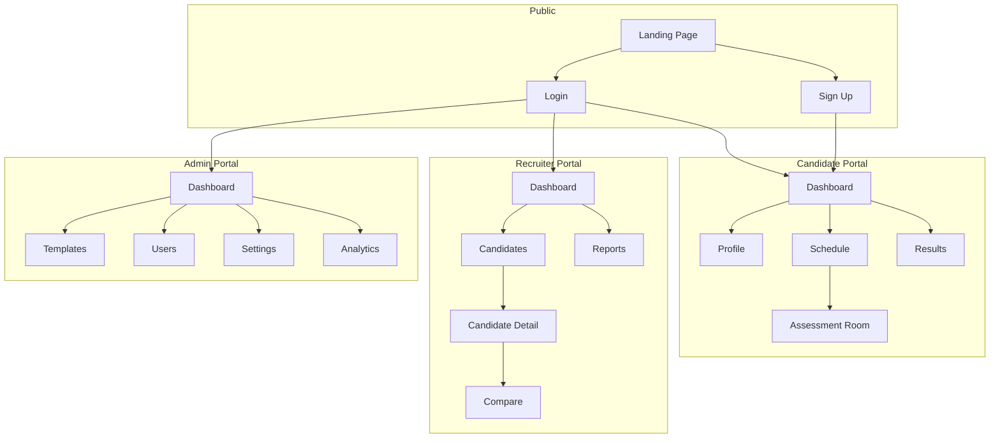

---

---

## HTML Prototypes

Interactive HTML/CSS wireframe prototypes are available in the `/wireframes/` folder. These provide clickable mockups for user testing and stakeholder review.

See [WIREFRAMES.md](WIREFRAMES.md) for the complete component library and screen specifications.

---

*Document Version: 3.1*
*Last Updated: 2026-01-07*
*Owner: Product Team*
